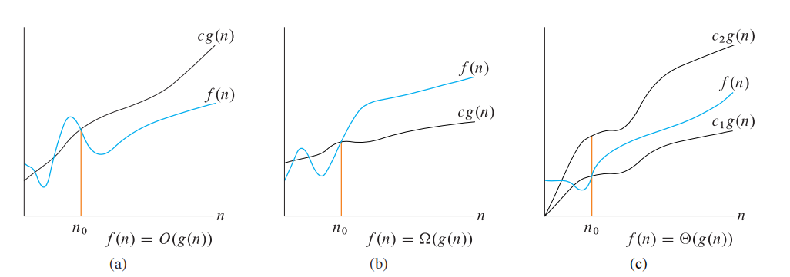
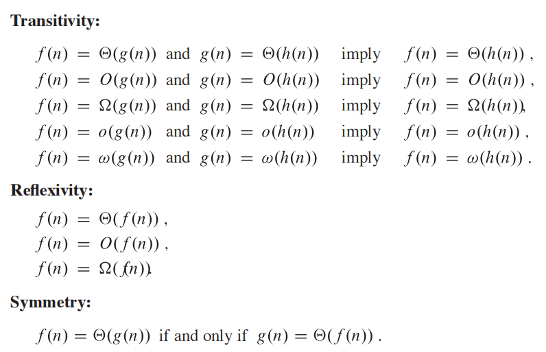
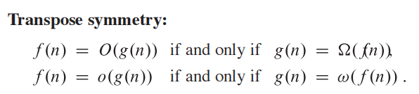
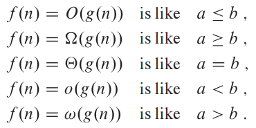
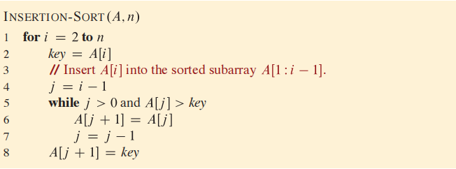
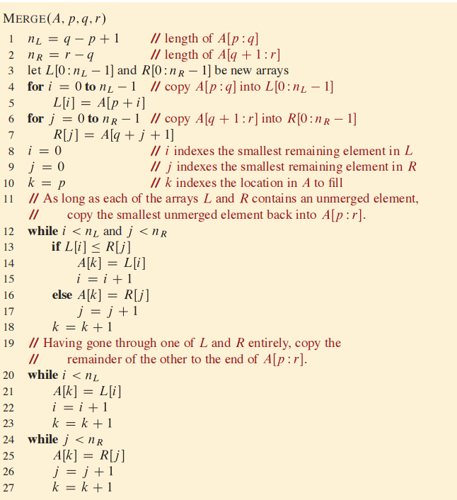
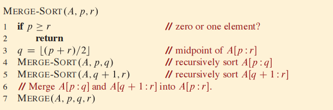
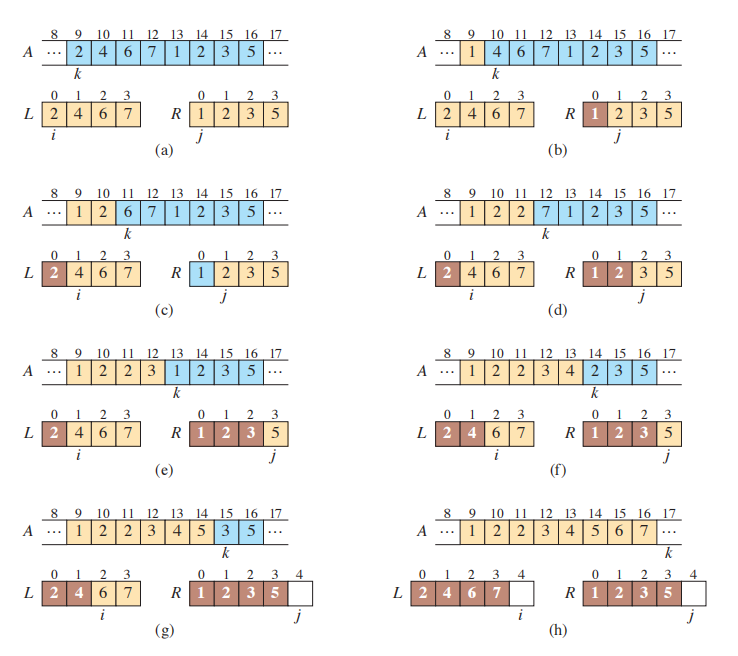
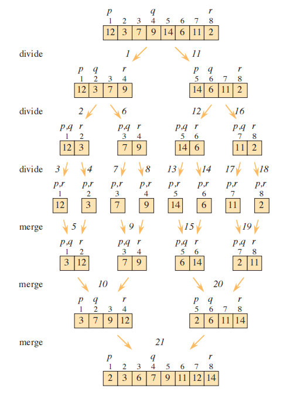
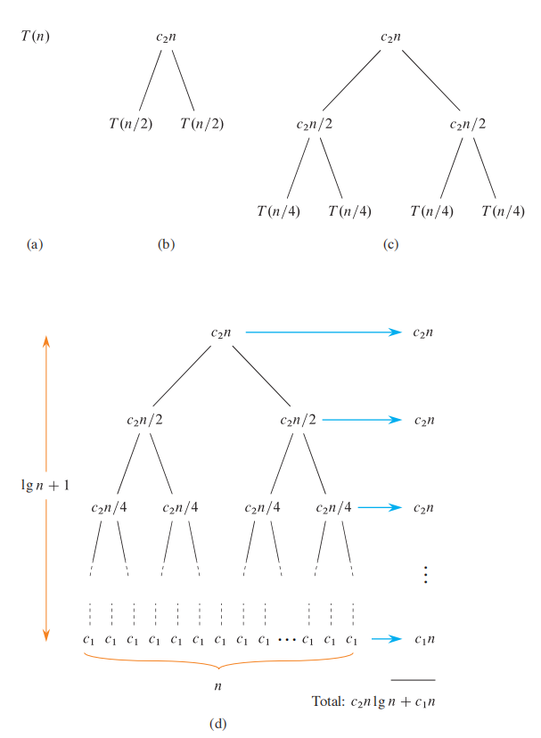

# 算法基础

[TOC]

## 算法概要

算法是任何一个定义明确的可计算性过程，它接受一组值作为**输入（input）**，并在**有限时间内**产生一组值作为**输出（output）**。

> 从数学角度来说，算法就是从问题空间到解空间的映射。

算法是解决特定可计算问题的工具，对于任意给定的**问题实例（instance）**，算法都能给出输入输出之间的关系。如果一个算法是**正确的（correct）**，那么它必须对任意给定的问题实例，都能在有限时间内正确地求解出来。对于一个错误的算法，只要控制它的错误率，那么还是有研究价值的，例如寻找大素数算法。

算法不仅仅是应用数学所要研究的问题，而且**还是计算机系统中的重要组成部分**，它在硬件、编译器、网络、应用程序、操作系统中都可以得到体现。

现在我们要讨论的算法都假定输入是在一开始就被全部获取的。但是有一些应用（例如，实时操作系统）的输入是随着时间变化而被获取的，基于这种特征的算法称为**在线算法（online algorithms）**。

### 伪代码

使用伪代码的好处就是可以忽略软件工程方面的知识，例如异常处理、模块化、数据抽象等，而重点关注算法本身。

我们对伪代码做出以下约定：

- 对于带有属性的对象来说，它们都是引用类型。而对于基本类型，它们都是值类型

- 数组下标默认从1开始，子数组用`A[i:j]`的形式表达。

- 缩进作为块级结构的文法指示符，而不使用`begin`、`end`、`{`、`}`。

- `NIL`表示对象不存在。

	

### 算法分析

算法分析主要涉及到其所消耗的时空资源。

> 在笔记中，我们通常分析算法的**运行时间（running time）**。

首先，为了屏蔽与算法本身无关的硬件细节，我们在**RAM框架（模型）**下来分析算法，该框架的特点如下：

- 通用单核处理器，指令顺序执行，且每条指令的时钟周期相同
- 内存随机访问，不支持虚拟内存以及缓存。
- 支持整型、浮点数、字符类型，而且还不考虑浮点数的精度。
- 指令有算术指令、数据处理指令以及控制指令。不支持具有复杂功能的指令，例如向量媒体指令，排序指令（不太现实）。
- 指令中操作数的位数取决于输入数$n$的大小。即$clog_2n \quad, c\geq1$。一般仅需考虑C语言中数据类型的**位宽**即可。

其次，我们还要考虑算法的**输入规模（input size**）。输入规模的含义取决于所研究的问题。例如，在图论中，通常用图的顶点数、边数刻画输入规模；在位操作中，是用位数刻画的；在排序问题中，是用数据的个数来刻画的。

最后，算法的**运行时间（running time）**是用执行多少条机器指令来刻画的。而伪代码中的语句是由一或多条机器指令组成。

**基于机器指令**来分析算法的运行时间会极其繁琐。为了简化分析过程，我们做了一些抽象工作，即认为伪代码中每条语句所花费的时间是一样的。但是这样做还是有些麻烦，为此我们进一步做简化抽象：**增长率（rate of growth，order of growth），它只考虑主项，直接忽略低阶项以及主项的系数**。这种抽象在输入规模大到一定程度时，才能正常工作。如果输入规模很小，那么增长率高的算法可能比增长率低的算法效率更高。我们称基于增长率的分析为**渐进分析（asymptotic analysis）**

对算法分析时，代数表达式中的常量因子受到算法实现、编译器、计算机体系结构的影响，通常对其不做考虑。

我们对算法在最坏情况下的运行时间特别感兴趣，原因如下：

- 它给出了在任何输入下运行时间的**上界（upper bound）**。这对实时计算十分重要
- 对于一些算法，经常发生最坏情况。例如执行搜寻算法时，所要搜索的对象并不存在。
- 算法的平均情况可能和最坏情况一样坏

对于平均情况的分析，通常需要使用**概率分析（probabilistic analysis）**技术。

注意：最好情况、平均情况以及最坏情况需要在证明中构造出来，而这构造过程是主观的。

### 渐进分析

下面介绍渐进分析中用到的符号

- $\Omega$，刻画一个函数的**渐进下界（asymptotic lower bound）**。定义如下：
	$$
	\Omega(g(n)) = \{f(n) | \quad \exist c,n_0 > 0 : 0 \leq cg(n)\leq f(n), n \geq n_0\}
	$$

- $\Theta$，刻画一个函数的**渐进紧密边界（asymptotic tight bound）**。定义如下：
	$$
	\Theta(g(n)) = \{f(n) | \quad \exist c_1,c_2,n_0 > 0 : 0 \leq c_1g(n)\leq f(n)\leq c_2g(n), n \geq n_0\}
	$$
	
- $\Omicron$，刻画一个函数的**渐进上界（asymptotic upper bound）**。定义如下：
	$$
	\Omicron(g(n)) = \{f(n) | \quad \exist c,n_0 > 0 : 0 \leq  f(n)\leq cg(n), n \geq n_0\}
	$$
	

注意到$0 \leq g(n), n \ge n_0$，这被称为**渐进非负（asymptotically nonnegative）**。

> 定理3.1：给定两个函数$f(n) \quad g(n)$，$f(n) = \Theta(g(n))$当且仅当$g(n) = \Theta(f(n))$
>
> 考虑定义即可证明。

我们对符号做出以下几点说明

- 渐进符号的使用要限定在特定语境下。例如，我们不能说“插入排序的运行时间是$\Theta(n^2)$”，必须这样说“插入排序在最坏情况下的运行时间是$\Theta(n^2)$”。如果一个算法在任何情况下的渐进运行时间是相同的，那么我们无需指明特定的语境。例如，我们可以说“归并排序的运行时间是$\Theta(nlogn)$”

- 我们说$\Omicron(nlogn)$算法比$\Omicron(n^2)$算法效率高是不正确的，因为$\Omicron$，刻画一个函数的**渐进上界（asymptotic upper bound）**。

- **注意到渐进符号表示的是集合**，因此在等式中有以下几种不同的解释方式：
	- $f(n) = \Theta(g(n))$：这里的$=$是$\in$
	- $f(n) + \Theta(n) = \Theta(n^2)$，表示对于任意$g(n) \in \Theta(n)$，总是存在$h(n) \in \Theta(n^2)$使得$f(n) + g(n) = h(n)$
	- $f(n) = g(n) + \Theta(h(n))$，表示存在一个函数$h^{'}(n) \in \Theta(h(n))$使得$f(n) = g(n) +h^{'}(n)$成立
	
	这些符号可以在不失精确语义下适当的滥用，以便简化我们的符号语言，在数学中也常常是这么做的：
	
	- $T(n) = \Omicron(1),n < 3$，在渐进定义下显然是无意义的，但是我们可以这样认为$\exist c : T(n) \leq c, n \leq3$。
	- 如果$T(n)$的定义域不连续，那么我们就在这些不连续的定义域上讨论渐进。
	
	此外，虽然$\sum^{n}_{i=1}\Omicron(i)$出现了多个渐进符号，但是我们不认为有$n$个函数与之对应，而是将它们认为一个渐进符号$\Omicron(n)$

$\Omicron(f(n))$刻画的上界可能是紧密上界或者不是紧密的，而$\omicron(f(n))$给出的上界一定是不紧密的！下面给出它的定义
$$
\omicron(g(n)) = \{f(n) | \quad \forall c >0,\exist n_0 > 0 : 0 \leq  f(n)\leq cg(n), n \geq n_0\}
$$
等价定义：
$$
\lim_{n \to +\infty}\frac{f(n)}{g(n)} = 0
$$
而$\omega(f(n))$给出不紧密下界，定义如下：
$$
\omega(g(n)) = \{f(n) | \quad \forall c>0, \exist n_0 > 0 : 0 \leq cg(n)\leq f(n), n \geq n_0\}
$$
等价定义：
$$
\lim_{n \to +\infty}\frac{g(n)}{f(n)} = 0
$$

此外，渐进还满足以下性质：（通过定义就能轻而易举地证明）

我们可以将渐进与比较运算做类比：

但是渐进不满足比较运算的**三分律（Trichotomy）**，即对于任意两个实数$a$和$b$，以下条件必有一个且只有一个满足：$a < b, a = b, a > b$。对于渐进我们可以给出一个反例（counter-example）：$n$和$n^{1+sinn}$。

### 循环不变量（loop invariant）

使用循环不变量可以帮助我们证明算法的正确性。

使用循环不变量需要证明以下三个部分：

- **初始化（initialization）**：在开始迭代前，证明不变量是正确的
- **维持（maintenance）**：每一步迭代后，证明不变量是正确的
- **终止（termination）**：获取到正确的不变量，并且它还带有循环终止的原因。

循环不变量类似**数学归纳法（mathematical induction）**，但是它只迭代有限步，而归纳法可以迭代无限步。

 

## 排序问题概述

输入：$n$个键的序列$<a_1, a_2, ... ,a_n>$

输出：对输入序列进行重排序，使得输出序列$<a_1^{'}, a_2^{'}, ...a_n^{'} >$满足$a_1^{'} \leq a_2^{'} \leq ... \leq a_n^{'}$

每个**键（key）**可以带有**卫星数据（satellite data）**，一个键与其卫星数据组成一条**记录（record）**。

### 插入排序

插入排序使用了**增加方法（incremental method）**，伪代码如下：

那么该算法在最好情况下的渐进时间是$\Theta(n)$，平均以及最坏情况下的渐进时间为$\Theta(n^2)$。

分析过程不再给出，相应证明请见第四版的P30、P31、P52。

### 归并排序

归并排序使用了**分治方法（Divide-and-Conquer method）**，伪代码如下：

下面给出它的示例

下面简要说明一下归并排序的渐进分析

不难得出归并排序的递归表达式
$$
\begin{equation}
T(n) = \left\{
\begin{aligned}
&c_1 &  n = 1. \\
&2T(n/2) + c_2n \quad & n  > 1.
\end{aligned}
\right.
\end{equation}
$$
画出递归树可分析出它的运行时间

