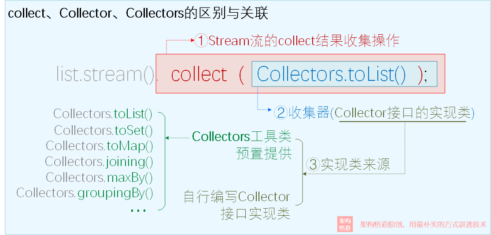

# 流式编程

[TOC]

## 概括

集合优化了对象的存储，而流（Streams）则是关于一组对象的处理。流实现了*声明式编程*（Declarative programming），这是一种编程风格——它声明了要做什么，而不是指明（每一步）如何做，这使得我们能够像编写SQL语句那样方便地操纵Java里的数据。你会注意到，命令式（Imperative）编程的形式（指明每一步如何做）会更难理解，下面是详细的代码对比：

~~~java
import java.util.*;
public class Randoms {
    public static void main(String[] args) {
        new Random(47)
            .ints(5, 20)
            .distinct()
            .limit(7)
            .sorted()			//内部迭代（internal iteration），看不到任何上述的迭代过程
            .forEach(System.out::println);
    }
    
}

import java.util.*;
public class ImperativeRandoms {
    public static void main(String[] args) {
        Random rand = new Random(47);
        SortedSet<Integer> rints = new TreeSet<>();
        while(rints.size() < 7) {				//外部迭代（external iteration）
            int r = rand.nextInt(20);
            if(r < 5) continue;
            rints.add(r);
        }
        System.out.println(rints);
    }
}
~~~

流式编程的一个核心特征就是内部迭代。当对象拆分迭代以及整合迭代等效时，命令式编程才可转换为声明式编程（个人理解）。另一个重要特征，流是惰性加载的。这代表着它只在绝对必要时（在执行终端操作时）才计算。你可以将流看作“延迟List”。由于计算延迟，流使我们能够处理非常大（甚至无限）的序列，而不需要考虑内存问题。之后我们进一步阐述这些特征。此外，流还适合进行并行处理。

为了兼容旧代码并实现平滑的过渡，有关流的方法在接口中修饰为了default（默认的），这样以前的类库无需重构代码以实现相应的新增接口。在包`java.util.stream.*`中

流操作的类型有三种：

- 创建流
- 修改流元素（中间操作， Intermediate Operations）
- 消费流元素（终端操作， Terminal Operations）

## 创建流

有以下方法创建一个流：

- Stream类的静态方法of(T... t) ：

	~~~ java
	int[] i = {1, 2, 3, 4};
	Stream s = Stream.of(i);					//本以为会得到Int的流，但是得到是Int[]的数据流
	Stream s1 = Stream.of(1, 2, 3, 4);			//会自动装箱
	IntStream s1 = IntStream.of(1, 2, 3, 4);	//针对基本类型的流，在本章节中不做考虑，这是设计上的败笔。
	~~~

	

- 有些集合类可以同通过调用stream()方法产生一个流。数组只能通过Arrays.stream(T[] t)方法将数组t转换为流

	~~~java
	Map<String, String> m = new HashMap<>();
	Stream s = m.entrySet().stream();
	
	int[] i = {1, 2, 3, 4};
	IntStream s = Arrays.stream(i);
	~~~

	

- Stream.generate(Supplier<T> s)静态方法。`generate`方法返回一个无限连续的无序流，其中每个元素由提供的供应商(`Supplier`)生成，这个Supplier可以是构造器的方法引用。

	~~~java
	class A implements Supplier<T> {
	    @Override
	    T get() { return new A(); }
	}
	
	class B {
	    public B() { }
	}
	
	class TestUnit {
	    public static void main(String[] args) {
	        Stream s = Stream.generate(B::new);
	        Stream s1 = Stream.generate(() -> new B());
	        Stream s2 = Stream.generate(new A());
		}
	}
	~~~

	

- iterate(T seed, UnaryOperator<T> f)，可以无限迭代来生成流元素，这点与iterate相似。第一个参数是种子，是第一次迭代的初始值。对于第二个参数来说，一方面生成当前流元素，另一方面当作生成下一个流元素的初始值。

  ~~~java
  Stream.iterate(1, item -> item + 1)
  ~~~

  

- Builder design pattern 建造者模式，

	~~~java
	class A {
	    Stream.Builder<T> builder = Stream.builder();	//获取一个对象
	    
	    void f() { builder.add(item); }					//构建这一个对象
	    
	    Stream<T> g() { return bhilder.build(); }		//返回这个流
	}
	~~~

	

- 其他
	- Random.ints()
	- Pattern.splitAsStream();
	- Stream.empty()

​	
​	
​	
​	

## 中间操作

**中间操作**又可以分为**无状态**（Stateless）与**有状态**（Stateful）操作:

 无状态是指元素的处理不受之前元素的影响；

 有状态是指该操作只有拿到所有元素之后才能继续下去。

`peek()` 对stream流中的每个元素进行逐个遍历处理，返回处理后的stream流。

`sorted()`可以传入比较器

`distinct()` 可用于消除流中的重复元素

`filter(Predicate)`：按照条件过滤符合要求的元素， 返回新的stream流

`map(Function)`：将已有元素转换为另一个对象类型，一对一逻辑，返回新的stream流

`mapToInt(ToIntFunction)`：操作同上，但结果是 **IntStream**。

`flatMap()` 将已有元素转换为另一个对象类型，一对多逻辑，即原来一个元素对象可能会转换为1个或者多个新类型的元素，返回新的stream流。实现逻辑是这样的：先每个元素处理并返回一个新的Stream，然后将多个Stream展开合并为了一个完整的新的Stream，这相当于降维处理。

`flatMapToInt(Function)`：当 `Function` 产生 `IntStream` 时使用。

`limit` 仅保留集合前面指定个数的元素，返回新的stream流

`skip` 跳过集合前面指定个数的元素，返回新的stream流

## 终端操作

**终结操作**又可以分为**短路**（Short-circuiting）与**非短路**（Unshort-circuiting）操作，

           -  **非短路**是指必须处理完所有元素才能得到最终结果
           -  **短路**是指遇到某些符合条件的元素就可以得到最终结果

​          

###  数组

- `toArray()`：将流转换成适当类型的数组。
- `toArray(generator)`：在特殊情况下，生成自定义类型的数组。

### 循环

- `forEach(Consumer)`无返回值，对元素进行逐个遍历，然后执行给定的处理逻辑
- `forEachOrdered(Consumer)`： 保证 `forEach` 按照原始流顺序操作。

### 集合

- `collect(Collector)`：将流转换为指定的类型，通过Collectors进行指定

	

`collect`是Stream流的一个**终止方法**，会使用传递的收集器（传参）对结果执行相关的操作，这个收集器必须是`Collector接口`的某个具体实现类。`Collectors`是一个**工具类**，提供了很多的静态工厂方法，**提供了很多Collector接口的具体实现类**，是为了方便程序员使用而预置的一些较为通用的收集器。

收集器可以分类成：

- **恒等处理**，指的就是Stream的元素在经过Collector函数处理前后完全不变，例如toList()、toSet()

- **归约汇总**，Stream流中的元素逐个遍历，进入到Collector处理函数中，然后会与上一个元素的处理结果进行合并处理，并得到一个新的结果，以此类推，直到遍历完成后，输出一个最终的结果。例如counting()、joining()、maxBy()

- 分组分区操作需要指定两个关键输入，即**分组函数**和**值收集器**：

	- **分组函数**：一个处理函数，用于基于指定的元素进行处理，返回一个用于分组的值（即**分组结果HashMap的Key值**），对于经过此函数处理后返回值相同的元素，将被分配到同一个组里。
	- **值收集器**：对于分组后的数据元素的进一步处理转换逻辑，此处还是一个常规的Collector收集器，和collect()方法中传入的收集器完全等同。

	这样collect返回的结果，就是一个`HashMap`

	

更多关于Collection知识请参阅[讲透JAVA Stream的collect用法与原理，远比你想象的更强大 - 架构悟道 - 博客园 (cnblogs.com)](https://www.cnblogs.com/softwarearch/p/16490440.html)

### 组合

将所有元素合并计算得到一个新的元素，降维处理

- `reduce(BinaryOperator)`：使用 **BinaryOperator** 来组合所有流中的元素。因为流可能为空，其返回值为 **Optional**。
- `reduce(identity, BinaryOperator)`：功能同上，但是使用 **identity** 作为其组合的初始值。因此如果流为空，**identity** 就是结果。
- `reduce(identity, BiFunction, BinaryOperator)`：更复杂的使用形式（暂不介绍）

### 匹配

- `allMatch(Predicate)` ：如果流的每个元素提供给 **Predicate** 后都返回 true ，结果返回为 true。在第一个 false 时，则停止执行计算。
- `anyMatch(Predicate)`：如果流的任意一个元素提供给 **Predicate** 后返回 true ，结果返回为 true。在第一个 true 是停止执行计算。
- `noneMatch(Predicate)`：如果流的每个元素提供给 **Predicate** 都返回 false 时，结果返回为 true。在第一个 true 时停止执行计算。

 ### 查找

- `findFirst()`： 找到第一个符合条件的元素时则终止流处理
- `findAny()`找到任何一个符合条件的元素时则退出流处理，这个**对于串行流时与findFirst相同，对于并行流时比较高效**，任何分片中找到都会终止后续计算逻辑

### 其他

- `count()`：流中的元素个数。
- `max(Comparator)`：根据所传入的 **Comparator** 返回“最大”元素。
- `min(Comparator)`：根据所传入的 **Comparator** 返回“最小”元素。

- `average()` ：求取流元素平均值。
- `max()` 和 `min()`：数值流操作无需 **Comparator**。
- `sum()`：对所有流元素进行求和。
- `iterator()`将流转换为Iterator对象

## Optional类

最令程序员头疼的问题就是处理null对象，一个典型的处理null对象方法是使用if语句:

~~~java
public String getName(User user) {
    if (user == null) {
        return "Unknown";
    } else {
        return user.name();
	}
}
~~~

在Java8中引入了Optional类，可以通过流式编程以及函数式编程优雅地处理null情况：

~~~java
public String getName(User user) {
    return Optional.ofNullable(user).map(u -> u.name).ofElse("Unknown");
}
~~~

当我们在自己的代码中生成一个 **Optional**对象时，可以使用下面 3 个静态方法：

- `empty()`：生成一个内容为null的 **Optional**对象（简称为空Optional）。相当于Optional.ofNullable(null)。
- `of(value)`：将值保存在Optional中，若为null，则抛出异常。
- `ofNullable(value)`： 将值保存在Optional中，可保存null值。

当你接收到 **Optional** 对象时，应首先调用 `isPresent()` 检查内容是否为null。可使用 `get()` 获取Optional的内容。

有许多便利函数可以解包 **Optional** ，这简化了上述“对所包含的对象的检查和执行操作”的过程：

- `ifPresent(Consumer)`：当值不为null时调用 **Consumer**，否则什么也不做。
- `orElse(otherObject)`：如果值不为null则直接返回，否则生成 **otherObject**。
- `orElseGet(Supplier)`：如果值不为null则直接返回，否则使用 **Supplier** 函数生成一个可替代对象。
- `orElseThrow(Supplier)`：如果值存在直接返回，否则使用 **Supplier** 函数生成一个异常。

 **Optional** 的后续能做更多的操作

- `filter(Predicate)`：对 **Optional** 中的内容应用**Predicate** 并将结果返回。如果 **Optional** 不满足 **Predicate** ，将 **Optional** 转化为空 **Optional** 。如果 **Optional** 已经为空，则直接返回空**Optional** 。
- `map(Function)`：如果 **Optional** 不为空，应用 **Function** 于 **Optional** 中的内容，并返回结果。否则直接返回空Optional。
- `flatMap(Function)`：如果 **Optional** 不为空，应用 **Function** 于 **Optional** 内容中的内容，并返回结果。否则直接返回空Optional。
