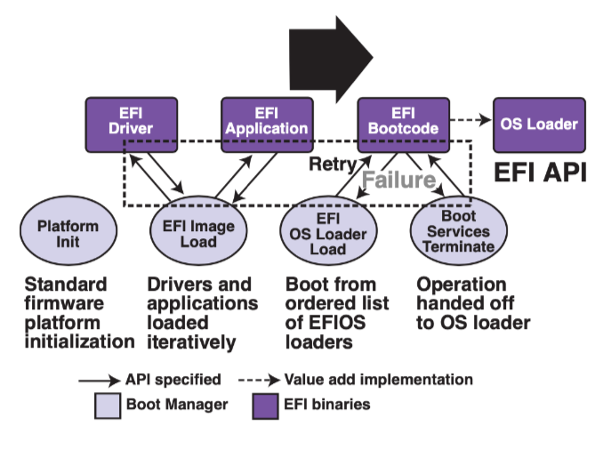

# 操作系统2
[TOC]
## 第九次课（状态机模型）
谁来加载操作系统？为了让计算机系统运行程序，一定存在着软件/硬件之间的约定。所以芯片厂商（AMD、Intel）、硬件厂商（显卡、主板、内存）、操作系统厂商（Windows、Apple）之间要相互合作，由于市场竞争问题，有不止一种软硬件约定。

**整个计算机系统也是一个状态机**。计算机加电启动后，即CPU RESET，芯片厂商的电路使得处理器处于某个确定的状态：

CPU Reset (Intel® 64 and IA-32 Architectures Software Developer’s Manual, Volume 3A/3B)

- 寄存器会有初始状态
	- EIP = 0x0000fff0
	- CR0 = 0x60000010
	16-bit 模式
	- EFLAGS = 0x00000002
	interrupt disabled
	- 其他寄存器是Undefined
- 其他：处理器的大部分特性处于关闭状态，例如缓存、虚拟存储等。

`ffff0` 通常是一条向 firmware 跳转的 `jmp `指令。**firmware（固件）**是位于主板ROM上的一段代码，由硬件厂商提供。

固件会进行*硬件检查*。然后*加载操作系统*。以x86为例，BIOS会将用户数据（操作系统、加载器等）从磁盘加载到内存。准确点来说，它会把第一个可引导设备（Floppy、HDD、SDD）的第一个主扇区（最后两个字节一定是0xaa55，作为标识符）的512字节加载到物理内存的 `7c00` 位置。在将控制权转交给操作系统后，它还可以*向操作系统提供简单的硬件服务*，例如中断、访问硬盘等，但是我们一般不需要。

CPU与主板的关系：CPU通过总线和外部设备通信，而主板必须设计出与CPU相兼容的结构（总线、接口等）才能使整个计算机系统正常工作。

> 以前firmware会先查询软盘再查询硬盘。所以软盘的默认标识符就用A、B，而硬盘的默认标识符是C

现在Firmware有两种：

- BIOS（逐渐要被淘汰）

- UEFI：各个厂商制定的统一标准。功能更丰富，例如支持文件系统，指纹认证等。可靠性、安全性更好。

	

## 第10次课 （状态机模型的应用）

### 物理世界

宏观物理世界（牛顿）近似于deterministic的状态机。状态转移就是物理定理。而微观世界可能是non-deterministic，例如量子力学。

[Conway's game of life](https://playgameoflife.com/)把物理世界建模成基本粒子的运动，是一个计算机与物理结合的应用。而且还被证明是图灵完备的。

状态机 + 一些公理还可以对平行宇宙、时间穿梭等概念做出定义，虽然可能不切实际 😑。

推荐阅读的文章：[Why philosophers should care about computational complexity, Ch. 10](https://www.scottaaronson.com/papers/philos.pdf)

> 个人认为以状态机视角来理解世界是很肤浅的🙃，但也提供了另一个理解世界的角度。

### 编译器与CPU优化

编译器以及CPU超标量/乱序执行等技术，可以使得在程序状态机翻译成数字电路状态机时，只需保证在可观测行为一致前提下，修改状态机以做优化工作。

一个例子[ilp-demo.c](http://jyywiki.cn/pages/OS/2022/demos/ilp-demo.c)。测试结果表明，程序运行速度远远超过你的CPU主频的，这得益于编译器以及CPU所做的优化。

### 查看状态机

gdb/strace不仅可以观察状态机的执行，而且还可以甚至记录和改变状态机的执行，例如状态回溯以及状态拷贝。

程序执行是随时间 “前进” 的 $s_0 \to s_1 \to s_2 \to ...$。记录所有$s_i$的开销太大 ($s_i$由内存 + 寄存器组成)。但一条指令的**side-effect **通常有限，只记录初始状态，和每条指令前后状态的差异 $s_0,Δ0,Δ1,…$

- 正向执行：$s_{i+1} = s_i + \Delta_0$
- 反向执行：$s_{i-1} = s_i e \Delta_0^{-1}$

对于deterministic指令的差异，我们可以简单地进行撤销工作。而且仅需记录初始状态，那么就可以复现程序执行的结果，举个例子假设$ s_0$ 执行 1,000,000 条确定的指令后得到 s'，那么只要记录 $s_0$和 1,000,000，就能通过 “再执行一次” 推导出 *s*′。

对于non-deterministic的指令，例如上锁顺序、条件变量、随机数、中断、IO指令。我们仅需保存它们的当时状态即可。

rdrand指令的副作用仅限于寄存器，所以gdb可以以低成本来保存状态，而有些复杂的指令（syscall）无法保证，因为gdb无法知道全部状态或者代价太大。

这篇论文说明了如何重放一整个虚拟机的执行。这对于安全测试中的现场复现很重要。[ReVirt: Enabling intrusion analysis through virtual-machine logging and replay](http://jyywiki.cn/OS/2022/slides/10.slides) (OSDI'02, Best Paper 🏅)

你甚至可以类比游戏的回放机制🤣，无非就是用日志记录玩家的行为，将整个系统变为确定性的。

profiler和性能摘要

性能摘要无非就是回答了“为了做某件事到底花去了多少资源”，或者说“一段时间内资源的消耗情况”。

> Premature optimization is the root of all evil. (D. E. Knuth)

对状态机执行进行采样，统计关键性能指标，然后去做性能分析。这样性能摘要需要对程序执行性能影响最小，往往不需要 full trace。

其中关键性指标包括：

- 函数的调用栈
- 执行的语句
- 其他

Linux Kernel perf的例子

- perf list, perf stat (-e), perf record, perf report

这是内核为我们提供的一个性能统计工具。

工业界现在用火焰图[The flame graph](https://cacm.acm.org/magazines/2016/6/202665-the-flame-graph/fulltext) 进行性能分析。

Model Checker可以探索程序的状态空间，一些工业界用的Model Checker：

- [TLA+](https://lamport.azurewebsites.net/tla/tla.html) by Leslie Lamport;
- [Java PathFinder (JFP)](https://ti.arc.nasa.gov/tech/rse/vandv/jpf/) 和 [SPIN](http://spinroot.com/)

non-deterministic的状态都可以检查，但状态空间太大，所以要将相似状态合并。基本思路是把状态随机性保留着，延迟状态的展开，那么这个状态将会坍缩，等真正需要该状态的结果时再执行计算，具体来说是通过约束求解器对状态进行展开。

下面给出一个例子

~~~c
u32 x = rdrand();
u32 y = rdrand();
if (x > y)
  if (x * x + y * y == 65)
    bug();

~~~

如果直接对状态进行展开，那么会有$2^{64}$种状态。

- [KLEE: Unassisted and automatic generation of high-coverage tests for complex systems programs](https://dl.acm.org/doi/10.5555/1855741.1855756) (OSDI'08, Best Paper 🏅)

## 第11次课（进程）

### Q1  操作系统启动后到底做了什么？

操作系统会加载一个进程init，它会完成基本的工作，例如启用shell、加载文件系统等。

[RTFSC](https://elixir.bootlin.com/linux/latest/source/init/main.c#L1555) (latest Linux Kernel)

~~~c
if (!try_to_run_init_process("/sbin/init") ||
	    !try_to_run_init_process("/etc/init") ||
	    !try_to_run_init_process("/bin/init") ||
	    !try_to_run_init_process("/bin/sh"))
		return 0;

	panic("No working init found.  Try passing init= option to kernel. "
	      "See Linux Documentation/admin-guide/init.rst for guidance.");
~~~

- 如果没有指定启动选项 `init=`，按照 “默认列表” 尝试一遍
- 从此以后，Linux Kernel 就进入后台，成为 “中断/异常处理程序”

操作系统为 (所有) 程序提供 syscall包括：

- 进程管理：fork、execve、exit
- 内存管理：mmap等
- 文件管理：open、close、read、write等
- 其他：网络

### Q2 操作系统如何管理程序 (进程)？

**虚拟化：操作系统在物理内存中保存多个状态机**

fork做一份状态机完整的复制 (内存、寄存器现场)，除了fork的返回值（在父进程中返回子进程的PID，而在子进程中返回0）以及PID。

虽然fork之后两个程序是并发的，但是它们是完全相互独立的，所以**fork状态图可以简化成进程树图**。

因为状态机是复制的，因此总能找到 “父子关系”，有了进程树 (pstree)

~~~bash
$ :(){ :|:& };:
~~~

stdout tty line buffer

pipe、file full buffer

setbuf(stdout, NULL) fllush(stdout)

execve()重置状态机，重置成某一个程序的初始状态。

wait()同步机制

## 工具使用

ld 链接

strace -T 打印系统调用所花费的时间

info local 查看局部变量

snapshot 将状态拷贝

reverse 状态后退。

record full -开始记录

record stop -结束记录

reverse-step 时间旅行调试

step 就是单步执行，会进入到函数内部

next 是在单步执行时，但不会进入函数内部

finish就是但单步执行到子函数内时，用step out就可以执行完子函数余下部分

