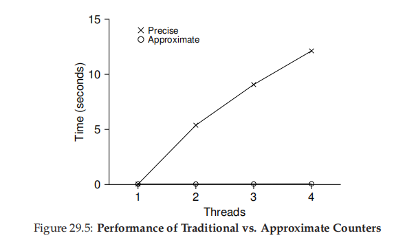
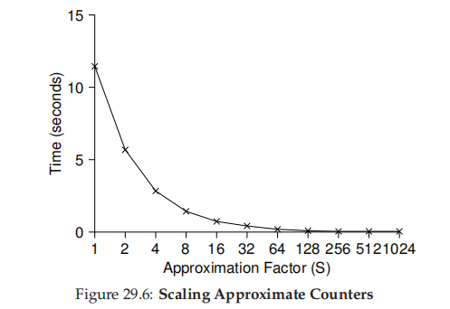

# 并发

[TOC]

## 概论

为了在多核处理器上实现真正意义上的并发，我们在进程上做进一步抽象工作：**线程（thread）**。线程之间共享的进程资源包括：

- 进程代码段
- 堆区、静态数据区
- 系统资源，例如文件描述符、信号处理器、权限等
- 虚拟（线性）地址空间

通过虚拟化技术，每个线程都拥有私有的栈、寄存器。与进程一样，在调度线程时需要执行上下文切换（context switch），将线程的状态保存到`thread control blocks（TCB）`数据结构中。

以下是使用线程的情景：

- 充分利用多核处理器的硬件优势，提高程序的性能。
- 在某个线程I/O阻塞时，还能够执行其他的计算任务，这也是一种`overlap`技术。
- 线程之间可以方便共享数据。

**从进程演变到线程，再演变到最新的协程，目的都是为了提高CPU有效利用率，降低系统额外开销，以及降低通信代价**

有一个十分棘手的并发问题：**竞态条件（race condition）**，有时也被称为**数据竞争（data race）**。它是指一个系统的输出依赖于不确定事件（通常是单核中线程调度或者多核线程并发执行）的发生时机，从而计算结果是**不确定的（indeterminate）**。

**临界区（critical section）**是一段访问共享资源的代码片段，当多个线程同时进入临界区同时更新共享资源时，会导致数据竞争。

**互斥（mutual exclusion）**是一种避免数据竞争的朴素方法，它确保在任何时刻最多只有一个线程可以进入临界区中。同步原语中的自旋锁可以实现互斥，而原语中的原子性保证了基于互斥的并发正确性。

**同步（ synchronization）**用于协调各个事件的时序关系。

**原语（primitives）**，是指由若干条指令组成的程序片段，具有原子性。**原子性（atomic）**，是指一系列的动作要么都完成，要么都未进行，没有任何**可以被等同外界观察到的**中间状态，整体具有不可分割性。在数据库以及分布式领域中，常常把原子性称为**事务（transaction）**。

Edsger Dijkstra在1968年发表`[D68]`论文中讨论过这些问题。值得注意的是，竞态条件并不只在并发中遇到，在数字电路设计、计算机体系结构等领域，也要处理这些问题。

##  锁（Lock） 

锁仅仅是一个变量（variable）。锁的状态有两种：

- **可用的**（**available**，or **unlocked** or **free**），表明没有线程持有该锁。
- **已获得的**（**acquired**，or **locked** or **held**），表明某个线程持有该锁，其他线程此时欲获得该锁，则会被拒绝。

锁类型中可以包含其他数据，例如，持有该锁的线程ID，请求队列等。通常调用`lock()`例程获取锁，`unlock()`例程释放锁。

值得注意的是，POSIX版本的`lock()`需要一个锁变量作为参数，这样做的目的是实现**细粒度访问控制（fine-grained）**。相比较**粗粒度访问控制（coarse-grained）**，细粒度访问控制可以用不同的锁对不同的数据结构施加保护，提高了并行能力。

可以从以下三个指标，来评价一个锁实现的好坏：

- 实现互斥，确保并发的正确性。
- 公平性，防止某个线程**饿死（starve）**
- 性能，也就是实现锁的额外开销。在考虑性能时，可分为三个情景去讨论与比较：单核单线程、单核多线程、多核多线程。

### 基于中断技术的锁

~~~c
void lock()
{
    DisableInterrupts();
}

void unlock()
{
    EnableInterrupts();
}
~~~

- 这种方案的优点就是实现简单（simplicity），但是有以下缺点：

	- 在多核处理器上，该锁不能实现互斥，进而并发是错误的。
	- 如果屏蔽中断信号的时钟周期过长，则可以会丢失中断信号，进而导致严重的系统问题。
	- 频繁的开关中断会影响指令执行的速度。
	- 显然关闭中断是一条特权指令，如果应用程序滥用基于中断技术的锁，那么有可能会垄断CPU使用权，或者造成系统死机。
	
	操作系统内部可以使用这种锁，为了保证访问数据结构操作的原子性。

### 自旋锁

所有的自旋锁都有一个通病那就是`spin-waiting`，**忙等待**。当一个线程想要获取锁但锁被其他线程持有时，它只能空转等待。只有等待系统分配给该线程的时间片段用完后，CPU才能调度其他的线程。CPU在该时间片段内做不了任何有意义的计算任务，造成了性能损失。在单核处理器上，忙等待会造成更严重的性能损失。在单核上，需要**抢占式调度器（preemptive scheduler）**才能使自旋锁正常工作。

此外自旋锁可能会使**优先级反转（priority inversion）**问题

使用Loads/Stores的自旋锁，这是在软件层面上实现的

~~~c
typedef struct __lock_t {int flag; } lock_t;

void init(lock_t *mutex) 
{
    mutex->flag = 0;
}

void lock(lock_t *mutex)
{
    while (mutex->flag == 1)
        ;
    mutex->flag = 1;
}

void unlock(lock_t *mutex)
{
    mutex->flag = 0;
}
~~~

有两种问题：

- 因为flag变量，仍会有数据竞争，并发错误。
- spin-waiting

还有其他在软件层面上实现的锁，最著名的是`Peterson算法`。但是它们在多核上的正确性都得不到保证，而且实现、理解起来比较复杂。因此研究方法转到借助硬件来实现锁，实践证明这是对的。

硬件提供了以下原子性指令（用C语言伪代码说明），利用这些指令我们可以构建出具有正确性的锁

- test-and-set（atomic exchange）

	~~~c
	int TestAndSet(int *old_ptr, int new) 
	{
		int old = *old_ptr; // fetch old value at old_ptr
		*old_ptr = new; // store ’new’ into old_ptr
		return old; // return the old value
	}
	
	typedef struct __lock_t {
		int flag;
	} lock_t;
	
	 void init(lock_t *lock) 
	 {
	    // 0: lock is available, 1: lock is held
	    lock->flag = 0;
	} 
	void lock(lock_t *lock) 
	{
	    while (TestAndSet(&lock->flag, 1) == 1)
	    	; // spin-wait (do nothing)
	}
	
	void unlock(lock_t *lock) 
	{
		lock->flag = 0;
	}
	~~~

	

- compare-and-swap

	~~~c
	int CompareAndSwap(int *ptr, int expected, int new) 
	{
		int original = *ptr;
		if (original == expected)
		*ptr = new;
		return original;
	}
	
	void lock(lock_t *lock) 
	{
	    while (CompareAndSwap(&lock->flag, 0, 1) == 1)
	        ; // spin
	}
	~~~

	此外compare-and-swap指令比test-and-set的功能更强大，用此指令可以实现lock-free synchronization[H91]

- Load-Linked and Store-Conditional

	~~~c
	int LoadLinked(int *ptr) 
	{
		return *ptr;
	} 
	int StoreConditional(int *ptr, int value) 
	{
	 	if (no update to *ptr since LoadLinked to this address) {
	        *ptr = value;
	        return 1; // success!
	 	} else {
			 return 0; // failed to update
	 	}
	}
	
	void lock(lock_t *lock) {
	    while (1) {
	        while (LoadLinked(&lock->flag) == 1)
	            ; // spin until it’s zero
	        if (StoreConditional(&lock->flag, 1) == 1)
	            return; // if set-it-to-1 was a success: all done
	            // otherwise: try it all over again
	    } 
	}
	
	void lock(lock_t *lock) 
	{
	    while (LoadLinked(&lock->flag) || !StoreConditional(&lock->flag, 1))
	    	; // spin
	   //Lauer's Law less code is better code
	}
	
	 void unlock(lock_t *lock) 
	 {
	 	lock->flag = 0;
	 }
	~~~

	

- Fetch-And-Add

	~~~c
	int FetchAndAdd(int *ptr) 
	{
	    int old = *ptr;
	    *ptr = old + 1;
	    return old;
	}
	~~~

	

想要提高自旋锁的性能，一种朴素的方法就是线程在while循环内调用`yield(）`，使线程主动放弃`CPU`转到`ready`状态，避免了`spin-waiting`，但是由于上下文切换，开销依旧很大。

~~~c
void init() 
{
	flag = 0;
}

void lock() 
{
    while (TestAndSet(&flag, 1) == 1)
    	yield(); // give up the CPU
} 

void unlock() 
{
	flag = 0;
}
~~~

以上讨论的锁实现在公平性方面表现的并不好，很可能会发生线程饿死，还有一种公平性较好的自旋锁实现：**Ticket Lock** by Mellor-Crummey and Scott[MS91]

~~~c
typedef struct __lock_t {
    int ticket;
    int turn;
}

void lock_init(lock_t *lock) 
{
    lock->ticket = 0;
    lock->turn = 0;
}

void lock(lock_t *lock)
{
    int myturn = FetchAndAdd(&lock->ticket);
    while (lock->turn != myturn)
        ;
}

void unlock(lock_t *lock)
{
    lock->turn = lock->turn + 1;
}
~~~

### Linux与Solaris的自旋锁实现

这些自旋锁的实现在性能以及公平性方面表现良好

首先给出Solaris系统中基于队列的原始实现：

~~~c
typedef struct __lock_t {
    int flag;
    int guard;
    queue_t *q;
} lock_t
    
void lock_init(lock_t *m) 
{
    m->flag = 0;
    m->guard = 0;
    queue_init(m->q);
}

 void lock(lock_t *m) 
 {
     while (TestAndSet(&m->guard, 1) == 1)
     	; //acquire guard lock by spinning
     if (m->flag == 0) {
         m->flag = 1; // lock is acquired
         m->guard = 0;
     } else {
         queue_add(m->q, gettid());
         m->guard = 0;
         //point 1
         park();
     }
 }

void unlock(lock_t *m) 
{
    while (TestAndSet(&m->guard, 1) == 1)
    	; //acquire guard lock by spinning
    if (queue_empty(m->q))
    	m->flag = 0; // let go of lock; no one wants it
    else
    	unpark(queue_remove(m->q)); // hold lock
   	//point2
    m->guard = 0;
}
~~~

这个实现依赖于两个调用`park()`与`unpark(threadID)`，park休眠当前线程，而unpark唤醒threadID线程。但是我们发现其中有些问题：如果线程B在point1处中断（此时已释放guard锁），而线程A在unlock中unpark线程B，那么当B恢复执行而继续调用park后只能永久性休眠了，这个问题称为**唤醒竞争（waiting/wakeup race）**。此外，如果线程A在唤醒线程B后在point2处中断，线程B之后执行unlock时，因为没有持有guard锁，故只能spin-waiting，这是个潜在的性能问题。

针对唤醒竞争问题，Solaris引入setpark()，并且做出以下改进：

~~~c
queue_add(m->q, gettid());
setpark();
m->guard = 0;
park();
~~~

如果在`setpark()`与`park()`之间发生中断并且unpark当前进程，那么在调用`park()`函数时，会立即返回而不是休眠当前线程。

下面给处Linux的futex锁实现。

~~~c
void mutex_lock(int *mutex)
{
    int v;
    if (atomic_bit_test_set(mutex, 31) == 0)
        return ;
   	atomic_increment(mutex);
    while (1) {
        if (atomic_bit_test_set(mutex, 31) == 0) {
            atomic_decrement(mutex);
		}
        v = *mutex;
        if (v >= 0)	continue;
        futex_wait(mutex, v);
    }
}

void mutex_unlock(int *mutex) 
{
    if (atomic_add_zero(mutex, 0x80000000))
        return;
   	futex_wake(mutex);
}
~~~

这里做几点说明：首先每个futex锁都有一个在内核中的队列，用于保存请求该锁的线程。mutex的符号位用于说明锁的状态，而剩下的31位用于说明当前队列中的元素个数。futex_wait(address, v)，如果在address处的值与v相等，那么就休眠当前进程并添加到队列中，否则立即退出。而futex_wake(address)，唤醒在队列中的某个线程，这里address参数表示特定的锁。

### 两阶段锁（Two-Phase Locks）

两阶段锁就是**杂合（hybrid）**研究的例子[M82]。在第一个阶段，循环一定次数去获取锁，如果获取失败则进入第二阶段，直接挂起当前线程。futex锁就是一种两阶段锁，在第一阶段仅循环一次。

## 条件变量（Condition Variables）

## 信号量（Semaphores）

## 其他

### API

在这里我们简要介绍有关线程的POSIX API，更多细节请阅读[TLPI] [LM]。

- 线程的创建

  ~~~c
  #include <pthread.h>
  int pthread_create(pthread_t *thread,
                    const pthread_attr_t *attr,
                    void* (*start_rountine)(void *),
                    void *arg);
  ~~~

  - thread：用于标识某个线程，pthread_t变量在此初始化。
  - attr：说明线程的属性，例如栈大小、线程优先级等。一般设置为NULL，使用默认配置即可。
  - start_rountine：指定线程的主函数。
  - arg：向线程主函数所传递的参数。在线程内修改arg，对调用者来说是可见的

  start_routine的参数以及返回值可以**打包（packing）**处理，以便处理复杂的情况：

  ~~~c
  typedef struct { int a; int b; char[10] c} myarg_t;
  typedef struct { int a; int b} myret_t;
  
  myarg_t args = {1, 2, "123"};
  pthread_create(&p, NULL, myThread, &args);
  myret_t *rvals;
  pthread_join(p, (void**) &rvals);				
  free(rvals);
  ~~~

  

- 线程的完成

  ~~~c
  int pthread_join(pthread_t thread, void* *value_ptr)
  ~~~

  等待线程执行完毕。在Web服务器处理请求时，一般不调用该库函数。

- 锁

  ~~~c
  int pthread_mutex_lock(pthread_mutex_t *mutex)
  int pthread_mutex_unlock(pthread_mutex_t *mutex);
  ~~~

  锁一定要初始化，有以下两种方式初始化：

  - pthread_mutex_init(&lock, NULL);
  - lock = PTHREAD_MUTEX_INITIALIZER; 只能在初始化语句中使用，赋值语句中使用会直接报错。

  

  注意每一个锁变量的作用范围

  ~~~c
  pthread_mutex_t lock = PTHREAD_MUTEX_INITIALIZER;
  
  void* worker(void *arg)
  {
      //pthread_mutex_t lock2 = PTHREADS_MUTEX_INITALIZER; 对于其他线程来说，这个锁不可见
      pthread_mutex_lock(&lock);
      pthread_mutex_unlock(&lock);
  }
  ~~~

  

- 信号量

  ~~~c
  int pthread_cond_wait(pthread_cond_t *cond, pthread_mutex_t *mutex);
  int pthread_cond_signal(pthread_cond_t *cond);
  
  //example
  pthread_mutex_t lock = PTHREAD_MUTEX_INITIALIZER;
  pthread_cond_t 	cond = PTHREAD_COND_INITIALIZER;
  
  //sleep thread
  pthread_mutex_lock(&lock);
  while (ready == 0)
  	pthread_cond_wait(&cond, &lock);
  pthread_mutex_unlock(&lock);
  
  //wake a thread
  pthread_mutex_lock(&lock);
  ready = 1;
  pthread_cond_signal(&cond);
  pthread_mutex_unlock(&lock);
  ~~~

  注意：信号量的使用必须在锁之内，而且信号量必须初始化。

  上述代码可能会错误的改写为：

  ~~~c
  //sleep thread
  while (ready == 0)
      ;
  //wake a thread
  ready = 1;
  ~~~

  这仍有数据竞争的问题。

### 常见的并发问题

### 基于事件的并发

## 基于锁的并发数据结构

如果一个操作在多线程下能保证正确性，那么它就是**线程安全的（thread safe）**。通常来说是用锁机制来实现数据结构的线程安全，可能会引发死锁问题。

> 编写并发程序的建议：**一定避免过早优化（avoid premature optimization）KNUTH's LAW**。像Linux、Sun OS这样大型项目，一开始就使用类似管程的锁，这样简易实现，而且还保证了并发的正确性。当遇到性能问题时，再开始进行优化。

### 计数器

下面给出在单线程中计数器的操作：

~~~c
#include <stdio.h>

typedef struct __conter_t {
    int value;
} counter_t;

void init(counter_t *c) {
    c->value = 0;
}

void increment(counter_t *c) {
    c->value++;
}

void decreament(counter_t *c) {
    c->value--;
}

int get(counter_t *c) {
    return c->value;
}
~~~

~~~c
typedef struct __conter_t {
    int value;
    pthread_mutex_t lock;
} counter_t;

void init(counter_t *c) {
    c->value = 0;
    pthread_mutex_init(&c->lock, NULL);
}

void increment(counter_t *c) {
    pthread_mutex_lock(&c->lock);
    c->value++;
    pthread_mutex_unlock(&c->lock);
}

void decreament(counter_t *c) {
    pthread_mutex_lock(&c->lock);
    c->value--;
    pthread_mutex_unlock(&c->lock);
}

int get(counter_t *c) {
    pthread_mutex_lock(&c->lock);
    int rc = c->value;
    pthread_mutex_unlock(&c->lock);
    return rc;
}

~~~

这样使用锁与**管程（monitors）**类似，所谓的管程就是在方法调用时与方法退出时自动获取锁与释放锁。

并发**扩展（scale）**就是并发程序性能随着CPU资源增加而提升。基于锁的计数器比与基于单线程的在性能上相差许多，因此这种方法的并发扩展性很差。我们对此方法进行改进——**近似计数器（approximate counter）**，下面给出实现代码：

~~~c
#define NUMCPUS 4
typedef struct __counter_t {
    int global;
    pthread_mutex_t glock;
    int local[NUMCPUS];
    pthread_mutex_t llock[NUMCPUS];
    int threshold;
} counter_t;

void init(counter_t *c, int threshold)
{
    c->threshold = threshold;
    c->global = 0;
    pthread_mutex_init(&c->glock, NULL);
    for (size_t i = 0; i < NUMCPUS; i++) {
        c->local[i] = 0;
        pthread_mutex_init(&c->llock[i], NULL);
    }
}

void update(counter_t *c, int thread_id, int amt)
{
    int id = thread_id % NUMCPUS;
    pthread_mutex_lock(&c->llock[id]);
    c->local[id] += amt;
    if (c->local[id] >= c->threshold) {
        pthread_mutex_lock(&c->glock);
        c->global += c->local[id];
        pthread_mutex_unlock(&c->glock);
        c->local[id] = 0;
    }
    pthread_mutex_unlock(&c->llock[id]);
}

int get(counter_t *c)
{
    pthread_mutex_lock(&c->glock);
    int rc = c->global;
    pthread_mutex_unlock(&c->glock);
    return rc;
}

~~~

随着阈值上升，准确性降低，性能提高

### 链表

下面给出链表的实现：

~~~c
typedef struct __node_t {
    int                 key;
    struct __node_t     *next;
} node_t;

typedef struct {
    struct __node_t     *head;
    pthread_mutex_t     lock;
} list_t;

void init(list_t *list)
{
    list->head = NULL;
    pthread_mutex_init(&list->lock, NULL);
}

int insert(list_t *list, int key)
{
    node_t *newNode = malloc(sizeof(node_t));
    if (newNode == NULL) {
        perror("insert");
        return -1;
        //这样写 一是稍微提高并发度，二是更安全地处理错误情况，不需要考虑是否要释放锁资源。
    }
    newNode->key = key; 
    pthread_mutex_lock(&list->lock);
    newNode->next = list->head;     //头插法
    list->head= newNode;
    pthread_mutex_unlocK(&list->lock);
    return 0;    
}

int lookup(list_t *list, int key)
{
    pthread_mutex_lock(&list->lock);
    node_t *cur = list->head;
    while (cur) {
        if (cur->key == key) {
            return 0;
        }
        cur = cur->next;
    }
    pthread_mutex_unlock(&list->lock);
    return -1;
}
~~~

**在释放资源时，别忘释放锁资源，这是程序员很容易忘记考虑的问题**。

有一种方法在理论上可以提高并发度，那就是**交手锁（hand-over-hand locking）**[MS04]，基本思想如下：将给每一个节点分配一个锁，当访问该节点时，要先获取该节点地锁再释放上一个节点的锁。但是在实践中，由于锁操作的开销很大，这种方法性能还不如这前面介绍的方法好。或许你可以尝试将两个方法混合，水一篇论文 :)

### 队列

Michael and Scott[MS98]

### 哈希表

 哈希表的结构很适合并发操作，它有实现高并发操作的天然潜力。下面给出其实现：

~~~c
#define BUCKETS (101)

typedef struct __hash_t {
    list_t lists[BUCKETS];
} hash_t;

void hash_init(hash_t *H) {
	for (size_t i = 0; i < BUCKETS; i++) {
		list_init(&H->lists[i]);
    }
}

int hash_insert(hash_t *H, int key) {
	return list_insert(&H->lists[map(key)], key);
}

int hash_lookup(hash_t *H, int key) {
	return list_lookup(&H->lists[map(key)], key);
}
~~~

## 论文

[D68] "Cooperating sequential processes" by Edsger W. Dijkstra. 1968.

[TLPI] The Linux Programming Interface

[LM] linux manual

[MS98] “Nonblocking Algorithms and Preemption-safe Locking on by Multiprogrammed Shared memory Multiprocessors. ” M. Michael, M. Scott. Journal of Parallel and Distributed Computing, Vol. 51, No. 1, 1998 

[MS04] “Concurrent Data Structures” by Mark Moir and Nir Shavit. In Handbook of Data Structures and Applications (Editors D. Metha and S.Sahni). Chapman and Hall/CRC Press,2004

