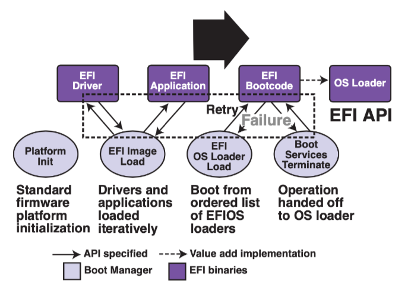

# 操作系统2
[TOC]
## 第九次课（状态机模型）
谁来加载操作系统？为了让计算机系统运行程序，一定存在着软件/硬件之间的约定。所以芯片厂商（AMD、Intel）、硬件厂商（显卡、主板、内存）、操作系统厂商（Windows、Apple）之间要相互合作，由于市场竞争问题，有不止一种软硬件约定。

**整个计算机系统也是一个状态机**。计算机加电启动后，即CPU RESET，芯片厂商的电路使得处理器处于某个确定的状态：

CPU Reset (Intel® 64 and IA-32 Architectures Software Developer’s Manual, Volume 3A/3B)

- 寄存器会有初始状态
	- EIP = 0x0000fff0
	- CR0 = 0x60000010
	16-bit 模式
	- EFLAGS = 0x00000002
	interrupt disabled
	- 其他寄存器是Undefined
- 其他：处理器的大部分特性处于关闭状态，例如缓存、虚拟存储等。

`ffff0` 通常是一条向 firmware 跳转的 `jmp `指令。**firmware（固件）**是位于主板ROM上的一段代码，由硬件厂商提供。

固件会进行*硬件检查*。然后*加载操作系统*。以x86为例，BIOS会将用户数据（操作系统、加载器等）从磁盘加载到内存。准确点来说，它会把第一个可引导设备（Floppy、HDD、SDD）的第一个主扇区（最后两个字节一定是0xaa55，作为标识符）的512字节加载到物理内存的 `7c00` 位置。在将控制权转交给操作系统后，它还可以*向操作系统提供简单的硬件服务*，例如中断、访问硬盘等，但是我们一般不需要。

CPU与主板的关系：CPU通过总线和外部设备通信，而主板必须设计出与CPU相兼容的结构（总线、接口等）才能使整个计算机系统正常工作。

> 以前firmware会先查询软盘再查询硬盘。所以软盘的默认标识符就用A、B，而硬盘的默认标识符是C

现在Firmware有两种：

- BIOS（逐渐要被淘汰）

- UEFI：各个厂商制定的统一标准。功能更丰富，例如支持文件系统，指纹认证等。可靠性、安全性更好。

	

## 第10次课 （状态机模型的应用）

### 物理世界

宏观物理世界（牛顿）近似于deterministic的状态机。状态转移就是物理定理。而微观世界可能是non-deterministic，例如量子力学。

[Conway's game of life](https://playgameoflife.com/)把物理世界建模成基本粒子的运动，是一个计算机与物理结合的应用。而且还被证明是图灵完备的。

状态机 + 一些公理还可以对平行宇宙、时间穿梭等概念做出定义，虽然可能不切实际 😑。

推荐阅读的文章：[Why philosophers should care about computational complexity, Ch. 10](https://www.scottaaronson.com/papers/philos.pdf)

> 个人认为以状态机视角来理解世界是很肤浅的🙃，但也提供了另一个理解世界的角度。

### 编译器与CPU优化

编译器以及CPU超标量/乱序执行等技术，可以使得在程序状态机翻译成数字电路状态机时，只需保证在可观测行为一致前提下，修改状态机以做优化工作。

一个例子[ilp-demo.c](http://jyywiki.cn/pages/OS/2022/demos/ilp-demo.c)。测试结果表明，程序运行速度远远超过你的CPU主频的，这得益于编译器以及CPU所做的优化。

### 查看状态机

gdb/strace不仅可以观察状态机的执行，而且还可以甚至记录和改变状态机的执行，例如状态回溯以及状态拷贝。

程序执行是随时间 “前进” 的 $s_0 \to s_1 \to s_2 \to ...$。记录所有$s_i$的开销太大 ($s_i$由内存 + 寄存器组成)。但一条指令的**side-effect **通常有限，只记录初始状态，和每条指令前后状态的差异 $s_0,Δ0,Δ1,…$

- 正向执行：$s_{i+1} = s_i + \Delta_0$
- 反向执行：$s_{i-1} = s_i e \Delta_0^{-1}$

对于deterministic指令的差异，我们可以简单地进行撤销工作。而且仅需记录初始状态，那么就可以复现程序执行的结果，举个例子假设$ s_0$ 执行 1,000,000 条确定的指令后得到 s'，那么只要记录 $s_0$和 1,000,000，就能通过 “再执行一次” 推导出 *s*′。

对于non-deterministic的指令，例如上锁顺序、条件变量、随机数、中断、IO指令。我们仅需保存它们的当时状态即可。

rdrand指令的副作用仅限于寄存器，所以gdb可以以低成本来保存状态，而有些复杂的指令（syscall）无法保证，因为gdb无法知道全部状态或者代价太大。

这篇论文说明了如何重放一整个虚拟机的执行。这对于安全测试中的现场复现很重要。[ReVirt: Enabling intrusion analysis through virtual-machine logging and replay](http://jyywiki.cn/OS/2022/slides/10.slides) (OSDI'02, Best Paper 🏅)

你甚至可以类比游戏的回放机制🤣，无非就是用日志记录玩家的行为，将整个系统变为确定性的。

profiler和性能摘要

性能摘要无非就是回答了“为了做某件事到底花去了多少资源”，或者说“一段时间内资源的消耗情况”。

> Premature optimization is the root of all evil. (D. E. Knuth)

对状态机执行进行采样，统计关键性能指标，然后去做性能分析。性能摘要需要对程序执行性能影响最小，往往不需要 full trace，而是每隔一段时间中断后进行采样。

其中关键性指标包括：

- 函数的调用栈
- 执行的语句
- 其他

Linux Kernel perf的例子

- perf list, perf stat (-e), perf record, perf report

这是内核为我们提供的一个性能统计工具。

工业界现在用火焰图[The flame graph](https://cacm.acm.org/magazines/2016/6/202665-the-flame-graph/fulltext) 进行性能分析。

Model Checker可以探索程序的状态空间，一些工业界用的Model Checker：

- [TLA+](https://lamport.azurewebsites.net/tla/tla.html) by Leslie Lamport;
- [Java PathFinder (JFP)](https://ti.arc.nasa.gov/tech/rse/vandv/jpf/) 和 [SPIN](http://spinroot.com/)

non-deterministic的状态都可以检查，但状态空间太大，所以要将相似状态合并。基本思路是把状态随机性保留着，延迟状态的展开，那么这个状态将会坍缩，等真正需要该状态的结果时再执行计算，具体来说是通过约束求解器对状态进行展开。

下面给出一个例子

~~~c
u32 x = rdrand();
u32 y = rdrand();
if (x > y)
  if (x * x + y * y == 65)
    bug();

~~~

如果直接对状态进行展开，那么会有$2^{64}$种状态。

- [KLEE: Unassisted and automatic generation of high-coverage tests for complex systems programs](https://dl.acm.org/doi/10.5555/1855741.1855756) (OSDI'08, Best Paper 🏅)

## 第11次课（进程）

### Q1  操作系统启动后到底做了什么？

操作系统会加载一个进程init，它会完成基本的工作，例如启用shell、加载文件系统等，使得整个系统“跑起来”。

[RTFSC](https://elixir.bootlin.com/linux/latest/source/init/main.c#L1555) (latest Linux Kernel)

~~~c
if (!try_to_run_init_process("/sbin/init") ||
	    !try_to_run_init_process("/etc/init") ||
	    !try_to_run_init_process("/bin/init") ||
	    !try_to_run_init_process("/bin/sh"))
		return 0;

	panic("No working init found.  Try passing init= option to kernel. "
	      "See Linux Documentation/admin-guide/init.rst for guidance.");
~~~

- 如果没有指定启动选项 `init=`，按照 “默认列表” 尝试一遍
- 从此以后，Linux Kernel 就进入后台，成为 “中断/异常处理程序”

操作系统为 (所有) 程序提供 syscall包括：

- 进程管理：fork、execve、exit
- 内存管理：mmap等
- 文件管理：open、close、read、write等
- 其他：网络

而`init`用fork, execve, exit 和其他系统调用创造整个操作系统世界。

### Q2  操作系统如何管理程序 (进程)？

**虚拟化：操作系统在物理内存中保存多个状态机，即管理状态机！**

**状态机的创建：fork()**

fork()会做一份对状态机的完整复制 (内存、寄存器现场)，除了fork的返回值（在父进程中返回子进程的PID，而在子进程中返回0）以及PID。

因为状态机是复制的，所以总能找到 “父子关系”，也就是说有了进程树 (pstree)，**pstree命令**可以查看进程树。

一个很好玩的命令，系统crash可别怪我🤯🤯🤯

~~~bash
$ :(){ :|:& };:
~~~

习题（1）

~~~c
pid_t pid1 = fork();
pid_t pid2 = fork();
pid_t pid3 = fork();
printf("Hello World from (%d, %d, %d)\n", pid1, pid2, pid3);
~~~

虽然fork之后两个程序是并发的，但是它们是完全相互独立的，所以**fork状态图可以简化成进程树图**。

习题（2）

~~~c
for (int i = 0; i < 2; i++) {
  fork();
  printf("Hello\n");
}
~~~

- 试一试：`./a.out` v.s. `./a.out | cat`

这是因为如果stdout执行tty，那么它就是`line buffer`；如果指向file或者pipe，那么它就是`full buffer`。可以通过`setbuf(stdout, NULL) ` `fllush(stdout)`强制刷新缓冲区。

思考题：多线程程序的某个线程执行 `fork()`，应该发生什么？

**状态机的重置：execve()**，将当前运行的状态机重置成成另一个程序的初始状态（环境变量 + 命令行参数）。

~~~c
int execve(const char *filename, char * const argv, char * const envp);
int main(int argc, char* argv[], char* envp[]);
~~~

- 使用env命令查看当前shell的环境变量

	- `PATH`: 可执行文件搜索路径。举一个例子 strace gcc

		~~~shell
		[pid 28369] execve("/usr/local/sbin/as", ["as", "--64", ...
		[pid 28369] execve("/usr/local/bin/as", ["as", "--64", ...
		[pid 28369] execve("/usr/sbin/as", ["as", "--64", ...
		[pid 28369] execve("/usr/bin/as", ["as", "--64", ...
		~~~

		这个搜索顺序恰好是 `PATH` 里指定的顺序

		另一个例子：

		~~~c
		stat(".", {st_mode=S_IFDIR|0755, st_size=4096, ...}) = 0
		stat("/usr/local/sbin/env", 0x7ffcd389a1c0) = -1 ENOENT (No such file or directory)
		stat("/usr/local/bin/env", 0x7ffcd389a1c0) = -1 ENOENT (No such file or directory)
		stat("/usr/sbin/env", 0x7ffcd389a1c0)   = -1 ENOENT (No such file or directory)
		stat("/usr/bin/env", {st_mode=S_IFREG|0755, st_size=43352, ...}) = 0
		stat("/usr/bin/env", {st_mode=S_IFREG|0755, st_size=43352, ...}) = 0
		 execve("/usr/bin/env", ["env"], 0x5610965e4920 /* 4 vars */) = 0
		~~~

		

	- `PWD`: 当前路径

	- `HOME`: home 目录

	- `DISPLAY`: 图形输出

	- `PS1`: shell 的提示符

- `export`: 修改环境变量

	~~~shell
	$ export PS1=*
	~~~

	

**状态机的销毁：exit()**

- `exit(0)` - `stdlib.h` 中声明的 libc 函数，会调用 `atexit`。return语句等价于这个调用。
- `_exit(0)` - glibc 的 syscall wrapper，执行 “`exit_group`” 系统调用终止整个进程 (所有线程)，并且不会调用 `atexit`。
- `syscall(SYS_exit, 0)`，执行 “`exit`” 系统调用终止当前线程，不会调用 `atexit`

atexit注册一个在程序exit时要执行的函数。

~~~c
void exit_function() {}
atexit(exit_function);
~~~

**strace以及gdb是怎么实现的？**它们都是使用ptrace系统调用，外加中断、信号机制，此外还有硬件提供的支持。

## 第12次课（进程的地址空间）

**进程的地址空间就是多个能文件关联的、带有访问权限（读、写、执行）的连续内存段**，例如`a.out`,` ld.so`,` libc.so`,` heap`, `stack`,` vdso`内存段。不在段内/违反权限的内存访问触发 `SIGSEGV`。

pmap [pid]可以查看一个进程的memory layout，它的实现是读取/proc/[PID]/maps（man 5 proc）文件中的内容。maps文件中给出内存段的地址 (范围) 和权限 (rwxsp)，以及对应的文件: offset, dev, inode, pathname。

readelf -l 也可以查看进程的memory layout

~~~shell
555555554000-555555555000 r--p 00000000 08:20 24257                      /root/code
555555555000-555555556000 r-xp 00001000 08:20 24257                      /root/code
555555556000-555555557000 r--p 00002000 08:20 24257                      /root/code
555555557000-555555559000 rw-p 00002000 08:20 24257                      /root/code
7ffff7fca000-7ffff7fce000 r--p 00000000 00:00 0                          [vvar]
7ffff7fce000-7ffff7fcf000 r-xp 00000000 00:00 0                          [vdso]
7ffff7fcf000-7ffff7fd0000 r--p 00000000 08:20 44881                      /usr/lib/x86_64-linux-gnu/ld-2.31.so
7ffff7fd0000-7ffff7ff3000 r-xp 00001000 08:20 44881                      /usr/lib/x86_64-linux-gnu/ld-2.31.so
7ffff7ff3000-7ffff7ffb000 r--p 00024000 08:20 44881                      /usr/lib/x86_64-linux-gnu/ld-2.31.so
7ffff7ffc000-7ffff7ffe000 rw-p 0002c000 08:20 44881                      /usr/lib/x86_64-linux-gnu/ld-2.31.so
7ffff7ffe000-7ffff7fff000 rw-p 00000000 00:00 0 
7ffffffde000-7ffffffff000 rw-p 00000000 00:00 0                          [stack]
~~~

> 地址空间会随机化，调试器会把这个特性关掉。

anon内存段是未经初始化的bss区。在程序加载时为其分配内存，这样可以节省磁盘空间。

vdso (7): Virtual system calls: 无需陷入内核的系统调用。vvar是vdso系统调用所需的数据，由操作系统负责更新。vdso与vvar都是内存映射。一个例子[vdso.c](http://jyywiki.cn/pages/OS/2022/demos/vdso.c)，内核维护秒级的时间 (所有进程映射同一个页面)。

init指令产生中断0x80，经硬件处理，CPU执行对应的系统调用。它还需要做中断现场保护工作。总体来说，这是开销很大的操作。为此x64提供了syscall指令（fast call to privilege level 0 system procedures）。

Linux x86-64 实现中，中断和异常都使用中断门，而任务门/陷阱门/调用门是不使用的。而 syscall 执行下列代码，它和中断/异常根本没关系。

~~~c
RCX    <- RIP; (* 下条指令执行的地址 *)
RIP    <- IA32_LSTAR;
R11    <- RFLAGS;
RFLAGS <- RFLAGS & ~(IA32_FMASK);
CPL    <- 0; (* 进入 Ring 0 执行 *)
CS.Selector <- IA32_STAR[47:32] & 0xFFFC
SS.Selector <- IA32_STAR[47:32] + 8;
~~~

syscall根据通用寄存器以及特殊的寄存器来执行指定的系统调用。

使用共享内存 + 同步机制与内核通信，也可以执行系统调用。

### 进程的地址空间管理

mmap将把文件映射到进程地址空间，这是很自然的事情因为文件 = 字节序列、内存 = 字节序列。从状态机的角度来说，mmap在状态上增加/删除/修改一段可访问的内存

~~~c
#include <sys/mman.h>
// 映射
void *mmap(void *addr, size_t length, int prot, int flags,
           int fd, off_t offset);
int munmap(void *addr, size_t length);

// 修改映射权限
int mprotect(void *addr, size_t length, int prot);
~~~

- `addr`：指定映射的虚拟内存地址，可以设置为 NULL，让 Linux 内核自动选择合适的虚拟内存地址。

- `MAP_PRIVATE`：建立一个写时复制（Copy on Write）的私有映射空间。
- `MAP_SHARED`：与其它所有映射到这个文件的进程共享映射空间（通过页页表项执行page cache来实现），注意会缓冲写操作。

同步 `mmap` 映射的内存到磁盘有 4 个时机：

- 调用 `msync` 函数主动进行数据同步（主动）。
- 调用 `munmap` 函数对文件进行解除映射关系时（主动）。
- 进程退出时（被动）。
- 系统关机时（被动）。

ELF loader根据可执行文件的ELF文件头，用mmap加载动态链接库。以及直接用mmap将可执行文件的代码映射到进程空间中。

### 地址空间隔离（<del>游戏外挂</del>）

一个指针可以访问本进程中任何合法地址

- 代码，只读
- 数据 (`static int x`)，读写
- 堆栈 (`int y`)，读写
- 运行时分配的内存 
- 动态链接库 

访问非法地址导致 segmentation fault。

~~~c
int main() {
	void *p = main;	//只能打印地址
    int (*p)() = main	//只能打印地址和调用该函数，这些都是语法限制
}
~~~

/proc/[PID]/maps会给其他进程暴露特定进程的内存布局，并且还可能通过mmap有权限修改其内存。为什么操作系统要将这么危险的操作暴露给用户呢？原因就是为了解决调试的需求。可以别有用心的人可以用此制作游戏外挂

利用mmap等技术还可以实现热补丁，这里不再介绍。

## 第13次课（系统调用和Shell）

Shell（壳）是内核与用户之间的接口，也就是说，它是一个用户能直接操作的程序来管理操作系统对象。Shell是一门把用户指令翻译成系统调用的编程语言。实际上Window11的GUI也可以认为是一个Shell。但Shell狭义上是指CLI（Command-line interface）。

man sh读手册！！

一个最小的零库函数依赖（-ffreestanding 编译、ld 链接）的shell：[sh-xv6.c](http://jyywiki.cn/pages/OS/2022/demos/sh-xv6.c)。其中-ffreestanding告知GCC正在编译内核。

读sh-xv6.c代码可知：

- cd命令是一个内部命令，在shell代码里实现，这是因为目录是当前进程的状态，必须在当前程序中处理。而其他命令是一个个程序。

- 直接调用系统函数：

	~~~c
	long syscall(int num, ...) {
	  va_list ap;
	  va_start(ap, num);
	  register long a0 asm ("rax") = num;
	  register long a1 asm ("rdi") = va_arg(ap, long);
	  register long a2 asm ("rsi") = va_arg(ap, long);
	  register long a3 asm ("rdx") = va_arg(ap, long);
	  register long a4 asm ("r10") = va_arg(ap, long);
	  va_end(ap);
	  asm volatile("syscall"
	    : "+r"(a0) : "r"(a1), "r"(a2), "r"(a3), "r"(a4)
	    : "memory", "rcx", "r8", "r9", "r11");
	  return a0;
	}
	~~~

	其中系统函数号对应的宏在<sys/syscall.h>，而各个寄存器的使用请查阅手册man 2 system。

- pipe()与命令行中的管道是有所不同的，代码如下：

	~~~c
	case PIPE:
	      pcmd = (struct pipecmd*)cmd;
	      assert(syscall(SYS_pipe, p) >= 0);
	      if (syscall(SYS_fork) == 0) {
	        syscall(SYS_close, 1);
	        syscall(SYS_dup, p[1]);
	        syscall(SYS_close, p[0]);
	        syscall(SYS_close, p[1]);
	        runcmd(pcmd->left);
	      }
	      if (syscall(SYS_fork) == 0) {
	        syscall(SYS_close, 0);
	        syscall(SYS_dup, p[0]);
	        syscall(SYS_close, p[0]);
	        syscall(SYS_close, p[1]);
	        runcmd(pcmd->right);
	      }
	      syscall(SYS_close, p[0]);
	      syscall(SYS_close, p[1]);
	      syscall(SYS_wait4, -1, 0, 0, 0);
	      syscall(SYS_wait4, -1, 0, 0, 0);
	      break;
	~~~

	

	

- 

	

- 命令的parse，是二叉树 + 递归分析解决的。例如命令

	~~~shell
	(echo a ; echo b) | wc - l
	~~~

	它的语法树为：

The Shell Programming Language

- 重定向: `cmd > file < file 2> /dev/null`

	2> 指定的是错误标准流。

- 顺序结构: `cmd1; cmd2`, `cmd1 && cmd2`, `cmd1 || cmd2`

	；执行每一个命令 

	&& 执行到第一个错误命令就终止

	|| 执行到第一个正确命令就终止

- 管道: `cmd1 | cmd2`

- 预处理: `$()`, `<()`，将命令的输出作为其他命令的参数，例如

	~~~shell
	cat $(ls)
	~~~

- 变量/环境变量

- 控制流

	- jobs，打印当前对话的所有任务，-l顺带打印进程号

	- fg，将指定任务放到前台执行
	- bg，将指定任务放到后台执行

	- ctrl + Z，将前台任务放到后台执行，并且stop

	- ctrl + C，终止前台任务。

​	

Shell在自然语言、机器语言以及1970s的算力之间达到了完美的平衡，但是仍有语法的二义性，例如

- ls > a.txt | cat

	是先`>`再`|` 还是先` |`再 ` >`？

- 每个程序对文本数据有着不同解释，尤其是在解释空格时。因此要责任自负

- ~~~shell
	echo hello > /etc/a.txt			//Permission 
	sudo echo hello > /etc/a.txt
	//Permission
	sudo vim /etc/a.txt
	~~~

	这是因为优先执行重定向，而sudo作为命令会之后再执行，因此就无权限执行。

Shell的展望

- 自动补全（vscode）
- 自动修复（Stackoverflow）
- Executable formal semantics for the POSIX shell

Linux中前台、后台、终端、Shell、对话的关系：

- 终端是与shell进行交互的设备。它们之间建立起唯一一个对话。终端可以通过/dev/pts/[ID]来访问。终端对用户的输入和输出做了抽象

- Session 中的每个进程组被称为一个 job，有一个 job 会成为 session 的前台 job(foreground)，其它的 job 则是后台 job(background)。

- Only the foreground process group may read(2) from the terminal; if a background process group tries to read(2) from the terminal, then the group is sent a `SIGTTIN` signal, which suspends it.
	
	验证程序
	
	~~~c
	int flag = 0;
	void handler(int i) {
	    if (flag) return;
	    switch(i) {
	        case SIGTTIN : {
	            int fd = open("file.txt", O_WRONLY | O_APPEND);
	            write(fd, "SINGAL", 6);
	            close(fd);
	            flag = 1;
	        }
	    }
	}
	int main(int argc, char* argv[])
	{
	    signal(SIGTTIN, handler);
	    int i;
	    scanf("%d", i);
	    return 0;
	}
	~~~
	
	
	
	- 同一个进程组的进程 read tty 会有数据竞争问题
	
	进程通过标准输入、标准输出、标准错误流与终端进行交互。
	
- The `setpgid()` and `getpgrp()` calls are used by programs such as bash(1) to create process groups in order to implement shell job control.

tmux工具用来模拟多个终端，并且支持分屏操作。

实现原理：在/dev/pts中创建文件来模拟终端。

为什么`printf` 能识别 tty 和管道？通过strace可知，使用过fstat来实现的

可以编写信号处理器还重新定义默认的信号处理行为。

注意：fork会复制信号处理器的。

如果信号由终端产生，那么这个信号会被发送给前端进程组中的所有进程。

## 第14次课（C标准库的实现）

如果没有标准库的话，我们只能使用操作系统提供的系统调用，而且必须带有编译选项-ffreestanding，以及只能使用少量的头文件，例如：[stdint.h](https://www.cplusplus.com/reference/cstdint/) 、[stdbool.h](https://www.cplusplus.com/reference/cstdbool/) 、[stdarg.h](https://www.cplusplus.com/reference/cstdarg/)等。

最原始的系统调用如下：

~~~c
asm volatile("syscall"
    : "+r"(a0) : "r"(a1), "r"(a2), "r"(a3), "r"(a4)
    : "memory", "rcx", "r8", "r9", "r11");
  return a0;
~~~

而操作系统以C语言的形式为我们封装了一下这些syscall指令，例如

~~~c
extern char **environ;
char *argv[] = { "echo", "hello", "world", NULL, };	//error，因为没有PATH环境变量
if (execve(argv[0], argv, environ) < 0) {
  perror("exec");						
}
~~~

而库函数进一步为我们封装：

### 封装系统调用

~~~c
execlp("echo", "echo", "hello", NULL);		//复制父进程的环境变量，因此在使用相对路径时，可以找到环境变量PATH。
system("echo hello");
~~~

### 纯粹的计算

例如[string.h](https://www.cplusplus.com/reference/cstring/)、qsort、[setjmp.h](https://www.cplusplus.com/reference/csetjmp/)、[math.h](https://www.cplusplus.com/reference/cmath/)等。这些基本上不需要系统调用。

虽然我们能写出玩具代码，但是业界要考虑的事情更多，例如安全检查、缓存和流水线对性能的影响、线程安全等。

其中标准库只对其自身实现的线程安全负责，例如printf的buffer，一个例子[memset-race.c](http://jyywiki.cn/pages/OS/2022/demos/memset-race.c)。

但是如果在手册中显式说明库函数是thread-safety的，那么它保证了在应用层面上的线程安全。例如scanf

### 文件描述符

UNIX的设计哲学：一切皆为文件。所以我们按理可以通过文件访问任何操作系统对象

我们以gdb来窥探glibc的一些内部实现：FILE的缓冲区实现

~~~c
FILE *file = fopen("file.txt", "r");
fprintf(file, "Hello World\n");

gdb: p *file
    
{_flags = -72536956, _IO_read_ptr = 0x555555559480 "Hello World\n", _IO_read_end = 0x555555559480 "Hello World\n",
  _IO_read_base = 0x555555559480 "Hello World\n", _IO_write_base = 0x555555559480 "Hello World\n", _IO_write_ptr = 0x55555555948c "",
  _IO_write_end = 0x55555555a480 "", _IO_buf_base = 0x555555559480 "Hello World\n", _IO_buf_end = 0x55555555a480 "", _IO_save_base = 0x0,
  _IO_backup_base = 0x0, _IO_save_end = 0x0, _markers = 0x0, _chain = 0x7ffff7fb85c0 <_IO_2_1_stderr_>, _fileno = 3, _flags2 = 0, _old_offset = 0,= 0, _vtable_offset = 0 '\000', _shortbuf = "", _lock = 0x555555559380, _offset = -1, _codecvt = 0x0, _wide_data = 0x555555559390, _freeres_list = 0x0, _fr
eeres_buf = 0x0, __pad5 = 0, _mode = -1, _unused2 = '\000' <repeats 19 times>}
~~~

### 其他

err，error，perror是libc为C语言提供的错误处理机制，注意errno是进程共享的。

还有environ可以读取到进程的环境变量

~~~c
extern char* *environ;
~~~

在动态链接中，这个变量是由加载器来赋值的，可以通过gdb验证这一点：

~~~c
$gdb starti
$gdb wa environ
$gdb c
    //output
Old value = (char **) 0x0
New value = (char **) 0x7fffffffde38
_init (argc=1, argv=<optimized out>, 
    envp=<optimized out>) at init-first.c:77
~~~

### 地址空间

在大区间$ [L, R)$中维护互不相交的区间的集合$ M={[ℓ_0,r_0),[ℓ_1,r_1),…,[ℓ_n,r_n)} $。

`malloc`，`mmap`申请某个区间，而`free`向集合$M$归还空间。

各种各样的内存分配策略在特定的workload讨论，你要记住**脱离workload 做优化就是耍流氓**。

**$O(n) $大小的对象分配后至少有$ \Omega(n) $的读写操作，否则就是 performance bug (不应该分配那么多)。 ** **而且越小的对象创建/销毁就越频繁，也就是生存周期短。**

在并行系统上，再采用单链表策略分配内存是不可取的，这是因为若4个线程被分配到4个CPU上，若它们都想获取内存，那么必须对整个链表上锁。这会严重损耗性能。

因此我们设置两套系统**Fast and Slow**。这是一个很重要的设计思想，在计算机系统的方方面面都体现着，例如Futex锁的实现、缓存的设计、分支预测等。

- fast path
	- 性能极好、并行度极高、覆盖大部分情况
	- 但有小概率会失败 (fall back to slow path)
- slow path
	- 不在乎那么快
	- 但把棘手的事情做好

> 社会制度也应该这么做Fast and Slow。人类也是这样的系统：Daniel Kahneman. *Thinking, Fast and Slow*. Farrar, Straus and Giroux, 2011.

fast path中我们为每个线程维护一个已分配的内存，而当这些内存不够时，我们slow path，即从进程的内存池中再获取一些内存。业界实例：slab系统

### 更多的封装

libc的手册[The GNU C Library](https://www.gnu.org/software/libc/manual/)，libc的源码[Newlib](https://sourceware.org/newlib/)

我们能用C形式化语义以及libc编写出C++、Go、V8（JavaScript）这些编程工具，再用这些编程语言实现MySQL、Web等各种各样应用，从而设计出整个计算机软件世界。这些都可以看做是libc的封装。这也反映了计算机设计哲学：抽象+封装。

【手画图】

## 第15次课（fork应用）

## 第16次课（可执行文件）

## 工具使用

time命令，测量程序的运行时间

timeout命令，设置程序的最长运行时间

gdb info inferiors，查看当前调试程序的pid以及可执行文件。

gdb x 打印地址，但不能访问vvar，这是一个特性，不是bug

ld 链接

strace -T 打印系统调用所花费的时间

info local 查看局部变量

snapshot 将状态拷贝

reverse 状态后退。

record full -开始记录

record stop -结束记录

reverse-step 时间旅行调试

step 就是单步执行，会进入到函数内部

next 是在单步执行时，但不会进入函数内部

finish就是但单步执行到子函数内时，用step out就可以执行完子函数余下部分

strace -f -o log command

- -o filename 输出写入到指定文件中的数据.
- -f 跟踪由fork调用所产生的子进程.

tail命令查看log文件。

tty 命令可以查看当前 shell 所属的 tty 信息

在man手册中，/word将查找word

