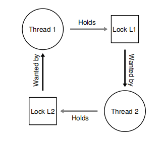
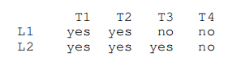
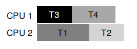
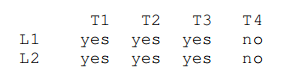
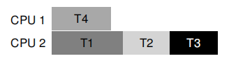

# 死锁

[TOC]

## 概述

我们了解一个简单的死锁案例

~~~c
//Thread 1
pthread_mutex_lock(L1);
pthread_mutex_lock(L2);

//Thread 2
pthread_mutex_lock(L2);
pthread_mutex_lock(L1);
~~~




在生产环境中很容易产生死锁，原因如下：

- 各个组件之间存在复杂的依赖关系

- 封装（encapsulation）技术屏蔽了内部实现细节。例如Java中Vector.addAll方法就是多线程安全（multi-thread safe）的，如果您写出以下代码，可能就会导致死锁。

	~~~java
	Vector v1, v2;
	//Thread1
	v1.AddAll(v2);
	//Threan2
	v2.AddAll(v1);
	~~~


## 死锁的产生与预防

死锁产生的四个必要条件：

- Mutual exclusion：一个线程独占它所需要的资源。
- Hold-and-wait：独占资源的那个线程等待获取额外的资源（其他线程现在独占着的）。
- No preemption：如果资源A被某个线程独占，那么它不能从那个线程中被迫释放，除非那个线程主动释放资源A。
- Circular wait：线程间的资源获取存在着循环依赖关系。


只要破坏上述任意一个必要条件，那么死锁就不会产生。下面我们分别考察这四个必要条件。


### 破坏Circular wait

最简单的破坏Circular wait的方式就是按**全序关系（total ordering）**获取锁。也就是说如果你要维护$L_1, L_2,...,L_n$这$n$个锁，那么在你的代码中根据需要依次获取$L_1, L_2,...,L_m,m \leq n$，然后再依次释放$L_m, ...,L_1$。但是这种方法并发粒度大，性能并不好。因此，人们提出了按**偏序关系（partial ordering）**获取锁，这种方法完美应用在Linux内存映射代码中。锁的获取要同时满足各个组中所要求的顺序，例如组A要求i_mutex -> i_mmp_rwsem，而组B要求I-mmap_rwsem -> private_lock -> swap_lock -> i_pages_lock。

不论是全序关系还是偏序关系，都需要仔细设计锁策略。而且这种关系仅仅是一种约定，程序员可能因为马虎而破坏这些锁协议，而造成死锁的产生。

> 假设有一个函数接受两个锁类型的参数：function(mutex_t *m1, mutex_t *m2)。而调用function(L1, L2)与调用function(L2, L1)就会在函数体内按不同顺序获取锁，从而破坏锁协议。为了避免这个问题，可以根据锁变量的地址依次获取到锁，从而保证了按照地址的全序关系进而避免了死锁。
>
> ~~~c
> if (m1 > m2) {
>     pthread_mutex_lock(m1);
>     pthread_mutex_lock(m2);
> } else {
> 	pthread_mutex_lock(m2);
>     pthread_mutex_lock(m1);
> }
> ~~~
>
> 

### 破坏Hold-and-wait

通过一次获取到全部的锁而破坏Hold-and-wait条件，此外还有维护一个全局锁prevention，prevention锁保证在线程A获取全部的锁时，其他线程无法获取到这些锁。

~~~c
pthread_mutex_lock(prevention);
pthread_mutex_lock(L1);
pthread_mutex_lock(L2);
//...
pthread_mutex_unlock(prevention);
~~~


这种方法降低并发度，因为可能获取到它现在先不需要的锁。

### 破坏No Preemption

许多线程库提供pthread_mutex_trylock()，如果获取锁失败，不像pthread_mutex_lock()直接阻塞线程，而是直接返回-1，获取成功返回0。基于这一点我们可以破坏No Preemption条件。下面给出基于该函数的锁协议：

~~~c
top:
	pthread_mutex_lock(L1);
	if (pthread_mutex_trylock(L2) != 0) {
        pthread_mutex_unlock(L1);			//失败了就被迫释放该锁
        goto top;
    }
~~~

但是，这又会导致另一个问题：活锁（livelock），即两个线程重复执行获取锁的代码，但它们都失败了，而线程没有被阻塞。有一个简单方法解决这种情况下的活锁问题：即获取锁失败后，随机延迟一段时间再去尝试获取锁。

值得注意的是：这种trylock方法并不是真正意义上的抢占式，而是允许程序员以一种优雅的方式处理资源的释放。真正意义上的抢占式是操作系统采取强制措施来回收线程所持有的锁。

### 破坏 Mutual Exclusion

使用锁一定会造成Mutual Exclusion。所以Herlihy在[H01，H91，H93]论文中讨论了**无锁（lock-free）**与**无等待（wait-free）**同步技术。这种技术很简单：利用**机器原子指令（machine atomic instruction）**。

> 实际上，锁的实现也是基于原子指令的


下面给出基于锁的链表插入操作以及无锁的

~~~c
void insert(int value) {
	node_t *n = malloc(sizeof(node_t));
    n->value = value;
    do {
        n->next = head;
	} while (CompareAndSwap(&head, n->next, n) == 0)
}

void insert(int value) {
	node_t *n = malloc(sizeof(node_t));
    n->value = value;
    pthread_mutex_lock(listlock);
    n->next = head;
    head = n;
    pthread_mutex_unlock(listlock);
}
~~~


## 通过调度避免死锁

**死锁避免（deadlock avoidance）**需要提前知道线程要占用哪些资源，才能正常工作。在现代操作系统中，处理的是交互式任务，不可能提前知道线程要占用哪些资源，故这种方法在现代操作系统中已废弃。不过在低端嵌入式系统（例如STM32）或批作业处理系统中，这种方法仍可以发挥作用。

下面给出一个例子来说明：假设有两个锁L1、L2，以及四个线程T1、T2、T3、T4。那么yes表示它需要该资源，no表示不需要。



调度器根据某种算法这样安排它们：



如果



那么



但这样会十分浪费CPU资源。

另一个著名的例子就是Dijkstra's Banker's Alogorithm[D64]。这里简要介绍一下：

~~~c
while (P != ∅) {
    found = FALSE;
    foreach (p ∈ P) {
        if (Mp − Cp ≤ A) {
             A = A + Cp ;
             P = P − {p};
             found = TRUE;
        }
    }
    if (!found) return FAIL;
}
return OK		
~~~

- P - 进程的集合

- Mp - 进程p的最大的请求数目

- Cp - 进程p当前被分配的资源

- A - 当前可用的资源

```
      Allocation　　　Max　　　Available
 　　 ＡＢＣＤ　　  ＡＢＣＤ　　ＡＢＣＤ
 P1   ００１４　　  ０６５６　　１５２０　
 P2　 １４３２　　  １９４２　
 P3　 １３５４　  　１３５６
 P4 　１０００　　  １７５０
```

## 检测与恢复死锁

这种技术在生产环境中广泛应用，因为完全避免死锁的开销是难以接受的，而且几乎对整个软件系统没有提升。除非您为出于安全性的考虑才要完全避免死锁，例如航天飞机编写多线程代码:）。


## 参考文献

- [D64] “Een algorithme ter voorkoming van de dodelijke omarming” by Edsger Dijkstra. 1964.Available: http://www.cs.utexas.edu/users/EWD/ewd01xx/EWD108.PDF. 
- [H01] “A Pragmatic Implementation of Non-blocking Linked-lists” by Tim Harris. International Conference on Distributed Computing (DISC), 2001. 
- [H91]*“Wait-free Synchronization” by Maurice Herlihy . ACM TOPLAS, 13:1, January 1991.
- [H93] “A Methodology for Implementing Highly Concurrent Data Objects” by Maurice Herlihy. ACM TOPLAS, 15:5, November 1993. 

