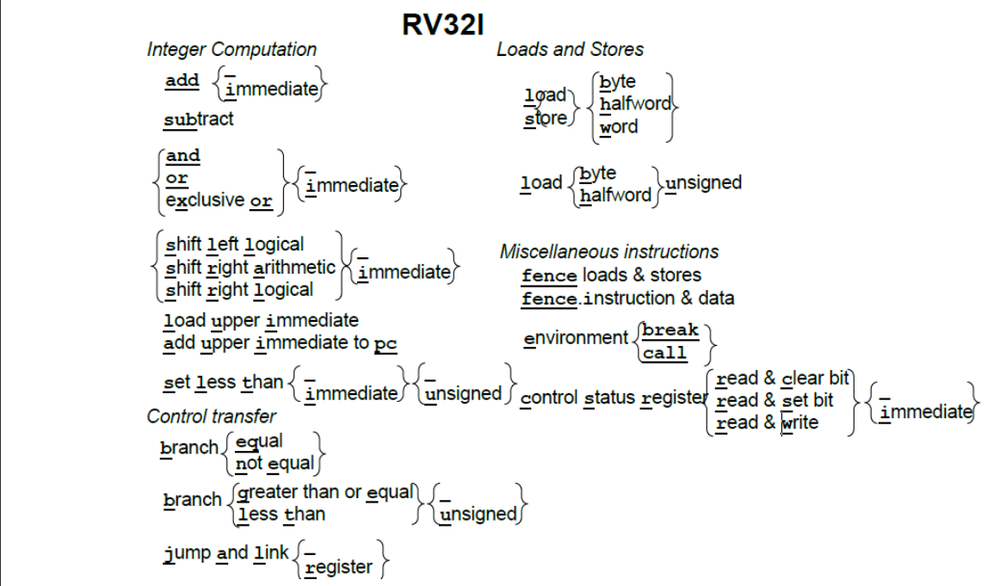
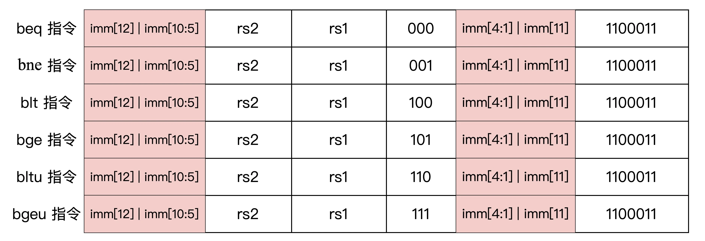

# RISC-V

[TOC]

## 概述

## RV32I

 任何基于**RISC-V ISA**构建的处理器必须实现**RV32I（基础整数指令集）**。

指令如下图所示：

为了帮助程序员进行调试，执行32位全为0或者全为1的指令会立即触发异常。

RISC-V中的立即数是有符号的，有符号扩展到32位后才会参与运算。

RISC-V 选择了**小端字节序**，因为它在商业上占主导地位：所有 x86-32 系统，Apple iOS， 谷歌 Android 操作系统和微软 Windows for ARM 都是低字节优先序。字节序在按字访问和按字节访问同一数据源的情况下才会有对程序员影响。

RISC-V对于**内存对齐**并没有要求，这简化了整体的设计。

寄存器`x0`被硬性编码为`0`，任何写入到`x0`的操作都会被处理器忽略。

下面对指令进行详细的说明：

### 算数指令（add，sub）

~~~RISC-V
add rd, rs1, rs2		#rd = rs1 + rs2
addi rd, rs1, imm		#rd = rs1 + imm
sub rd, rs1, rs2		#rd = rs1 - rs2
~~~

注：sub的立即数版本用addi指令来实现

无符号数的加减算法和有符号数的是一样的，故无需再设计无符号数版本的加法指令。而且无符号数与有符号数相加减仍是无符号数，这在地址计算中是很重要的。

RISC-V并不在硬件上支持整数算术溢出检测，而x86通过设置EFLAG寄存器来进行溢出检测，这使得大多数指令都需要隐式设置一些额外状态，这使乱序执行的依赖性计算复杂化。RISC-V在软件层面上检查溢出，代码如下：

~~~risc
# 无符号数加法
addu t0, t1
bltu t0, t1, overflow

# 有符号数加法
add t0, t1, t2
slti t3, t2, 0		# t3 = (t2 < 0)
slt t4, t0, t1		# t4 = (t1 + t2 < t1)
bne t3, t4, overflow	# if (t2 < 0) && (t1 + t2) >= t1 || (t2 >= 0) && (t1 + t2 < t1) then overflow
~~~

可以实现大位宽数据的加法，主要是处理进位情况

~~~risc-v
add a0, a1, a2 		#a0 = a1 + a2 a0存放低32位
sltu a2, a0, a2
add a5, a3, a5
add a1, a2, a5		#a1存放高32位
~~~

逻辑指令（and，or，xor）

~~~RISC-V
and rd, rs1, rs2 		#rd = rs1 & rs2
andi rd, rs1, imm		#rd = rs1 & (signed)imm
or rd, rs1, rs2			#rd = rs1 & rs2
...

~~~

 移位指令（sll，srl，sra）

~~~risc-v
sll rd, rs1, rs2
slli rd, rs1, imm
...
~~~

RISC-V不支持循环移位指令。

 slt & sltu

~~~risc-v
slt rd, rs1, rs2	
sltu rd, rs1, rs2	
#if rs1 < rs2 then rd = 1 otherwise rd = 0
~~~

### lui & auipc

这两个指令用于构建32位立即数

先说明它们的语法格式

~~~risc-v
lui rd, imm			#rd = imm << 12
auipc  rd, imm		#pc = pc + imm << 12; rd = (new)pc
~~~

下面演示如何构造32位立即数

把32位立即数存放到寄存器，一般使用`lui` + `addi`的指令组合

~~~risc-v
lui x2, 0xfffff
addi, x2, x2 0xfff
#x2 = 0xffffffff
~~~

上述构造是有问题的，想想为什么。

因为addi中的立即数会有符号扩展到32位，如果addi中立即数最高位是1，那么将lui中立即数加1就可以避免这种问题。

`auipc`+`jalr`指令组合实现32位偏移量的相对跳转

~~~risc-v
auipc x1, imm[12 : 31]
jalr x0, x1, imm[0 : 11]
~~~

### 控制转移指令

 

无条件跳转（jal，jalr）

~~~risc-v
jal rd, label			# rd = pc + 4; pc = pc + (label << 1)
jalr rd, rs1, imm		# rd = pc + 4; pc = rs1 + imm；
~~~

一般用`jalr`指令实现`switch`、函数调用等特性

`auipc`+`jalr`指令组合实现32位偏移量的相对跳转，代码见`auipc`指令

`lui` + `jalr`指令组合实现32位绝对跳转

~~~risc-v
lui x1, imm[12 : 31]
jalr x0, x1, imm[0 : 11]
~~~

条件跳转（beq、bne、blt、bltu、bge、bgeu）

~~~risc-v
beq rs1, rs2, label
bne rs1, rs2, label
blt rs1, rs2, label				
~~~

以`blt`指令为例，如果`rs1 < rs2`条件满足，那么就跳转到`Label`处。注意`blt`中的`Label`必须位于当前指令地址的偏移`-4096 - 4095`范围内。这是由于RISC-V指令的长度是2的倍数，为了跳转到更大的范围，12位的立即数首先乘以`2`，然后再加到`PC`中去。而`jal`中的`Label`是一个20位的立即数，所以可跳转的范围是$PC \pm 1MB$。

### load and store

RISC-V不像x86那样，指令的操作数可以是内存。RISC-V的操作数只能是寄存器或者立即数，即所有的操作都在寄存器之间 。这样做的好处是可以预先计算出程序所需的时钟周期以及减少体系结构的复杂程度。

~~~risc-v
lw rd, imm(rs1)			#rd = mem[rs1 + imm]
sw rs2, imm(rs1)		#mem[rs1 + imm] = rs2
~~~

注意立即数是有符号扩展的。

此外还有`lb`、`lbu`、`lh`、`lhu`、`sb`、`sh`。load时会将`mem[rs1 + imm]`扩展（有符号或者无符号）到32位后，在存储到`rd`中。

### 其他指令

控制状态寄存器指令（`csrrc、csrrs、csrrw、csrrci、csrrsi、csrrwi`）

系统调用指令 `ecall`

调式指令`ebreak`

### 指令格式

有以下六种格式类型如下：

值得注意的是，立即数的最高位总是在指令31位上。

### 伪指令

## 汇编、链接、加载

### 函数调用

函数的调用过程通常分为六个阶段：

- 参数传递到被调用函数能够访问到的位置，通常是寄存器或者栈中
- 跳转到函数的开始位置
- 保存被调用者保存寄存器的内容，获取函数需要的局部存储资源，通常是寄存器或者栈中。
- 执行指令
- 返回值保存到调用者能够访问到的位置，并恢复寄存器，释放局部资源
- 从函数中返回到调用点

寄存器的使用约定

根据上述ABI规范以及函数调用的过程，我们可编码出标准的RV32I函数：

~~~risc-v
	# save not preserved register
	jalr ra, t1, 0			# t1 holds the address of callee entry_label
	
	
entry_label:
	addi sp, sp, -framesize		#allocate space for stack frame by adjusting stack pointer
	sw ra, framesize-4(sp)		# save return address
	# save other registers to stack if needed
	# body of the function
	# restore registers from stack if needed
	lw ra, framesize-4(sp)		# restore return address register
	addi sp, sp framesize		# deallocate space for stack frame
	ret						  # return tp calling point 
~~~

`ret`是伪指令，它等价于`jalr x0, x1 0`。

### 汇编指示符

.aligin integer，以$2^{integer}$字节对齐

.balign integer，以$integer$字节对齐

.globl sym，定义全局符号`sym`

.section [{.text, .data, .rodata, .bss}] ，定义段，省略参数则默认是`.text`的

.string "str"，定义字符串`str`

.equ name, value，定义名为name的常量value，它并不会占用任何空间。

.word w1, w2, ... ,wn，在当前内存位置连续存储n个字。

其他部分需要再学习 [risc-v book](http://riscvbook.com/chinese/RISC-V-Reader-Chinese-v2p1.pdf)。

## RISC M 乘法除法指令

无符号数的乘法算法与有符号数的是不一样的，所以需要两个版本的乘法指令。与此同时，在一条指令中把64位的乘积运算结果存放到两个寄存器中会使得硬件设计变得复杂，所以RV32M需要两条乘法指令才能得到一个完成64位的积。`mul`指令获得低32位的结果，`mulh`获得高32位的结果。

~~~risc-v
mul rd, rs1, rs2
mulhsu rd, rs1, rs2
div rd, rs1, rs2
divu rd, rs1, rs2
rem rd, rs1, rs2
...
~~~

RV32I不会因为除以零操作而产生异常。可以通过在执行除法操作前执行`beqz`伪指令来判断除数是否为零。

下面两点不再做说明，有需求再详细研究。

- mulhsu 对于多字有符号乘法很有用

- mulh 和 mulhu 可以检查乘法的溢出

## RISC F D 单双浮点指令

## RISC V 向量指令

## RISC A 原子指令

RV32A有两种类型的原子操作：

- 内存原子操作（AMO）
- 加载保留/条件存储（load reserved / store conditional）

在这里只介绍加载保留/条件存储的基本使用，更多细节等到充分体系结构知识后再补充：

~~~risc-v
lr.w  rd, (rs1)

sc.w rd, rs2, (rs1)
~~~

`lr.w`将`mem[rs1]`的内容加载到寄存器`rd`中。在执行`sc.w`指令时，如果`mem[rs1]`的内容改变，则向`rd`写入`0`，否则向`rd`写入`1`并且将`rs2`的内容写入到`mem[rs1]`中。

## 系统编程 *

在`risc-v`架构内，程序运行在三个模式中：

- Machine Mode，所有的RISC-V处理器都必须实现这种模式，
- Supervisior Mode，操作系统在这种模式下运行
- User Mode，应用程序必须在User Mode下运行

### 中断

RISC-V将异常分为了两类：

- 内部中断
	- 计时器中断（Timer Interrupt）
	- 软件中断（Software Interrupt）
- 外部中断

异常的代码

mcause最高位表示异常类型，而其余各位表示异常原因。

机器模式下异常处理的必要部分是这8个**控制状态寄存器（CSR）**：

|   名称   |                             全称                             |                     功能描述                     |
| :------: | :----------------------------------------------------------: | :----------------------------------------------: |
|  mtvec   | 异常入口基地址寄存器（Machine Trap-Vector Base-Address Register） |                                                  |
|   mepc   |      异常PC寄存器（machine Exception Program Counter）       |                 指向引发异常指令                 |
|  mcause  |           异常原因寄存器 (Machine Cause Register)            |                                                  |
|   mie    | 局部中断屏蔽控制寄存器（Machine Interrupt Enable Register）  |  表示是否屏蔽某个中断，布局与Exception Code相同  |
|   mip    |     中断等待寄存器（Machine Interrupt Pending Register）     | 表示当前待处理的中断，布局与Exception Code相同。 |
|  mtval   |         异常值寄存器（Machine Trap Value Register）          |                                                  |
| mscratch |                          暂存寄存器                          |                                                  |
| mstatus  |        异常处理状态寄存器（Machine Status Register）         |                                                  |

- MIE：为1表示中断的全局开关打开，中断能够被正常响应

CPU响应中断所作的工作

- 将更新mepc CSR的内容。
- 

### 进程隔离

### 虚拟内存

