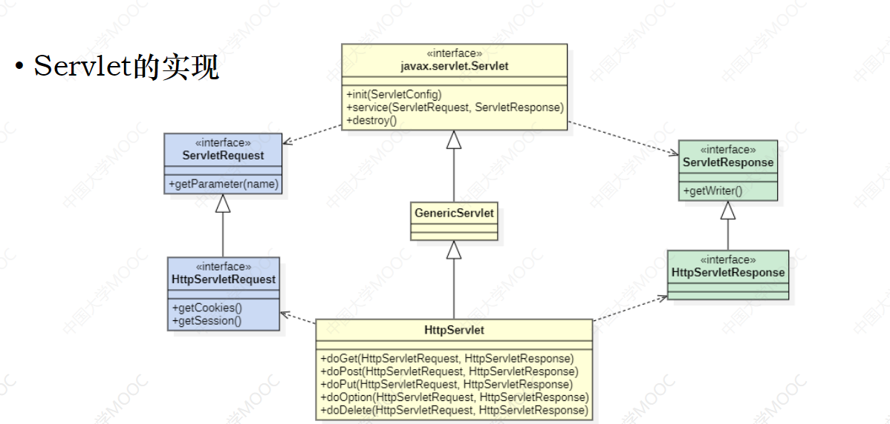

# Servlet

[TOC]

## HTTP

### URL

```
https://www.example.com:80/path/to/myfile.html?key1=value1&key2=value2#SomewhereInTheDocument
```

- 协议（http、https）：https://

- 域名：www.example.com

- 端口：80

- 资源路径：/path/to/myfile.html

- 额外参数：?key1=value1&key2=value2。

	~~~html
	<a href="/23638727/favlist?fid=1802813327&ftype=create"> </a>
	
	<form>
	    <input name="username" />
	    <input name="password" />
	</form>
	~~~

	

- 资源的锚点：#SomewhereInTheDocument


### HTTP协议的特点

- 无状态：cookie以及session解决这一问题。cookie在客户端解决这问题，而session在服务端解决这问题。
- 无连接：
- 灵活：支持各种格式的数据


HTTP请求协议有以下三部分组成

- 请求行：
	- Method：GET、POST 
	- Request-URL：资源路径 + 额外参数
	- HTTP-Version
- 请求头：Connection、User-Agent、Accept
- 请求体（请求正文）：


HTTP响应协议

- 状态行
	- HTTP-Version
	- status code
	- 状态码对应的字符串，这字符串在每个浏览器之间存有差异
- 响应头：Content-type
- 响应体


请求头字段：

- Referer：在跳转到当前页面时，浏览器会自动添加该字段，以指明上一个跳转过来的页面的地址。如果直接从地址栏输入页面地址，那么没有该请求头。用于防盗链或指定页面的访问顺序。

	>浏览器就像一个安全的沙盒

	

响应头字段：

- Location：重定向，用于更换域名。浏览器在解析该字段后，会强制跳转到指定页面

- Refresh：可以通知浏览器在指定的时间后跳转到其他页面，或者定时刷新当前页面。

	可以通过meta标签实现此功能

	~~~html
	<meta http-equiv="refresh" content="5;url=http://www.bilibili.com">
	~~~

	


## Tomcat

>  服务器是大体上来说就是，等待客户端的请求，根据请求类型，将分发给不同的方法来处理，最后将处理结果返回给客户端。


Tomcat是一个轻量级Web应用服务器，符合JavaEE标准的Web容器。

### 目录结构

- bin：Tomcat的脚本文件
- lib：Tomcat的jar包
- logs：日志文件
- conf ：Tomcat服务器的配置文件：
	- server.xml：配置连接时间、服务器端口等
	- tomcat-users：服务器用户的权限
	- web：mime-type与文件类型之间的映射
- webapps：各个web项目
- work：保存jsp生成的源码


注意：webapps下的各个子文件夹就是一个项目文件，所有html、css、JavaScript都放在这个子文件夹中。项目文件夹中有个WEB-INF文件夹，该文件夹不允许被用户访问，因此保存源代码、jar包等文件。


项目的根目录就是webapps下的子文件夹webapp。而Servlet程序以及外部资源的路径由Tomcat服务器统一管理，并且将HTTP请求到达或者调用相关API所提供的URL映射到正确的路径。通过servlet_context.getRealPath("/")获取到资源真正的路径。

这里要注意一点：**在html页面中的根路径是服务器的根路径而不是项目的根路径！**


当有HTTP请求到达Tomcat服务器时，它会自己发送HTTP响应请求将资源发送回客户端，或者调用Servlet程序。

Tomcat集成到IDEA中 "File" -> "Setting" -> "Build, Execute, Employment" -> 
"Application Servers"。添加文件夹为"apache-tomcat-9.0.70"

## Servlet

Servlet是Server与Applet的缩写，即服务端小程序。Servlet容器有Tomcat、Jetty等。Servlet项目的创建、使用、销毁都由Servlet容器进行管理。

### Servlet的实现

~~~java
import java.servlet.http.*;	//Tomcat容器会有个这包
@WebServlet(name = "helloServlet", value = "/hello-servlet")	
/*
	设置注解，注册成为Servlet组件，指定该服务资源在浏览器中访问的路径，在这里的话就是http://localhost:8080/demo1_war_exploded/hello-servlet
	demo1_war_exploded是项目地址，可以在Tomcat的Deployment中更改
	注意注解中的value是一个string[] 所以可以这样写
	@WebServlet(name = "helloServlet", value={"/s1", "/s2", "/s3"})
	@WebServlet(name = "helloServlet", urlPatterns = {"/ser01"})
*/
public class servletXXX extends HttpServlet {			//创建普通Java类，并实现Servlet规范
	@Override
    protected void service(HttpServletRequest req, HttpServeltResponse resp) throws ServletException, IOException {				//覆写service方法，处理http请求
        
    }
}
~~~

@Web("url")注解等价于webapp/WEB-INFO/web.xml中的

~~~xml
<servlet>
    <servlet-name></servlet-name>
    <servlet-class></servlet-class>
</servlet>
<servlet-mapping>
    <servlet-name></servlet-name>
    <url-pattern>url</url-pattern>
</servlet-mapping>
~~~




service实现的部分代码

~~~JAVA
protected void service(HttpServletRequest req, HttpServletResponse resp) throws ServletException, IOException {
        String method = req.getMethod();
        
        if (method.equals("GET")) {
            
        } else if (method.equals("HEAD")) {
            
        } else if (method.equals("POST")) {
            this.doPost(req, resp);
        } else if (method.equals("PUT")) {
            this.doPut(req, resp);
        } else if (method.equals("DELETE")) {
            this.doDelete(req, resp);
        } else if (method.equals("OPTIONS")) {
            this.doOptions(req, resp);
        } else if (method.equals("TRACE")) {
            this.doTrace(req, resp);
        } else {
            
        }

    }
~~~

所以最好覆写doGet这些方法。


### Servlet的生命周期

- **初始化**：容器查看组件是否存在，如果不存在，则容器创建实例，且之后会调用组件的`init()`方法。
- **服务**：如果组件存在，则每次有请求到达时容器就会调用组件的`service()`方法。
- **销毁**：在服务（Servlet）关闭时，调用`destroy()`方法。

### HttpServletRequest对象

方法：

- getRequestURL()
- getRequestURI()
- getQueryString()
	- getParameter(name)
	- getParameterValues(name)
- getMethod()
- getProtocol()
- getContextPath()

~~~java
		//获取请求时的完整路径，不包括参数
		req.getRequestURL();

        //获取请求时的部分路径，只包括资源路径
        req.getRequestURI();

        //获取请求时的参数字符串
        req.getQueryString();

        //获取请求方式
        req.getMethod();

        //获取当前协议版本
        req.getProtocol();

        //获取项目的站点名
        req.getContextPath();
        
        //获取指定名称的参数值
        String username = req.getParameter("username");
        String password = req.getParameter("password");
        System.out.println(username + " " + password);

        //获取指定名称参数的所有参数值（复选框）
        String[] hobbys = req.getParameterValues("hobby");
        for ( String hobby: hobbys) {
            System.out.println(hobby);
        }


		//获取HTTP协议的body部分
		InputStream inputStream = request.getInputStream();	

//http://localhost:8080/demo2_war_exploded/ser01?username=GaoRuofan&password=grf.2001&hobby=dance&hobby=rap

/*
	http://localhost:8080/demo2_war_exploded/ser01
	/demo2_war_exploded/ser01
	username=GaoRuofan&password=grf.2001&hobby=dance&hobby=rap
	GET
	HTTP/1.1
	/demo2_war_exploded
	GaoRuofan grf.2001
	dance
	rap
*/
~~~


### HttpServletResponse对象

#### 字符乱码问题

在Tomcat8以上，Get请求不会乱码，而Post请求会乱码。这是因为request的Post请求默认编码为`ISO-8859-1`（此编码不支持中文）。

解决方法（一）：此方案对Get请求乱码无效。

~~~java
request.setCharacterEncoding("UTF-8");
~~~

解决方案（二）：仅限于对Tomcat 7及以下版本中的Get请求使用

~~~java
String var = new String(request.getParameter("username").getBytes("ISO-8859-1"), "UTF-8");
~~~

字符编码的本质就是二进制表示，对于编码格式的转换，实际上就是对二进制进行处理。而且转换时可能会信息丢失


> 请求转发 + request作用域 + jsp是一整套技术栈。而现在前后端分离，这种技术被淘汰了，了解即可。

#### 请求转发

将请求转发给其他Servlet或者让Tomcat容器发送静态资源。

~~~java
request.getRequestDispatcher(url).forward(request, response);
~~~

只能转发一次请求，而且转发后，不能再此Servlet中发送响应体，否则`500`。

#### request作用域

将键值对存放在Request对象中，以实现jsp页面与Servlet之间的数据共享。

```java
req.setAttribute(String name, Object value);
req.getAttribute(String name);
req.removeAttribute(String name)
```


### HttpServletRespnose对象

- `getWriter()`，字符流，输出字符串
- `getOutputStream() `，字节流，输出二进制数据

~~~java
PrintWriter writer = resp.getWriter();
writer.write("Hello");

ServletOutputStream out = resp.getOutputStream();
out.write("Hi".getBytes());
~~~

注意：不能同时打开`getWriter`以及`getOutputStream`。


getOutputStream()、getWriter()的字符乱码，服务器端进行编码时默认会使用ISO-8859-1。解决方案：

~~~java
//设置服务端的编码格式
response.setCharacterEncoding("UTF-8");
//设置客户端的编码格式，否则浏览器以默认编码格式，例如GDK，来解释UTF-8数据。
response.setHeader("content-type", "text/html;charset=UTF-8");

//同时设置服务端与客户端的编码格式
response.setContentType("text/html;charset=UTF-8");
~~~


response.sendRedirect(url);		重定向

url形如https://... 则重定向网站，其他的是相对项目根目录进行重定向的。

~~~java
sendRedirect("https://www.bilibili.com");	// jump to https://www.bilibili.com
sendRedirect("www.bilibili.com")		   //jump to  Project/www.bilibili.com
~~~


请求转发是服务端行为，仅有一次请求，数据在request域中共享，不允许跨域！

而重定向是客户端行为，有两次请求，数据在request中并不共享，允许跨域。


注：当response对象的发送是由容器控制的！

## Cookie对象

Cookie对象在HTTP协议用Set-Cookie进行传输。每次发送HTTP请求时，都携带着Cookie对象，从而“模拟”有状态的传输。

Cookie作用：

- Cookie是将服务器的少量数据保存在客户端本地上的，以降低服务器的运行负荷。
- 或者用Cookie将用户行为数据发送回服务器。

同源规则是适用于Cookie对象的！第三方Cookie是指域A设置了一个域B的Cookie，那么域A将一些数据主动共享给域B！

### Cookie创建、发送、获取

~~~java
Cookie cookie = new Cookie("name", "admin");
response.addCookie(cookie);


Cookie[] cookies = request.getCookies();
cookies[0].getName();
cookies[0].getValue();
~~~

服务器发送重复Cookie，那么就会覆盖原有的Cookie。

Cookie存储数量和大小是有上限的，大小一般是4kb。

### Cookie乱码问题

Cookie和url一样是不支持中文的：解决方案是：

~~~java
URLEncoder.encode(String);		//姓名 -> %D0%D5%C3%F8 
URLDecoder.decode(String);		//%D0%D5%C3%F8  -> 姓名
~~~


到期时间的取值

- 负整数：浏览器关闭即cookie失效，-1为默认值
- 正整数：保存时间单位为秒，持久化存储
- 零：删除该cookie

~~~java
cookie.setMaxAge(0);
~~~


设置Cookie的路径。注意此路径是相对整个服务器的资源路径，而不是项目的资源路径，这点与WebServlet的以及请求转发中的是不一样的。

~~~java
cookie.setPath("/");		//服务器中的所有项目都可以拿到
cookie03.setPath("/demo3_war_exploded");		//服务器中的demo3_war_exploded项目可以获取
cookie04.setPath("/demo4_war_exploded/Cookie02");//服务器中demo4_war_exploded项目中的Cookie02 可以获取
~~~


## HttpSession对象

~~~java
HttpSession session = request.getSession();		//不存在则创建一个
session.getId();							//获取会话标识符
session.getCreationTime();					//获取创建时间
session.getLastAccessedTime();				//获取上次访问时间
session.isNew();							//判断是否为新的会话
~~~

HttpSession默认是用cookie来实现的，也可以通过改写URL来实现。下面简单阐述一下Session的创建：

- HTTP请求到达服务器，服务器判断在cookie中是否有JSESSIONID键值对。
	- 如果没有，则服务器创建一个新的会话对象
	- 如果有，判断此JSESSIONID是否存在服务器中
		- 如果没有，则创建一个新的会话对象（这种情况发生在服务器重启，此时内存会被重置）。
		- 返回该会话对象，从而在多个请求之间实现数据共享。


通过`setAttribute()`、`getAttribute()`、`removeAttribute()`来实现数据共享。


Session销毁的三种方式：

- Session默认不活动时间为30min。。默认不活动时间可以在web.xml中修改：

~~~xml
<session-config>
    <session-timeout>30</session-timeout>
</session-config>
~~~

- session.setMaxInactiveInterval(int)，设置不活动时间，单位为秒。

- session.invalidate()，立即销毁

	

## ServletContext对象

每一个Web应用都有且只有一个ServletContext对象，又称Application对象。


获取ServletContext对象

```java
request.getServletContext();
request.getSession().getServletContext();
getServletConfig().getServletContext();
getServletContext();					//只能在Servlet子类中使用
```

一些方法：
```java
servlet_context.getServerInfo()			//获取服务器信息
servlet_context.getRealPath("/")		//获取在文件系统中的路径
```

ServletContext也有setAttribute方法，但几乎不怎使用。

IO的有些方法是要求文件系统中的路径。而Tomcat会将资源路径统一管理，因此在项目中获取到的路径并不一定是真实的文件系统路径。所以要使用相应的`servlet_context.getRealPath("/")`方法。

## Token & JWT

## JSON

JSON类库分别为：**Gson，FastJson，Jackson，Json-lib**。这里我们介绍Jackson。

依赖：

~~~xml
<!-- https://mvnrepository.com/artifact/com.fasterxml.jackson.core/jackson-databind -->
<dependency>
    <groupId>com.fasterxml.jackson.core</groupId>
    <artifactId>jackson-databind</artifactId>
    <version>2.14.1</version>
</dependency>
<!-- https://mvnrepository.com/artifact/com.fasterxml.jackson.core/jackson-core -->
<dependency>
    <groupId>com.fasterxml.jackson.core</groupId>
    <artifactId>jackson-core</artifactId>
    <version>2.14.1</version>
</dependency>
<!-- https://mvnrepository.com/artifact/com.fasterxml.jackson.core/jackson-annotations -->
<dependency>
    <groupId>com.fasterxml.jackson.core</groupId>
    <artifactId>jackson-annotations</artifactId>
    <version>2.14.1</version>
</dependency>
~~~

**序列化 (Serialization)**是将对象的状态信息转换为可以存储或传输的形式的过程。

~~~Java
ObjectMapper mapper = new ObjectMapper();
Person person = mapper.readValue(json, Person.class);
String json = mapper.writeValueAsString(person);
~~~

这种mapper必须提前定义好POJO对象才能够进行转换，这是十分麻烦的。所以Jackson提供了jsonObject以及支持向Map的转换。注意在Javascript中，对象就是一个Map，所以Javascript的JSON是很方便灵活的。


在解析时处理时间的格式

```java
@JsonFormat(pattern = "yyyy-MM-dd")
```

## 案例 — 文件上传与下载

如果表单enctype为multipart/form-data，那么必须设置注解@MultipartConfig，Servlet才支持文件上传。具体来说@MultipartConfig的Servlet对象会将multipart/form-data的POST请求封装成Part对象，并通过Part对象对上传的文件进行操作。

如果不设置，那么请求体里的数据解析不出来，getParameter()、req.getPart()都会抛出异常。

~~~java
@WebServlet("/uploadServlet")
@MultipartConfig
public class UploadServlet extends HttpServlet {
    @Override
    protected void service(HttpServletRequest req, HttpServletResponse resp) throws ServletException, IOException {
        req.setCharacterEncoding("UTF-8");
        String uname = req.getParameter("uname");
        req.getPart("myfile").write(req.getServletContext().getRealPath("/") 
                   + "/" 
                   + part.getSubmittedFileName());
    }
}
~~~


文件下载的两种方式

- 前端：`<a>`标签

- 后端：

	- Content-Type设置为application/octet-stream或application/x-msdownload
	- Content-Disposition设置为attachment;filename="文件名"
	- 使用getOutputStream

	核心代码

	~~~java
	
	resp.setContentType("application/x-msdownload");
	resp.setHeader("Content-Disposition", "attachment;filename=" + filename);
	InputStream in = new FileInputStream(file);
	ServletOutputStream out = resp.getOutputStream();
	while ((length = in.read(bytes)) != -1) {
	      out.write(bytes, 0, length);
	}
	~~~

	

## 数据库 日期时间的处理

推荐使用java.sql.Timestamp，直接与MySql中的datetime对应。

~~~java
Timestamp time = new Timestamp(System.currentTimeMillis());	//获取当前时间
time = Timestamp.valueOf(str)			//String -> Timestamp
SimpleDateFormat df = new SimpleDateFormat("yyyy-MM-dd HH:mm:ss");  
String timeStr = df.format(time);		//Timestamp -> String
JSONmapper.setDateFormat(new SimpleDateFormat("yyyy-MM-dd"));	//与JSON配合使用
~~~

