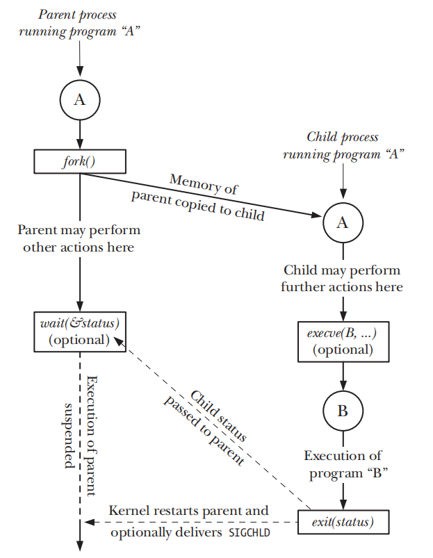
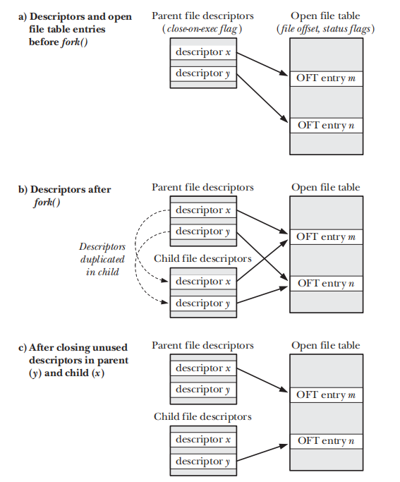
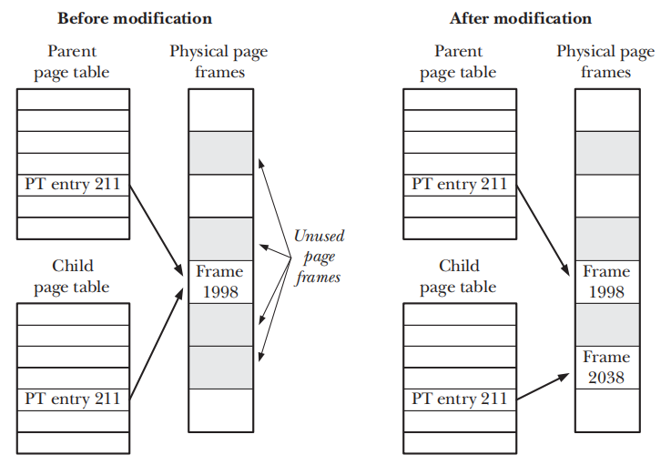

# 进程

[TOC]

 

## 创建进程

### fork

fork函数声明如下：

~~~c
#include <unistd.h>
pid_t fork(void);
~~~

fork()系统调用会创建一个新的进程——子进程，并且将父进程的系统资源（程序文本段、栈、堆、静态或全局数据区以及其他）复制给子进程。此外子进程也会复制父进程的文件描述符表。

下面是使用fork的惯例：

~~~c
	pid_t childPid = -1;
    switch (childPid = fork()) {
        case -1:
            /*Handle error*/
        case 0 :
            /*Perform actions specific to child*/
        default :
            /*Perform actions specific to parent*/
    }
	/*common code for child and parent*/
~~~

如果fork()仅仅将父进程的虚拟页面（virtual frame）复制给子进程，那么十分浪费资源而且性能损失严重。因此，现代操作系统采用以下两种技术来实现fork（注：以下仅考虑一级页表）

- 内核将每个进程的程序文本段设置为**只读（read-only）**的。因此，fork通过让子进程的页表项指向物理页面，该物理页面同样是由父进程的页表项所指向的，为子进程创建程序文本段。

- fork()处理堆、栈、静态或全局数据区的方法与处理文本段的类似，但是使用了**写时复制（copy-on-write）**技术。在为子进程创建页表时，每个页表项都指向父进程页表项所指向的物理页面，并且将这些父子进程的页表项都设置为只读的。如果任何一方尝试修改物理页面，那么将会抛出异常。此时操作系统捕获异常，并调用相应的中断处理程序为子进程分配新的物理页面，并修改相应的虚拟页面。

	

	> 写时复制技术的实现可参阅[Bach, 1986] and [Bovet & Cesati, 2005]这两篇论文。

在父进程中，fork()会返回子进程的PID；而在子进程中，会返回0；如果fork()函数执行失败，则返回-1。注意fork()返回后，父子进程哪个被CPU优先调用是不确定的，这种不确定性可能会导致**竞争条件（race conditions）**。在Linux2.6.32版本中，/proc/sys/kernel/sched_child_runs_first决定了`fork()`返回时父子进程谁被CPU调用。最好根据以下行为来设置sched_child_runs_first的值

- 子进程仅仅执行exec，而优先调度父进程并且触发了copy-on-write机制。为了避免浪费，应该优先调度子进程
- 计算机体系架构建立起了父进程的状态（TLB、Cache）。为了性能，应该优先调度父进程

绝对大多数情况，这两种行为之间的差异不会影响到应用程序。

如果你要保证父子进程的执行顺序，建议使用信号量、文件锁、信号等机制来同步它们之间的执行。

有些操作系统将`fork`与`exec`函数的功能组合起来，构成所谓的`spawn`操作。但是`UNIX`这种方法更加简单优雅，它允许程序在`fork`与`exec`这两步中执行某些操作，这提供了一定的灵活性。此外，在某些情境下仅仅执行`fork`也是很有用的。

> `SUSv3`标准规范了`posix_spawn()`函数。它允许程序在不支持分页交换以及内存管理的这种体系架构上（通常是嵌入式系统）创建进程。在这种体系架构下，通常很困难甚至不可能实现`fork()`。

在早期BSD实现中，它提供了vfork()，以解决fork()复制物理页面而造成的资源浪费以及性能问题。它的声明如下：

~~~C
#include <unistd.h>

pid_t vfork(void);
~~~

vfork与fork由以下不同

- vfork不会为子进程复制虚拟页面甚至创建页表，而是与父进程共享内存，直到它成功执行exec()或者_exec()。因为文件描述符表是由内核维护的，所以vfork会为子进程复制一份父进程的，除了stdio文件描述符。
- 父进程会暂缓执行，直到子进程成功执行exec()或者_exec()。因此这保证了子进程一定在父进程之前被CPU调度。

> 因为现在fork实现都使用了copy-on-write技术，而且由于vfork奇怪的语义而导致微妙的程序BUG，所以在正常情况下应当避免再使用vfork()。只有极少数情况下，vfork()才能带来性能提升，但是也不推荐使用。
>
> SUSv3将vfork标记为废除的，在SUSv4直接移除了vfork。而且一些UNIX系统直接用fork来实现vfork，在Linux 2.0内核上也确实是这么做的。这样违背了vfork语义，程序的可移植性得不到保证。

## 终止进程

exit()库函数封装_exit()系统函数。

wait函数通常用在`SIGHLD`信号（默认被父进程忽略）的处理器中

## 监控子进程

## 执行程序

## 更多细节

