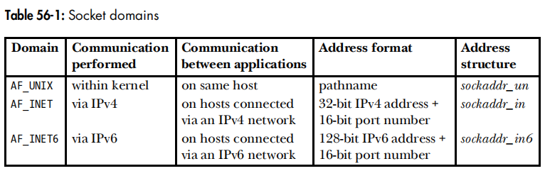
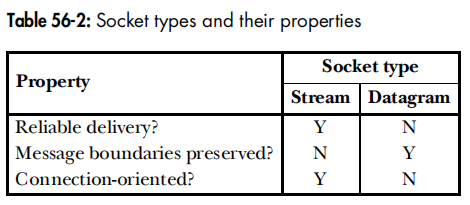
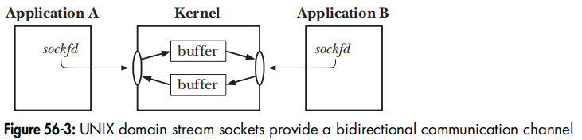
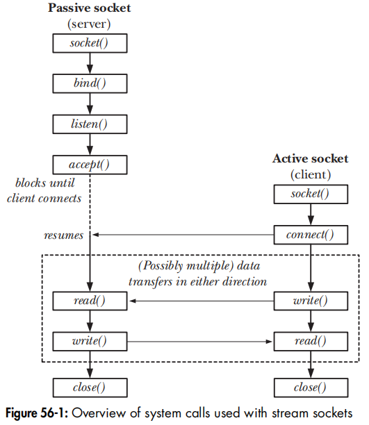
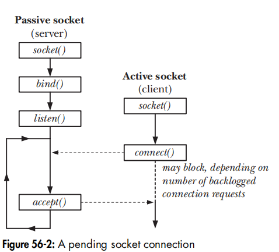
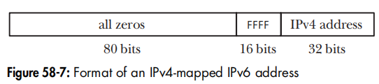
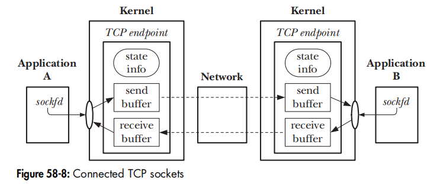

# SOCKET

[TOC]

## Theory

### Sockets

Sockets既可以用在同端系统中的进程间通信（IPC），也可以用在两端系统中的网络通信。

Sockets位于**通信域（communication domain）**中，通信域决定了：

- 标识Sockets的方法，需要程序员手动处理
- 通信的范围，内核会自动处理

现在操作系统至少支持以下通信域：

- AF_UNIX：UNIX域
- AF_INET：Internet Protocol version 4 network
- AF_INET6：Internet Protocol version 6 network

> AF代表address family，PF代表 protocol family。从理论上讲，一个PF支持多个AF。但是在实践中，PF与AF是同义的。

Socket有以下类型：Stream（TCP）、Datagram（UDP）、Raw（IP）

- **可靠交付（Reliable delivery）**是保证消息按序、不重复、不丢失，否则我们会接受到失败的通知。

- **面向连接（Connection-oriented）**

	

- **消息边界（Message boundary）**

有关socket的API：

~~~c
#include <sys/socket.h>
int socket(int domain, int type, int protocol);		
//Returns file descriptor on success, or -1 on error

int bind(int sockfd, const struct sockaddr *addr, socklen_t addrlen);	//Returns 0 on success, or -1 on error

int listen(int sockfd, int backlog);	
//Returns 0 on success, or -1 on error

int accept(int sockfd, struct sockaddr *addr, socklen_t *addrlen);	
//Returns file descriptor on success, or -1 on error

int connect(int sockfd, const struct sockaddr *addr, socklen_t addrlen);
//Returns 0 on success, or -1 on error

ssize_t recvfrom(int sockfd, void *buffer, size_t length, int flags, 
                 struct sockaddr *src_addr, socklen_t *addrlen);
//Returns number of bytes received, 0 on EOF, or -1 on error

ssize_t sendto(int sockfd, const void *buffer, size_t length, int flags, 
               const struct sockaddr *dest_addr, socklen_t addrlen);
//Returns number of bytes sent, or -1 on error
~~~

### TCP/IP

数据链路层有MTU限制

IP协议有分段机制

如果一个主机具有多个网络接口，每一个网络接口都连接着一个子网，那么我们称该主机为**多宿主主机（multihomed host）**。

IPv4地址由两部分组成：Network ID、Host ID。此外还有一个网络掩码（network mask），用于指示网络号的长度。Host ID为全零表示本网络，为全一表示子网广播地址。

127.0.0.1是一个特殊的地址——环回地址（loopbacl address），表示本地主机，用于测试客户端与服务端之间的通信。INADDR_LOOPBACK宏表示该地址。

INADDR_ANY表示IPv4的**通配符地址（wildcard address）**，SUSv3并未规定该值，大部分的实现将该值定义为0.0.0.0。这在多宿主主机上很有用，它允许一个应用绑定到主机的任意一个IP地址，而不是一个特定的IP地址。                   

IPv6提供IPv4-mapped IPv6地址，与IPv4主机通信。格式如下：

                                                                                                                                                                                                                                                                                                                                                                                                                                                                                                                                                                                                                                                                                                                                                                                                                                                                                                                                                                                                   

IPv6采用十六进制标识，并允许用唯一一个双冒号指示多个零。

传输层（Transprot Layer）解决位于不同端系统之间的应用通信问题。

其中最重要的是16bit的端口号（port number），它分为三类：

- well-known port numbers：0-1023 由IANA（http://www.iana.org/）统一分配。例如HTTP使用80，ssh使用22。这些端口号是特权的（privileged，有时被称为reserved ports），只有具有`CAP_NET_BIND_SERVICE`进程才能绑定这些port。
- registered ports：1024-41951，这些端口号分配给应用开发者（http://www.iana.org/assignments/port-numbers），许多服务松散地绑定在这些端口上
- 动态和/私有端口（Dynamic and/or Private Ports）Ephemeral ports：49152 - 65535。但是每个实现的范围不一样，Linux通过`/proc/sys/net/ipv4/ip_local_port_range`文件获取到这个范围（ 32768  ~ 60999）。

最好避免IP分段，TCP的某些机制保证避免IP分段，而UDP没有。因此UDP数据报的大小通常选择548（576 - 20 - 8）字节，甚至更少的512字节。

TCP具有连接建立、确认重传超时、流控制、拥塞控制（慢启动 + 拥塞避免）、序列机制。

## UNIX domain SOCKET

UNIX Domain Socket Address：

~~~c
struct sockaddr_un {
	sa_family_t sun_family;
    char sun_path[108];
}
~~~

> SUSv3并未规定sun_path字段的长度，推荐路径名长度不超过92。sun代表socket_unix

bind函数会在Socket Address指定的位置创建一个socket文件，该文件不能通过open()打开，而不能通过close()关闭。只能通过listen(int fd, int backlog)、connect()函数访问，通过remove()、unlink()函数删除socket文件，从而关闭socket。

socket文件作为两个进程之间通信的媒介！它们通信的数据都在socket文件当中，因此通过读写该socket文件来实现通信。

注意：accept()返回一个新的socket，表示客户端的socket，可以通过该socket从客户端中读，或者向客户端中写。

Linux允许在socket()的type参数中OR SOCK_CLOEXEC 或者 SOCK_NONBLOCK，这分别等价于FD_CLOEXEC、O_NONBLOCK

### Stream Socket

~~~c
#include "us_xfr.h"
#include "../util.h"
#define BACKLOG 5
int main(int argc, char* argv[])
{
    int sfd = socket(AF_UNIX, SOCK_STREAM, 0);
    assert(sfd != -1);
    struct sockaddr_un addr;
    memset(&addr, 0, sizeof(struct sockaddr_un));
    addr.sun_family = AF_UNIX;
    strncpy(addr.sun_path, SV_SOCK_PATH, sizeof(addr.sun_path) - 1);
    if (bind(sfd, (struct sockaddr *)&addr, sizeof(struct sockaddr_un)) == -1) errExit("bind()");
    if (listen(sfd, BACKLOG) == -1) errExit("listen()");
    for (;;) {
        int cfd = accept(sfd, NULL, NULL);
        if (cfd == -1) errExit("accept()");
        ssize_t numRead;
        char buf[BUF_SIZE];
        while ((numRead = read(cfd, buf, BUF_SIZE)) > 0) {
            if (write(STDOUT_FILENO, buf, numRead) != numRead) errExit("write")
        }
        if (numRead == -1) errExit("read()");
    }
    close(sfd);
    exit(0);
}
~~~

~~~c
#include "us_xfr.h"
#include "../util.h"
int main(int argc, char* argv[])
{
    
    int sfd = socket(AF_UNIX, SOCK_STREAM, 0);
    if (sfd == -1) errExit("socket()");
    struct sockaddr_un addr;
    memset(&addr, 0, sizeof(struct sockaddr_un));
    addr.sun_family = AF_UNIX;
    strncpy(addr.sun_path, SV_SOCK_PATH, sizeof(addr.sun_path) - 1);
    if (connect(sfd, (struct sockaddr *) &addr, sizeof(struct sockaddr_un)) == -1) errExit("connect");
    ssize_t numRead = 0;
    char buf[BUF_SIZE];
    while ((numRead = read(STDIN_FILENO, buf, BUF_SIZE)) > 0) {
        if (write(sfd, buf, numRead) != numRead) {
            errExit("write() ");
        }
    }
    if (numRead == -1) errExit("read");
    exit(EXIT_SUCCESS);
}
~~~

### Dragram Socket

~~~c
//Server
#include "ud_ucase.h"

int main(int argc, char *argv[])
{
    int sfd = socket(AF_UNIX, SOCK_DGRAM, 0);
    if (sfd == -1) errExit("socket()");
    if (remove(SV_SOCK_PATH) == -1 && errno != ENOENT) errExit("remove()");
    struct sockaddr_un svaddr;
    memset(&svaddr, sizeof(struct sockaddr_un), 0);
    svaddr.sun_family = AF_UNIX;
    strncpy(svaddr.sun_path, SV_SOCK_PATH, sizeof(struct sockaddr_un) - 1);
    if (bind(sfd, (struct sockaddr *)&svaddr, sizeof(struct sockaddr_un)) == -1) errExit("bind() ");
    for (;;) {
        size_t len = sizeof(struct sockaddr_un);
        struct sockaddr_un claddr;
        char buf[BUF_SIZE];
        ssize_t numBytes = recvfrom(sfd, buf, BUF_SIZE, 0, (struct sockaddr *)&claddr, (socklen_t *)&len);
        if (numBytes == -1) errExit("recvfrom() ");
        for (size_t j = 0; j < numBytes; j++) 
            buf[j] = toupper((unsigned char) buf[j]);
        if (sendto(sfd, buf, numBytes, 0 ,(struct sockaddr *)&claddr, len) != numBytes) errMsg("sendto()");
    }
    exit(EXIT_SUCCESS);
}
~~~

~~~c
//Client
#include "ud_ucase.h"
int main(int argc, char* argv[])
{
    if (argc < 2 || strcmp(argv[1], "--help") == 0)
        errExit("socket");
    int sfd = socket(AF_UNIX, SOCK_DGRAM, 0);
    if (sfd == -1) errExit("socket");
    struct sockaddr_un claddr;
    memset(&claddr, 0, sizeof(struct sockaddr_un));
    claddr.sun_family = AF_UNIX;
    snprintf(claddr.sun_path, sizeof(claddr.sun_path), "/home/sockets/ud_ucase_cl.%ld", (long)getpid());
    if (bind(sfd, (struct sockaddr *)&claddr, sizeof(struct sockaddr_un)) == -1) errExit("bind");
    struct sockaddr_un svaddr;
    memset(&svaddr, 0, sizeof(struct sockaddr_un));
    svaddr.sun_family = AF_UNIX;
    strncpy(svaddr.sun_path, SV_SOCK_PATH, sizeof(svaddr.sun_path) - 1);
    for (size_t i = 1; i < argc; i++) {
        size_t msgLen = strlen(argv[i]);
        if (sendto(sfd, argv[i], msgLen, 0, (struct sockaddr *)&svaddr, sizeof(struct sockaddr_un)) != msgLen) errExit("sendto");
        char resp[BUF_SIZE];
        ssize_t numBytes = recvfrom(sfd, resp, BUF_SIZE, 0, NULL, NULL);
        if (numBytes == -1) errExit("recvfrom()");
        printf("Response %d: %.*s\n", (int)i, (int)numBytes, resp);
    }
    remove(claddr.sun_path);
    exit(EXIT_SUCCESS);
}
~~~

### Abstract Namespace & socketpair()

抽象命名空间是Linux专用的特性，它具有以下优点：

- 无需担心与文件系统中的其他文件重名
- 在关闭socket，抽象名会自动移除

启用该特性，只需将sun_path的第一个字符指定为空字符`\0`即可。

~~~c
int main(int argc, char* argv[])
{
    struct sockaddr_un addr;
    memset(&addr, 0, sizeof(struct sockaddr_un));
    addr.sun_family = AF_UNIX;
    strncpy(&addr.sun_path[1], "xyz", sizeof(addr.sun_path) - 2);
    int sockfd = socket(AF_UNIX, SOCK_STREAM, 0);
    if (sockfd == -1) errExit("socket");
    if (bind(sockfd, *(struct sockaddr *)&addr, sizeof(struct sockaddr_un)) == -1) errExit("bind()");
    close(sockfd);
    exit(EXIT_SUCCESS);
}
~~~

socketpair创建一对已连接的UNIX domain sockets。可以使用该方法实现父子进程的通信

~~~c
#include <sys/socket.h>
int socketpair(int domain, int type, int protocol, int sockfd[2]);
//Returns 0 on success, or -1 on error
~~~

## Internet domain SOCKET

字节序问题困扰着网络中的数据传输。在x86上是小端，而其他大部分架构上是大端模式。为此我们统一规定网络字节序是大端的。为了在不同架构上可移植，推荐一直使用这些函数进行字节序转换：

~~~c
#include <arpa/inet.h>
uint16_t htons(uint16_t host_uint16);
~~~

>`s`表示`short`，而`l`表示表示`long`。

此外编写网络程序还需要考虑不同系统之间的数据类型尺寸、字节对齐、填充规则的差异。一种解决方案是marshalling——将要传输数的据处理成标准格式，例如XDR、ASN.1-BER、CORBA、XML、JSON（十分推荐）等。也可以将数据视为一个个字符，并用换行符来分割这些数据。因此我们可以定义readLine()函数处理这些数据。

IPv4套接字地址：struct sockaddr_in

~~~c
#include <netinet/in.h>
struct in_addr {
	in_addr_t s_addr;
}
struct sockaddr_in {
	sa_family		sin_family;
    in_port_t		sin_port;
    struct in_addr	sin_addr;
    unsigned char 	__pad[X];
}
~~~

IPv6套接字地址：struct sockaddr_in6

~~~c
#include <netinet/in.h>
struct in6_addr {
	uint8_t s6_addr[16];
}
struct sockaddr_in6 {
	sa_family_t 	sin6_family;
    in_port_t		sin6_port;
    uint32_t		sin6_flowinfo;
    struct in6_addr	 sin6_addr;
    uint32_t		sin6_scope_id;
}
~~~

其中sin6_scope_id字段以及sin6_flowinfo字段超出了教学的讨论范围，具体参考Stevens。s6_addr字段遵循大端字节序，而且在Linux中sa_addr字段可能由uint16_t数组或者uint32_t数组来实现。

glibc为我们定义了IPv6中的通配符地址IN6ADDR_ANY_INIT，以及环回地址IN6ADDR_LOOPBACK_INIT

~~~c
#define IN6ADDR_ANY_INIT {{0,0,0,0,0,0,0,0,0,0,0,0,0,0,0,0,0}}
~~~

注意C语言中复合字面量只能用在初始化语句中，不能用在赋值语句中

~~~c
struct sockaddr_in6 addr;
const struct in6_addr in6addr_any = IN6ADDR_ANY_INIT;
addr.sin6_addr = in6addr_any;
~~~

注意的是IPv4与IPv6Socket共享一个port空间。也就是说，如果IPv6Socket绑定了TCP 6000，那么IPv4Socket就不能绑定到TCP6000，但可以绑定到UDP6000。

此外还有sockaddr_storage结构体，它表示IP地址，屏蔽了IP具体版本。

~~~c
#define __ss_aligntype uint32_t;		/* On 32-bit architectures */
struct sockaddr_storage {
	sa_family_t ss_family;
    __ss_aligntype __ss_align;
    char __ss_padding[SS_PADSIZE];		/*	Pad to 128 bytes */
}
~~~

### Conversion Functions

- 一个主机地址可以由二进制数值、符号主机名、presentation format（dotted-decimal for IPv4 or  hex-string for IPv6）表示。
- 端口号可以由二进制数值、符号服务名表示。

下面介绍在这些格式中进行转换的函数

二进制与格式之间的转换，这些转换偶尔会用到。

~~~c
#include <arpa/inet.h>
int inet_pton(int domain, const char *src_str, void *addrptr);
//Returns 1 on successful conversion, or if src_str is not in presentation format, or -1 on error
const char *inet_ntop(int domain, const void *addrprt, char *dst_str, size_t len);
//Returns pointer ot dst_str on success, or NULL on error
~~~

p表示presentation，n表示network。presentation format的例子：

- 204.152.189.116
- ::1
- ::FFFF:204.152.189.116

参数domain是AF_INET或者AF_INET6。src_str表示presentation format。addrprt、dst_str根据domain参数是in_addr或者in6_addr。如果len参数指定的长度小于转换后format的长度，那么返回NULL，并且errno设置为ENOSPC。

为了确保长度足够，在<netinet/in.h>中定义了两个常量，用于表示IPv4/6 presentation format的最大长度（包括空字符）。

~~~c
#define INET_ADDRSTRLEN 16
#define INET_ADDRSTRLEN 46
~~~

二进制与符号之间的转换

还有一些废除的转换函数：inet_aton()、inet_ntoa()、gethostbyname()、getservbyname()、gethostbyaddr()、getservbyport()。

## Server Design

## Advanced topics

