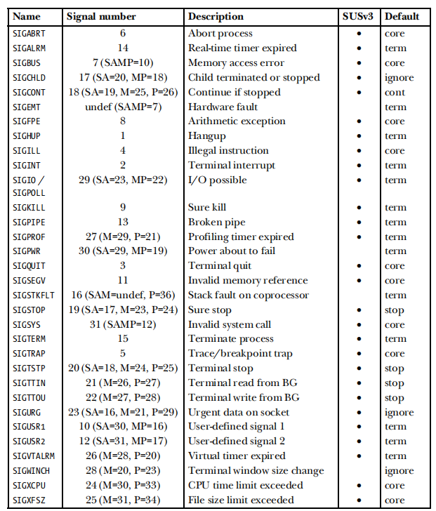
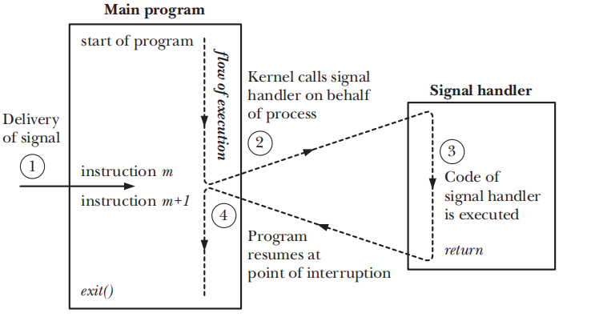
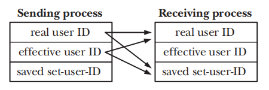

# 信号

[TOC]

## 基本概念

信号用于告知进程一个事件已经发生。信号有时被称为软件中断，要与体系结构中的软中断相区分。

进程可以向其他进程发送信号（如果它有权限的话），这可以实现同步机制，甚至可以作为IPC的原语。不过大多数信号都是由操作系统发出的。以下事件的发生会让操作系统向进程发送信号：

- 产生硬件异常
- 用户键入特殊字符，特殊字符包括：中断字符（Ctrl + C）、挂起字符（Ctrl + Z）、退出字符（Ctrl + \）
- 在程序内部发生的系统事件，例如子进程结束、调整终端窗口大小等

每个信号由独一无二的整型来标识的，并且有相对应的宏名字SIGxxxx。

信号基本上可以分为两类：

- 标准信号（standard signals）：这类信号用于内核通知进程某个事件发生了。在linu上，这些信号是用1到31的标识的。这些信号有SIGABRT、SIGALRM、SIGBUS等，建议查阅手册以了解全部的标准信号。

	

	（SA、P、M）都是在某些体系架构上为信号所分配的整型标识。还有一些信号在表中并未列出。

- 实时信号（realtime signals）

这里规范下术语，信号由事件**产生（generated）**，并且随后**发送（delivered）**给进程。在等待发送的期间内，信号处于**未决（pending）**状态。

进程的**信号屏蔽字（signal mask）**，指明当前哪个信号的发送**被阻塞（blocked）**了。如果信号被阻塞了，那么它一直处于未决状态直到从屏蔽字中移除。

进程对于信号会采取以下默认行为：

- 系统将该信号丢弃掉，从而信号被进程忽略掉（ignored），因此这类信号对进程毫无影响。
- 进程被不正常终止，这里的不正常是相对调用exit()而言的。
- 生成core dump file并且进程被终止。core dump file包含了进程的运行信息，用于debug。
- 进程被暂停
- 进程从先前的暂停中恢复执行

程序可以设置以下**信号处理（disposition）**来改变进程对信号的默认行为

- 允许默认行为，一般用于撤销之前的信号处理
- 忽略信号
- 执行信号处理器*

信号处理器就是一个函数，该函数返回类型为void，仅接受一个int实参。

~~~c
void signal_handler(int sig) { }
~~~

当发送某个信号，相应的信号处理器就会被调用，并且将信号的数值传递给sig形参，同时我们说该信号**被处理（handled）**或者**被捕获（caught）**。

信号处理器会中断进程的执行流。信号处理器退出后，会恢复进程的执行。

注意到信号处理需要调用exit()或者abort()来终止或者转储（dump core）进程。abort函数生成SIGABRT信号，可以让进程转储并且终止。

> 在Linux中、/proc/PID/status文件包含了位屏蔽字来决定进程如何处理一个信号。位屏蔽字从最低有效位到最高有效位，依次代表信号1、信号2.....。位屏蔽字有SigPnd、ShdPnd、SigBlk、SigIgn、SigCgt
>
> ps命令也可以获取到相同的信息

## 信号处理（Signal Disposition）

signal()与sigaction()用于信号处理。sigaction()比signal()更复杂，但是具有更多的功能，而且在其他unix实现上，signal()行为有所不同，因此使用signal()保证不了程序的可移植性。

signal函数声明如下：
~~~c
#include <signal.h>

void (*signal(int sig, void (*handler)(int)))(int);
~~~

sig指明我们希望改变处理方式的信号，handler指明信号处理器的地址。signal是个函数指针，成功调用signal()后，该函数指针赋予之前信号处理器的地址，否则赋予SIG_ERR。这就相当于函数的返回值了。此外，可以给handler赋值SIG_DFL，表示使用默认信号处理。赋值为SIG_IGN，表示内核会丢弃该信号，从而进程会忽略它。

glibc定义了在<signal.h>中定义sighandler_t类型，需要定义`_GNU_SOURCE`宏

~~~c
typedef void (*sighandler_t)(int)
~~~

 下面给出使用signal的例子

~~~c
#include <signal.h>
static void sighandler(int sig)
{
    static int count = 0;
    switch(sig) {
        case SIGINT :
            printf("Caught SIGINT (%d\n)", count++);
            return;
        default :
            printf("Caught SIGQUIT - that's all folks!\n");
            exit(0);
    }
}

int main(int argc, char* argv[])
{
    if (signal(SIGINT, sighandler) == SIG_ERR) exit(1);
    if (signal(SIGQUIT, sighandler) == SIG_ERR) exit(1);	//ctrl + \
    while (1) pause();
    exit(0);
}
~~~

一个进程可以使用kill系统调用向另一个进程发送信号。它的函数声明如下：

~~~c
#include <signal.h>
int kill(pid_t pid, int sig);
~~~

pid参数指定要向哪个（些）进程发送信号，sig以整型形式指定要发送信号。调用成功返回0，失败返回-1。

- pid > 0，向pid进程发送信号
- pid = 0，向本组中的所有进程发送信号，包括调用kill的进程本身。
- pid < -1，向本组中pid等于kill中pid绝对值的进程发送信号。
- pid = -1，向本组中所有进程发送信号，前提调用kill的进程是有权限向某个进程发送信号。除了init（PID = 1）以及调用kill的进程本身。

如果sig指定为0，那么可以检查特定进程是否存在。若不存在则errno设置为ESRCH

信号的发送权限规则如下：

- 特权进程（CAP_KILL）可以向任何进程发送信号

- init进程是例外情况。只能向它发送已经安装相应信号处理器的信号。这样做的原因是为了避免系统管理员意外kill init进程

- 非特权进程只能向自己的real or effective UID与real UID、saved set-user-ID相匹配的进程发送信号

	

- SIGCONT信号被特殊对待。非特权进程可以向任何其他进程发送这一信号，而忽略规则3

