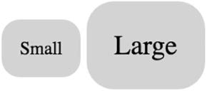

# CSS 基础

[TOC]

## 基本术语

~~~css
color : black
~~~

上述语句被称为一个**声明**，声明由一个**属性**和一个**值**组成。不要将CSS属性（Property）和HTML属性（attribute）混淆。

~~~css
body {
    color : black;
    font-family : Helvetica;
}
~~~

大括号内的一组声明被称为一个声明块。声明块前面有一个选择器。选择器和声明块一起组成了规则集（ruleset），简称规则（rules）

>20 世纪 90 年代末到 21 世纪初，在完成 CSS 规范的初始工作之后的很长一段时间，CSS几乎没有什么大的改变。1998 年 5 月，W3C（万维网联盟）发布了 CSS2 规范。紧接着开始制定 2.1 版本，对 CSS2 的问题和 bug 进行修正。CSS2.1 的制定工作持续了许多年，仍然没有增加重大的新特性，直到 2011 年 4 月，才作为提案推荐标准（Proposed Recommendation）发布。此时，浏览器已经实现了 CSS2.1 的大部分特性，并且还以 CSS3 的名义增加了更多特性。“3”是一个非正式的版本号，其实并没有 CSS3 规范，而是 CSS 规范分成了单独的模块，每个模块单独管理版本。如今背景和边框的规范脱离了盒模型模块以及层叠和继承模块。这样W3C 就能够制定 CSS 某个领域的新版本，而不需要更新其他没变的领域。很多规范仍然停留在版本 3（现在称作 level 3），但是有一些规范已经处于 level 4，比如选择器规范。还有一些规范处于 level 1，比如 Flexbox。随着这些变化的出现，我们发现从 2009 年到 2013 年,新特性呈现了爆炸式发展。在此期间值得关注的新特性包括 rem、视口的相对单位，以及新的选择器、媒体查询、Web 字体、圆角边框、动画、过渡、变形、指定颜色的不同方式等。现在每年还在不断地涌现新特性。这也意味着我们不再只针对一个特定版本的 CSS 开发了。CSS 现在是一个活的标准（living standard）。每个浏览器在持续地增加对新特性的支持。开发人员使用这些新特性，并且适应了这些变化。**未来不会有 CSS4 了**，除非人们拿它作为一个更通用的市场术语。虽然本书覆盖了CSS3 的特性，但是我尽可能不这么称呼它们，因为对于 Web 来说，它们都属于 CSS。

## 层叠

层叠机制用于解决多个规则应用到同一个元素而产生样式冲突的情况。

层叠会根据以下规则来解决冲突：

- 样式表的来源：优先级：作者样式表 > 用户样式表 > 用户代理样式表（浏览器默认样式）。这里有一种例外情况，即标记为!important的声明会被视为最高来源。

- 优先级：浏览器将优先级分为两个部分：行内样式、选择器优先级。行内样式是HTML中元素的`style`属性。**行内样式的优先级比选择器优先级高！**。而选择器优先级的规则如下：

	- 如果选择器的 ID 数量更多，则它会胜出（即它更明确）
	- 如果 ID 数量一致，那么拥有最多类的选择器胜出
	- 如果以上两次比较都一致，那么拥有最多元素名的选择器胜出

	> 伪类选择器（如:hover）和属性选择器（如[type="input"]）与一个类选择器的优先级相同。通用选择器（*）和组合器（>、+、~）对优先级没有影响。
	>
	> 最好不要以ID选择器或者个!important来设置样式，因为这样做可以提高CSS代码可扩展性、可维护性，不会演变成选择器之间的“军备竞赛”。调试或者特殊场合下可以考虑使用它们。

	

- 源码顺序：如果两个声明的来源和优先级相同，如果其中一个声明在源码中出现较晚，则该声明胜出。

	源码顺序还影响伪类的使用，一般来说链接样式的顺序为`:link` `:visited` `:hover` `:active`

**层叠值**——作为层叠结果，应用到一个元素上的特定属性的值。

## 继承

继承通常体现在，如果一个元素的某个属性没有层叠值，则**可能**隐式会继承某个祖先元素的值。但不是所有的属性都能被继承，默认情况下，只有特定的一些属性能被继承。

> 可继承的属性主要是跟文本相关的：color、font、font-family、font-size、font-weight、font-variant、font-style、line-height、letter-spacing、text-align、text-indent、text-transform、white-space 以及 word-spacing。还有一些其他的属性也可以被继承，比如列表属性：list-style、list-style-type、list-style-position 以及 list-style-image。表格的边框属性 border-collapse 和border-spacing 也能被继承。

隐式继承过来的值可以被任何层叠值覆盖掉。想要继承过来的值正常参与到层叠过程，必须显式继承，即将**inherit **和 **initial**两个特殊的属性值赋给特定的属性。

`inherit`继承父元素中对应的属性，还可以使用 inherit 关键字强制继承一个通常不会被继承的属性，比如边框和内边距。通常在实践中很少这么做。**每一个 CSS属性都有初始（默认）值**。如果将 `initial `值赋给某个属性，那么就会有效地将其重置为默认值，常用于撤销作用于某个元素的样式。

虽然`initial`与代理用户样式表都是由浏览器决定的，但不要把它们混为一谈！黑色是 color 属性的初始值。但是代理用户样式表中`p`元素的`color`、`a`元素的`color`属性值是不同的。

> 声明 display: initial 等价于 display: inline。。实际上，用 width: auto 是一样的，
>
> 因为 width 的默认值就是 auto。但是要注意，auto 不是所有属性的默认值，对很多属性来说甚至不是合法的值。

## 选择器 

## 相对单位

CSS 支持几种绝对长度单位，最常用、最基础的是CSS像素（px）。不常用的绝对单位是 mm（毫米）、cm（厘米）、in（英寸）、pt（点，印刷术语，1/72 英寸，不是苹果设计中的术语）、pc（派卡，印刷术语，12 点）。这些单位都可以通过公式互相换算：
$$
1in = 25.4mm = 2.54cm = 6pc = 72pt = 96px
$$

> 设计师经常用点作为单位，开发人员则习惯用像素。
>
> 一个px单位（不是CSS像素）的大小受到屏幕密度的影响。因此人们更倾向使用dp（density-indepentdent pixel），即密度无关像素。他它
>
> dp与px之间换算关系：$px = dp * (dpi / 160)$。其中，dpi是每英尺像素数。使用dp单位的好处是各个元素的布局和比例不会失调。
>
>  CSS 像素并不严格等于通常意义上屏幕的像素，尤其在高清屏（视网膜屏）下。尽管 CSS 单位会根据浏览器、操作系统或者硬件适当缩放，在某些设备或者用户的分辨率设置下也会发生变化，但是 96px （CSS像素）通常等于一个物理英寸的大小。

把浏览器根据相对单位的值计算出绝对值称作**计算值（computed value）**。

**当一个元素的值定义为长度（px、em、rem，等等）时，子元素会继承它的计算值，而不是具有相对单位的值**！

**长度**，一种用于测量距离的 CSS 值的正式称谓。它由一个数值和一个单位组成，比如 5px。长度有两种类型：绝对长度和相对长度。百分比类似于长度，但是严格来讲，它不是长度。

em 是最常见的相对长度单位，适合基于特定的字号进行排版。在 CSS 中，**n em 等于n倍当前元素所应用的字体大小**。当设置 padding、height、width、border-radius 等属性时，使用 em 会很方便。这是因为可以先用em定义一个元素的大小，然后只需要改变字号就能整体缩放元素。

在font-size中使用em相对单位时，其含义变为相对于父元素的font-size。对大多数浏览器来说，默认的字号为 16px。准确地说，medium 关键字的值是 16px。

rem是相对于根元素的字体大小，可以通过伪类`:root`选择根元素（实际上就是`html`元素）。而根元素上的em是相对于浏览器默认值的。rem可以解决em的嵌套问题。

~~~css
:root {
	font-size : 1em
}
~~~

> 我一般会用 rem 设置字号，用 em 设置其他大部分属性，尤其是内边距、外边距和圆角（不过我有时用百分比设置容器宽度）。
>
> **还有千万别将像素思维带入到响应式设计中**，即不要考虑任何的绝对值，而是需要习惯“模糊”值。

视口——浏览器窗口里网页可见部分的边框区域。它不包括浏览器的地址栏、工具栏、状态栏。

- vh：视口高度的 1/100
- vw：视口宽度的 1/100。
- vmin：视口宽、高中较小的一方的 1/100。这可以保证元素在屏幕方向变化时适应屏幕
- vmax：视口宽、高中较大的一方的 1/100

视口相对长度非常适合展示一个填满屏幕的大图

这里介绍一个平滑设置字体大小的技巧：

~~~css
calc(0.5em + 1vw)
~~~

使用vw为了平滑的过渡，而使用em是避免极端情况。这样我们不用媒体查询就实现了大部分的响应式策略。省掉三四个硬编码的断点，网页上的内容也能根据视口流畅地缩放。

有些属性允许无单位的值（即一个不指定单位的数）。支持这种值的属性包括 line-height、z-index、font-weight（700 等于 bold，400 等于 normal，等等）。任何长度单位（如 px、em、rem）都可以用无单位的值 0，因为这些情况下单位不影响计算值，即 0px、0%、0em 均相等，但不能用于角度值，比如度，或者时间相关的值，比如秒。

## 盒模型

盒模型有两种类型：

- content-box：此时width、height属性仅作用在content中。该值是默认值。

	

- border-box：此时width、height属性作用在内容、内边距、边框上。

	

### 

## 其他

### 自定义属性

定义**CSS变量（自定义属性）**，仅需以`--`开头，其余部分和普通属性无任何区别：

~~~CSS
:root {
 	--main-font: Helvetica, Arial, sans-serif;
}
~~~

通过`var()`函数使用该变量

~~~css
p {
	font-family : var(--main-font);
}
~~~

`var()`还可以接受第二个参数，如果第一个参数指定的变量未定义，那么就会使用第二个值。

~~~css
p {
    color : var(--secondary-color, blue);
}
~~~

如果 var()函数算出来的是一个非法值，对应的属性就会设置为其初始值。

~~~css
padding : var(--brand-color)
~~~

计算出是一个颜色，那么padding属性应用初始值0。

**自定义属性仍遵循作用域规则，以及变量屏蔽规则**。

### 简写属性

简写属性就是同时为多个属性赋值的属性。

background 是多个背景属性的简写属性：background-color、background-image、background-size、background-repeat、background-position、background-origin、background-chip 以及 background-attachment。 

font 是一个简写属性，可以用于设置多种字体属性。它指定了 font-style、font-weight、font-size、font-height 以 及font-family。

border 是 border-width、border-style 以及 border-color 的简写属性，而这几个属性也都是简写属性。

border-width 是上、右、下、左四个边框宽度的简写属性。

简写属性有个小坑：对于在简写属性中省略的值，它们会被隐式地设置为初始值。这会默默覆盖在其他地方定义的样式。例如

~~~css
h1 {
    font-weight : bold;
}
.titla {
    font : 32px Helvetica, Arial, sans-serif;
}
~~~

实际上却是：

~~~css
h1 { 
 	font-weight: bold;
} 
.title {
     font-style: normal;
     font-variant: normal;
     font-weight: normal;
     font-stretch: normal;
     line-height: normal;
     font-size: 32px;
     font-family: Helvetica, Arial, sans-serif;
}
~~~

字体不会被加粗。因此，要避免在`<body>`元素的通用样式以外的地方使用 font。当然，其他简写属性也可能会遇到一样的问题，因此要当心！

有时候简写属性中的值很模糊，这种情况下，值的顺序很关键。

对于margin、padding 这样的属性来说，值的顺序是从上边开始，顺时针方向（上右下左）。如果声明结束时四个属性值还有没指定，那么没有指定的一边会取其对边的值。因此，以下声明是等价的：

~~~css
padding: 1em 2em;
padding: 1em 2em 1em;
padding: 1em 2em 1em 2em;
~~~

而对于括 background-position、box-shadow、text-shadow这样的属性来说，值的顺序是从水平到垂直的。这样做是为了遵循笛卡尔坐标系的约定。

~~~css
background-position: 25% 75% 
~~~

