# CSS布局

## 浮动

浮动原本的设计初衷是将一个元素（通常是一张图片）拉到其容器的一侧，这样文档流就能够包围它。更具体地说，浮动元素会被移出正常文档流，也就是说**它们的高度通常不会加到父元素上！（BFC规则除外）**，**并被拉到容器（父元素）边缘**。**文档流会重新排列，但是它会包围浮动元素此刻所占据的空间**。

具体来说就是，位于浮动元素之前的块级元素会挤占浮动元素的位置。而且浮动元素会影响位于其后面的块级元素中的内联元素的位置。与浮动元素属于同一个BFC的元素会与该浮动元素重叠，BFC规则可以避免这一情况。

浮动的元素之间会相互“排挤”，外边距也会参与到该过程。下一个浮动元素会在上一个浮动元素后面左右浮动。

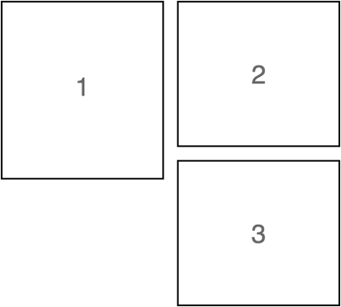

> 回来记得画图做补充。

通过`float`属性进行浮动。属性值如下：

- `left`：向左浮动
- `right`：向右浮动

如果我们不想让其他元素也受到浮动元素的影响，我们需要停止它；这是通过添加 [`clear`](https://developer.mozilla.org/zh-CN/docs/Web/CSS/clear) 属性实现的，属性值如下：

- `left`：停止任何活动的左浮动
- `right`：停止任何活动的右浮动
- `both`：停止任何活动的左右浮动，添加该属性的元素则会在离它前面最近的浮动元素处开始布局。

后来，人们开始使用浮动进行布局（**十分不推荐**），这需要很多的trick，增加程序员的心智负担。更加现代的做法是使用`Flex`、`Grid`进行布局。

通常通过伪类::after来清除浮动

~~~css
.float_container::after {
	clear : both;
    display : block;
    content: "";
}
~~~

许多CSS框架中的网格系统是借助浮动特性来实现的，基本原理如下

~~~css
.row::after {
     content: " ";
     display: block;
     clear: both;
} 

[class*="column-"] {
     float: left;
     padding: 0 0.75em;
     margin-top: 0;
}

.column-1 { width: 8.3333%; }
.column-2 { width: 16.6667%; }
.column-3 { width: 25%; }
.column-4 { width: 33.3333%; }
.column-5 { width: 41.6667%; }
.column-6 { width: 50%; }
.column-7 { width: 58.3333%; }
.column-8 { width: 66.6667%; }
.column-9 { width: 75%; }
.column-10 { width: 83.3333%; }
.column-11 { width: 91.6667% }
.column-12 { width: 100%; }
~~~

~~~html

    
 

    
 

    
 

    
 

    
 

~~~

实际上CSS中的grid容器可以完美取代这种做法。

## Flexbox

给元素添加 display: flex，该元素变成了一个flex容器，它的直接子元素变成了flex项。

> 还可以用display:flex-inline，这只会影响flex容器的行为，实际开发中很少会用到这一特性。

flex容器的flex-direction可以切换主副轴的方向。其值有

- column，此时flex-basis、flex-grow 和 flex-shrink作用于元素的高度而不是宽度。即使改变主轴方向，也不会影响这一本质：高度是由元素的内容决定的。如果不指定column flex容器的高度，那么flex-grow、flex-shrink就会失去作用。
- row
- row-reverse
- column-reverse

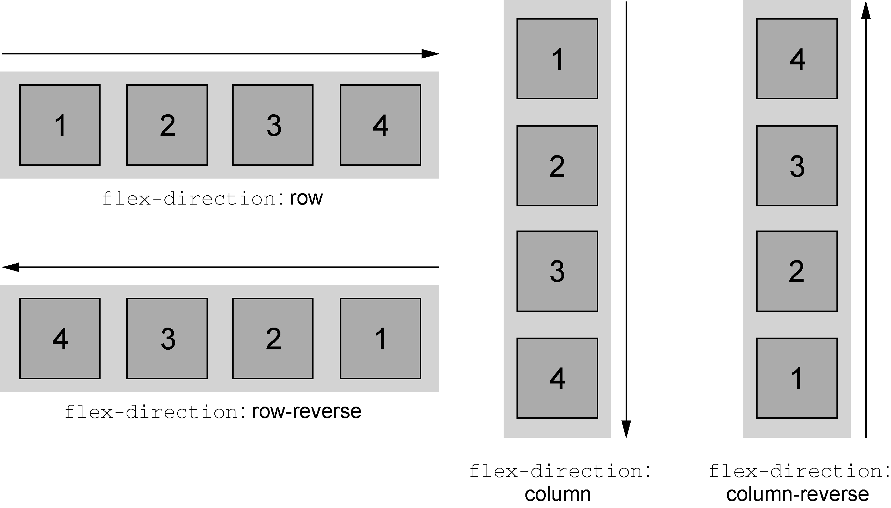

flex是flex-grow、flex-shrink、flex-basis的简写属性。

>  flex简写属性的默认值是 1 1 0%，这一点和其他简写属性不同

**flex-basis**，其初始值为auto。flex-basis 属性可以设置为任意的 width 值。定义了元素大小的基准值。

如果flex-basis的值是auto，此时浏览器会检查元素是否设置了 width 属性值。如果有，则使用 width 的值作为 flex-basis 的值；如果没有，则用元素内容自身的大小。

如果 flex-basis 的值不是 auto，width 属性会被忽略。

之后flex-grow和flex-shrink来决定缩放规则。

> 一定要注意，flex项的响应式主要就体现在flex-grow中而不是在flex-basis中。

容器中的剩余空间根据**flex-grow**比例进行分配。
$$
剩余空间大小 = flex容器大小 - \sum^{flex 项}(margin + padding + border + content)
$$
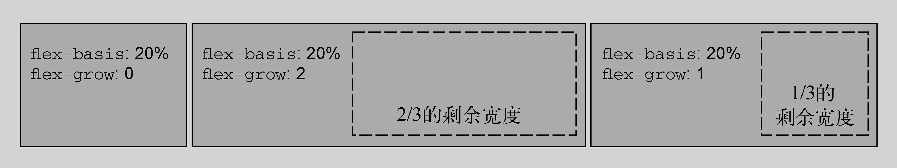

若从容器中溢出，则按照**flex-shrink**比例进行收缩，`flex-shrink : 0`表示不收缩。

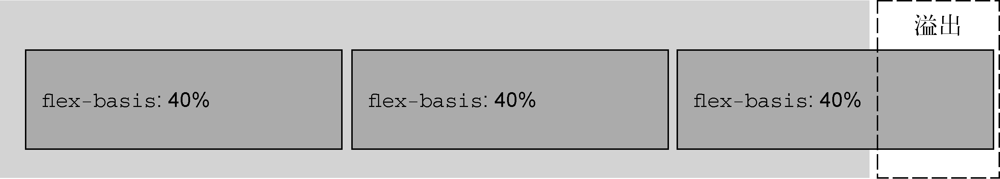

下面介绍如何设置flex-item的间距以及对齐。

flex-wrap指定了弹性子元素是否会在弹性容器内折行显示。

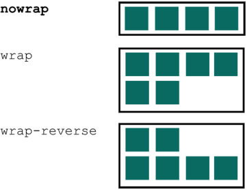

justify-content控制item在主轴上的位置

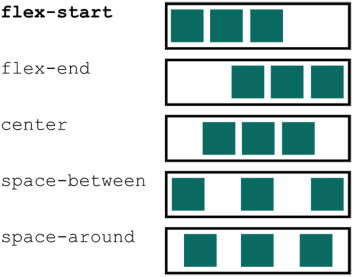

align-items控制item在副轴上的位置

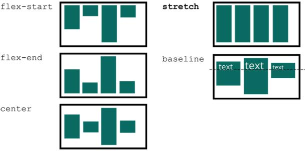

algin-content，控制在item在副轴上的间距，在flex-wrap : wrap下才有意义

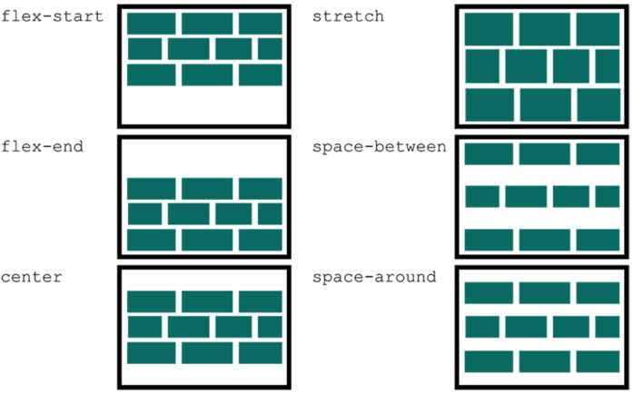

## Grid

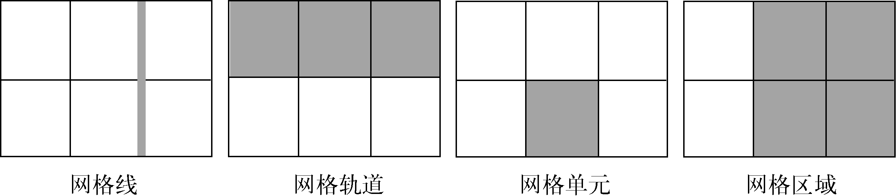

首先介绍一下重要的术语`Grid Container`、`Grid Item`、`Grid Line`、`Grid Track`、`Grid Area`、`Grid Cell` 。

`display:grid`定义一个网格容器。：`grid-template-columns `和 `grid-template-rows`。这两个属性定义了网格每行每列的大小。`column-gap` `row-gap`设置网格的间隔。

~~~css
.grid {
	display : grid;
    grid-template-columns : 1fr 200px, 10%;
    
    grid-template-rows : repeat(3, 1fr 2fr);
   	grid-template-rows: repeat(auto-fill, minmax(200px, 1fr));
    
    column-gap : 10px;
    row-gap : 10px;
}
~~~

有两个与网格相关的函数：

- `repeat()`函数，第一个参数是重复的次数，第二个参数是所要重复的值。fr单位用于按比例分配剩余空间。这个函数的第一个参数有两个特殊的值`auto-fill`、`auto-fit`。`auto-fill`尽可能生成更多列数，`auto-fit`使网格的列宽尽可能地大。

- `minmax()`。如果$max < min$则该函数返回$min$，反之返回`max`。

网格布局一共有三种语法：

- 编号的网格线
- 命名的网格线
- 命名的网格区域

下面依次介绍它们

每个网格线都有一个默认的编号

每个元素可以根据网格线编号进行定位（**个人推荐使用这个方式**）

~~~css
.main {
    grid-column : 1 / 2;
    grid-row : 3 / -1;
}

.header {
    grid-column : 3 / span 2;
    grid-row 2 / 4;
}
~~~

grid-column是grid-column-start和grid-column-end的简写，中间的斜线用于区分两个值的。$span\ n$关键字表示该元素要跨越$n$个网格单元。

此外，可以对网格线进行命名：

~~~css
grid-template-columns : [left-start] 2fr
					  [left-end right-start] 1fr
					  [right-end] 3fr
~~~

那么定义元素所占的网格区域时，可以

~~~css
grid-column : left-start / right-end
~~~

如果有一对网格线命名为`xxx-start`,` xxx-end`，那么给元素设置 `grid-column: xxx`，它就会跨越从 `xxx-start` 到 `xxx-end` 的区域

还可以对网格区域进行命名，这种特性需要借助grid-template-areas属性以及grid-area属性：

~~~css
.container { 
     display: grid; 
     grid-template-areas: "title title"
     "nav nav" 
     "main aside1" 
     "main aside2"; 
     grid-template-columns: 2fr 1fr;
     grid-template-rows: repeat(4, auto);
} 
header { grid-area: title;} 
nav { grid-area: nav; } 
.main { grid-area: main; } 
.sidebar-top { grid-area: aside1; } 
.sidebar-bottom { grid-area: aside2;}
~~~

使用 grid-template-* 属性定义网格轨道时，创建的是**显式网格（explicit grid）**，但是有些网格元素仍然可以放在显式轨道外面，此时网格容器会自动创建隐式轨道以扩展网格，从而包含这些元素，隐式网格轨道的默认大小是auto。可以给网格容器设置 grid-auto-columns 和 grid-auto-rows，为隐式网格轨道指定一个大小。

当不指定网格上元素的位置时，元素会按照其布局算法自动放置。默认情况（grid-auto-flow:row）下，布局算法会按元素在标记中的顺序将其逐列逐行摆放。当一个元素无法在某一行容纳（也就是说该元素占据了太多网格轨道）时，算法会将它移动到下一行，寻找足够大的空间容纳它。grid-auto-flow属性可以控制布局算法的行为：属性值如下 

- row dense | column dense：尽可能紧凑地填满网格中里的空白。可能会打乱元素的顺序
- row（默认值），优先放在一行中。
- column，优先放在一列中。

CSS给网格布局提供了三个对齐属性：justify-content 、 justify-items 、justify-self

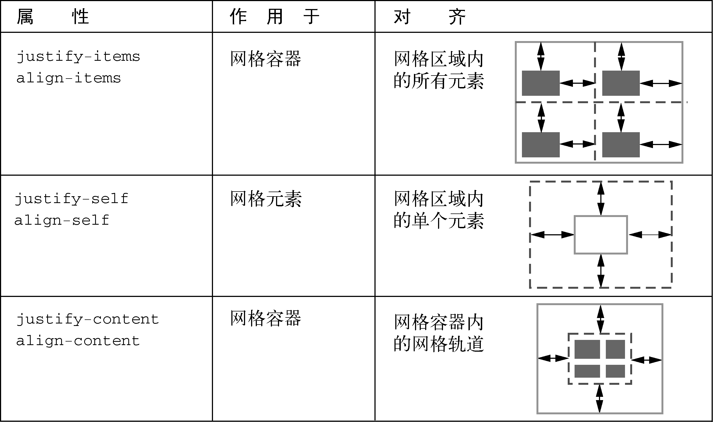

~~~css
.container {
  justify-items: start | end | center | stretch;
}

.container {
  justify-content: start | end | center | stretch | space-around | space-between | space-evenly;    
}
~~~

place-items同时设置justify-items与align-items。

## 定位于层叠上下文

**position:static**（默认值）是静态定位。

**position:fixed**是固定定位，此时元素可以放在相对于视口的任意位置。还需要搭配top、right、bottom、left属性一起使用。固定元素从文档流中移除了，所以它不再影响页面其他元素的位置。别的元素会跟随正常文档流，就像固定元素不存在一样。

设置这四个值还隐式地定义了元素的宽高。比如指定 left: 2em; right: 2em 表示元素的左边缘距离视口左边 2em，右边缘距离视口右边 2em。因此元素的宽度等于视口总宽度减去4em。top、bottom 和视口高度也是这样的关系。

一般用固定定位创建一个模态框

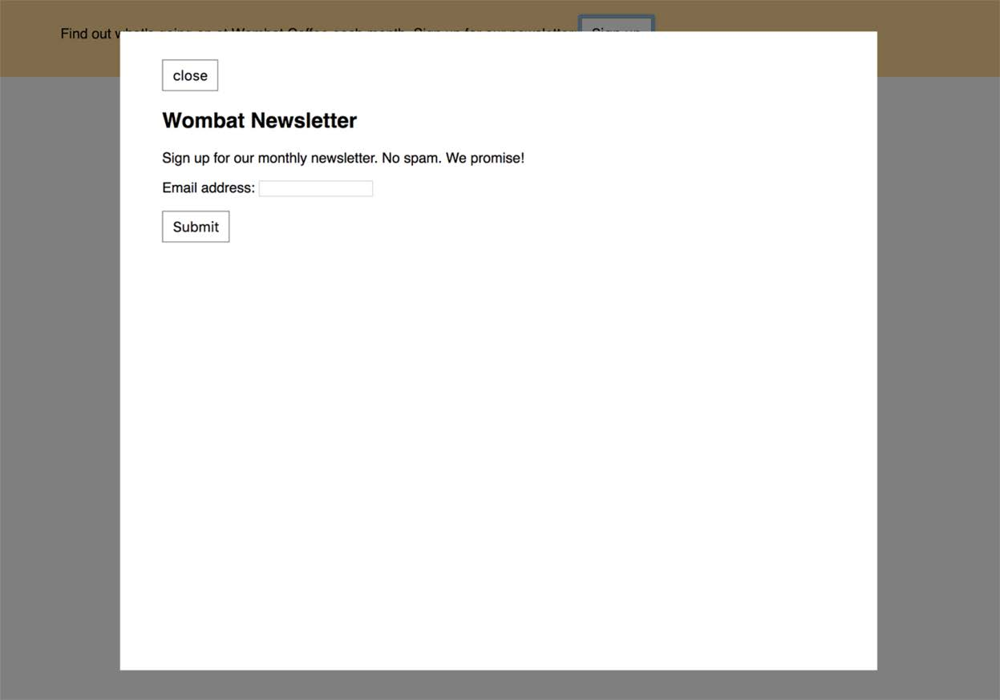

~~~css
.modal {
	display : none;		/*默认隐藏模态框，可以通过javascript设置该属性。*/
}
.modal-backdrop {
	position : fixed;
    top : 0;
    right : 0;
    bottom : 0;
    left : 0;
    background-color : rgba(0, 0, 0, 0.5)
    /*设置前景*/
}
.modal-body {
     position: fixed;
     top: 3em;
     bottom: 3em;
     right: 20%;
     left: 20%;
     padding: 2em 3em;
     background-color: white;
     /*设置模态框的主体*/
}
~~~

固定定位的元素还可以通过以下方式定义大小

~~~css
.modal-body {
	position : fixed;
    top : 2em;
    right : 2em;
    width : 50%;
}
~~~

此时该元素放置在离右边2em位置处，宽度（从右向左考虑）为视口的50%。

**position:absolute**，绝对定位，它是相对于已定位元素（除position:static之外的）进行定位的。它的使用和固定定位是一样的，在这里不再介绍。

**position: relative**，相对定位，它相对于本身进行定位。跟固定或者绝对定位不一样，不能用 top、right、bottom 和 left 改变相对定位元素的大小。这些值只能让元素在上、下、左、右方向移动（偏移）。可以用 top 或者 bottom，但它们不能一起用（bottom 会被忽略）。同理，可以用 left 或 right，但它们也不能一起用（right 会被忽略）。**它不会脱离正常的文本流**。更常见的用法是使用 position: relative 给它里面的绝对定位元素创建一个包含块，从而实现精妙、难处理的布局。

~~~css
top : 30px;
left : 30px;
~~~

会让元素向右下偏移30px。而不是向左上偏移30px。

**position:sticky**，粘性定位。正常情况下，元素会随着页面滚动，当到达屏幕的特定位置时，如果用户继续滚动，它就会“锁定”在这个位置。最常见的用例是侧边栏导航。此时top属性值可以理解为阈值，即在离视口顶部一定距离时，该元素就会表现的像fixed一样了，否则表现的像正常元素。top 比bottom优先级高，left比right的优先级高。

浏览器将 HTML 解析为 DOM 的同时还创建了另一个树形结构，叫作**渲染树（render tree）**。通常情况下（使用定位之前），元素在 HTML 里出现的顺序决定了绘制的顺序

~~~html

one

two

three

~~~

假设它们之间有负外边距，则会渲染成

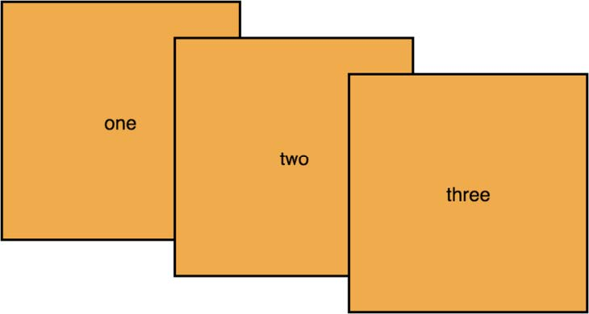

定位元素时，这种行为会改变。默认情况下（不设置z-index），**浏览器会先绘制所有非定位的元素，然后绘制定位元素**。此时可以使用z-index属性控制定位元素的层叠顺序。

z-index 属性的值可以是任意整数（正负都行）。拥有较高 z-index 的元素出现在拥有较低 z-index 的元素前面。拥有负数 z-index 的元素出现在静态元素后面。**z-index只在定位元素上生效**。

z-index有个至关重要的概念——层叠上下文，即其子级层叠上下文的 `z-index` 值只在父级中才有意义。子级层叠上下文被自动视为父级层叠上下文的一个独立单元，也就是说，在渲染父元素时将其子元素一并渲染。举个例子

~~~html

 one
 
nested

two

three

~~~

这段代码包含了三个盒子，其中两个被定位，并且 z-index 为 1，第一个盒子里面有一个绝对定位的元素，它的 z-index 为 100。虽然第一个盒子的 z-index 很高，但还是出现在第二个盒子后面，因为它的父元素，即第一个盒子形成的层叠上下文在第二个盒子后面。

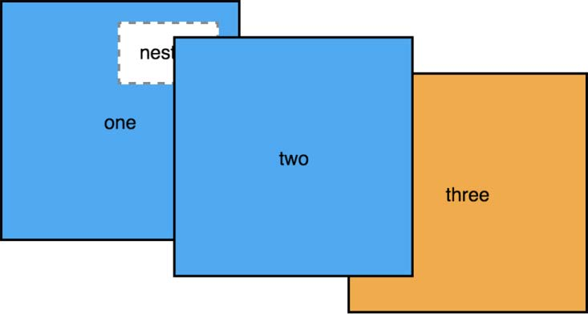

> 还有opacity 、 transform、filter 属性都会创建一个层叠上下文

所有层叠上下文内的元素会按照以下顺序，从后到前叠放：

- 层叠上下文的根（注意：html会创建一个顶级的层叠上下文），无论它的z-index相对其子元素的是多么大。
- z-index 为负的定位元素（及其子元素）
- 非定位元素
- z-index 为 auto 、0的定位元素（及其子元素）
- z-index 为正的定位元素（及其子元素）
