# CSS 高级主题

[TOC]

## 背景 & 渐变 & 阴影

background属性是以下八个属性的简写：

- -image，指定一个图片或者渐变作为背景
- -position，设置背景图片的初始位置
- -size，指定图片的大小
- -repeat：默认是x轴、y轴重复的
- -origin：决定背景相对于元素的border、padding（默认）、content进行定位
- -attachment，指定背景图片是随着元素上下滚动（初始值），还是固定在视口区域。注意，使用 fixed 值会对页面性能产生负面影响。
- -color：指定纯色背景，会渲染到-image的下方

~~~css
background-image : url(figure.png);
~~~

背景还支持混合模式，一般用不到故不做介绍。

此外还可以通过linear-gradient函数创建线性渐变

~~~css
inear-gradient(to right, white, blue);
~~~

第一个参数说明渐变的角度，还可以用以下单位

- deg 角度

- rad 弧度` 6.2832 = 360 deg`
- turn 圈数` 1 turn = 360 deg`
- grad 百分度 `400grand = 360 deg`

还可以包含多个节点的渐变

~~~css
linear-gradient(90deg, red, white, blue)
~~~

还可以进一步调整节点的位置

~~~css
linear-gradient(90deg, red 10%, white 40%, blue 70%)
~~~

> 可以在 css-tricks 网站的文章 *Stripes in CSS* 上找到更多关于渐变的例子

radial-gradient创建径向渐变，更多请了解MDN。

## 

box-shadow生成块级元素的阴影，而text-shadow生成文字的阴影

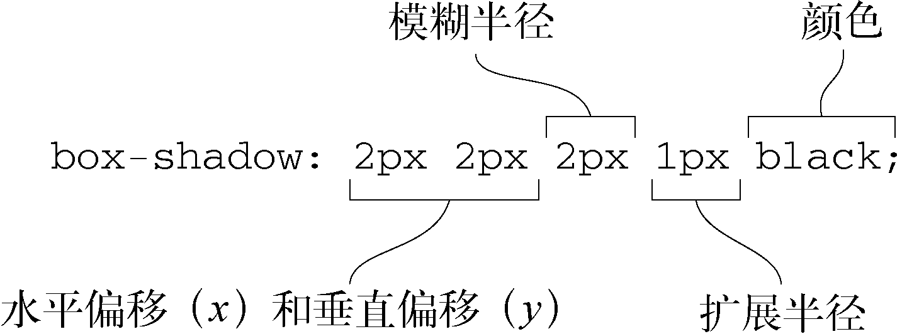

box-shadow可以同时定义多个阴影，并且通过关键字inset使得阴影在border内渲染。

~~~css
box-shadow : inset 0 0 0.5em #124,
			inset 0 0.5em 1em rgba(0, 0, 0, 0.5);
~~~

## 设计原则 & 间距 & 颜色 & 行高

这一小节只是简单地阐述设计理论，不会涉及到CSS语法。

对比是设计中的一种手段，通过突出某物来达到吸引注意力的目的。使用不同的颜色、间距和大小是建立对比的一些常用方法。

颜色可以通过十六位表示法、`rgb()`、`hsl()`函数来设置。

hsl各个参数分别表示色相、饱和度、光度。

- 色相取值范围是$0 ~ 359$​​，从红色（0）、黄色（60）、绿色（120）、青色（180）、蓝色（240）、洋红色（300）依次过渡，最后回到红色。
- 第二个参数表示饱和度，是一个代表色彩强度的百分数，100%的时候颜色最鲜艳，0%就意味着没有彩色，只是一片灰色。
- 第三个参数表示明度，也是百分数，代表颜色有多亮（或者多暗）。大部分鲜艳的颜色是使用 50%的明度值。明度值设置得越高，颜色越浅，100%就是纯白色；设置得越低，颜色越暗，0%就是黑色。

> RGB和 HSL表示法都有一个对应的包含 alpha通道的表示法：rgba()和 hsla()。它们接受第四个参数，一个取值范围在 0～1 的数字，用来表示透明度。

为某种颜色寻找一个搭配的颜色，最简单的方式是找到它的**补色（complement）**。补色位于色相环的对侧位置，蓝色的补色是黄色；绿色的补色是洋红色（或者紫色）；补色之间对比是最强烈的。使用 HSL 颜色值时，计算补色非常简单，为色相值加上或者减去 180 即可。

> 如果你想更深入地研究颜色选择，可以上网浏览颜色理论相关的文章。你可以从 Natalya Shelburne 所写的这篇著名的文章 *Practical Color Theory for People Who Code* 开始。

在背光式计算机屏幕上，纯白色背景（#fff）上的纯黑色文本会产生强烈的对比效果，很容易在阅读时造成视觉疲劳，特别是大段的文本。推荐适用浅灰色字体。W3C 的**Web 内容无障碍指南（Web Content Accessibility Guidelines，WCAG**提供了关于对比度最小值的建议（称为 AA 级），更严格一点，还有加强型对比度（称为 AAA 级）。WCAG 定义的大号文本，是指未加粗的 18pt（24px）及其以上的文本，或者加粗的 14pt（18.667px）及其以上的文本。正文字体应该达到或者超出普通文本建议的对比度，标题文本应该达到或者超出大号文本建议的对比度。**CSS颜色对比检查器（CSS color contrast checker）**可以查看对比度

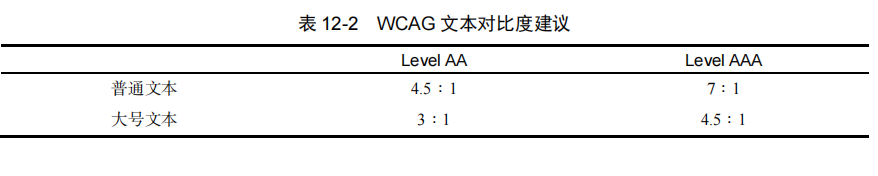

> 更细的字体需要更强烈的对比度！

一般我们从设计师手中拿到的设计稿通常用px作为距离单位的，推荐开发人员在编码中进行单位转换到相对单位。此外你还要考虑行高对于设计的影响。

## 字体

以前，开发者只能从有限的字体中做选择，即所谓的**Web 安全字体（Web safe font）**。这些字体系统会默认安装的。现在Web 字体使用@font-face 规则，告诉浏览器去哪里找到并下载自定义字体，供页面使用！

推荐在Google字体上选择你想要的字体http://www.googlefonts.cn

> **字型（typeface）**和**字体（font）**这两个术语经常被混为一谈。字型通常是指字体（比如 Roboto）的整个家族，一般由同一个设计师创造。一种字型可能会存在多种变体和字重（比如细体、粗体、斜体、压缩，等等），这些变体的每一种可称之为一种字体（font）。

在选好字体后，可以将代码嵌入到你的页面，并使用它们

~~~html
<link href="https://fonts.googlefonts.cn/css?family=Roboto:300|Sansita:400,800" rel="stylesheet">
~~~

~~~css
body {
	font-family : Roboto, Sansita;
}
~~~

这是如何工作的呢？让我们看看Google提供的CSS文件https://fonts.googlefonts.cn/css?family=Roboto:300|Sansita:400,800。

~~~css
@font-face {
 	font-family: 'Roboto';
 	font-style: normal;
 	font-weight: 300;
    /*文件的位置*/
    src: local('Roboto Light'), local('Roboto-Light'),
 	url(https://fonts.gstatic.com/s/roboto/v15/Hgo13k- 
 tfSpn0qi1SFdUfZBw1xU1rKptJj_0jans920.woff2) format('woff2');
    /*适用的Unicode编码范围*/
 	unicode-range: U+0000-00FF, U+0131, U+0152-0153, U+02C6, U+02DA, U+02DC, U+2000-206F, U+2074, U+20AC, U+2212, U+2215;
}
~~~

font-family 设置了引用字体的名称，可以在样式表的其他地方使用（例如font、font-family中）。src:提供了一个逗号分隔的浏览器可以搜索的地址列表，以 local(Roboto Light)和 local(Roboto-Light)开头，这样的话，如果用户的操作系统中恰好安装了名为 Roboto Light 或者 Roboto-Light 的字体，就使用这些字体。否则，就下载使用 url()指定的 woff2 字体文件。

> fotmat()各个浏览器支持的都不太好，不推荐使用。

如果需要用到同一种字型的多种字体，那么每一种字体都需要自己的@font-face 规则，并与font-style、font-weight匹配。

>如果页面样式需要用到其他版本的字体（比如 font-weight: 500 或者 font-style: italic），浏览器就会从提供的两种字体中选择更接近的字体。不过这取决于浏览器，它可能会把某个已提供字体倾斜或者加粗来达到想要的效果，通过使用计算机图像学的方法来实现字母形状的转换。因为这样的字体显示肯定不如原生设计的效果好，所以不建议依靠这种方式

通过调整字距，提高可读性。这里涉及两个属性：`line-height` 和 `letter-spacing`，这两个属性可以控制文本行之间的距离（垂直方向）和字符之间的距离（水平方向）。

~~~css
line-height : 1.5 /*无单位值，相对于字号*/
letter-spacing : 0.01em;
~~~

> 文字行越长，行高应该设置得越大。这样读者的眼睛扫到下一行的时候才更容易，不会注意力分散。理想情况下，每行文字的长度应该控制在 45～75 个字符，一般认为这样的长度最利于阅读。

此外，有一条重要的设计原则——垂直规律，即这是同时基线网格来实现的

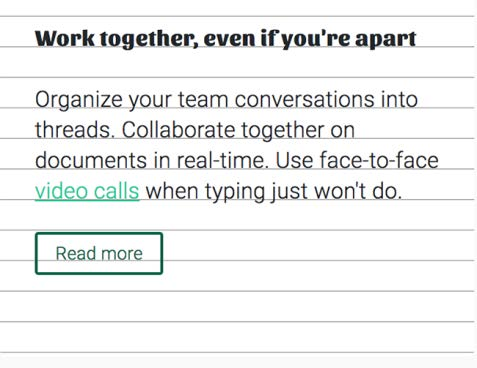

大多数的浏览器供应商为了尽可能快地渲染页面，使用了可用的系统字体。然后，当Web字体加载完成后，页面会使用 Web 字体重新渲染一次。这会造成FOUT，即**无样式文本闪动（Flash of Unstyled Text）**

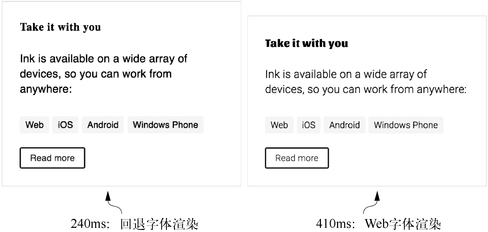

因为开发者们不喜欢这样，所以大部分浏览器供应商修改了浏览器的行为。他们不再渲染回退字体，改成渲染页面上除了文本以外的其他所有元素。确切地说，他们把文本渲染成不可见的，因此文字依然会占据页面的空间。这就导致了一个新的问题，FOIT，即**不可见文本闪动（Flash of Invisible Text）**

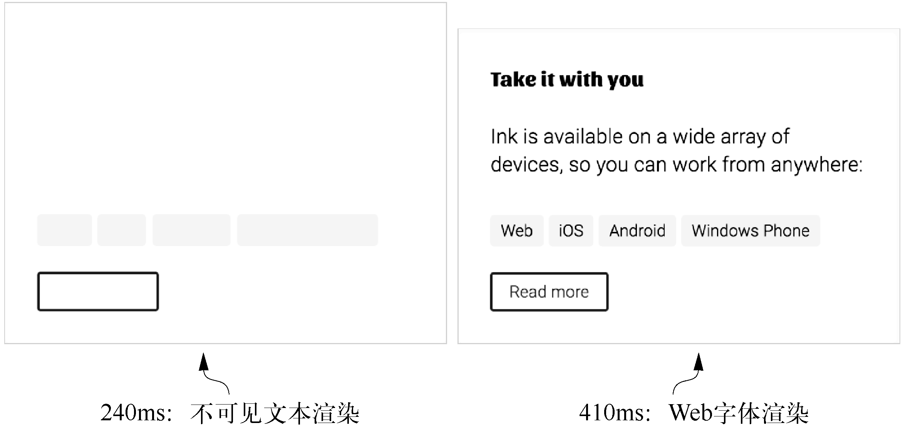

可以通过Javascript动态加载资源并修改样式来解决这种问题（这种方式还适用于其他情景）。或者适用CSS属性font-display，这条属性需要在@font-face 规则内部使用，用来指定浏览器应该如何处理 Web 字体加载。

- auto，默认行为
- swap，即FOUT
- fallback，介于 auto 和 swap 之间。文本会保持较短时间（100ms）的隐藏状态，如果这时候 Web 字体还没有准备好，就显示回退字体。接下来一旦 Web 字体加载完成，就会显示 Web 字体。
- optional，但是允许浏览器基于网速判断是否显示 Web 字体。这就意味着在较慢的连接条件下 Web 字体可能不会显示。

## 过渡

过渡是通过一系列 transition-*属性来实现的。下面给出一个例子：

~~~html
<button>Hover over me</button>
~~~

~~~css
button {
    background-color: hsl(180, 50%, 50%);
    border: 0;
    color: white;
    font-size: 1rem;
    padding: .3em 1em;
    transition-property: all;
    transition-duration: 0.5s;
} 
button:hover {
    background-color: hsl(0, 50%, 50%);
    border-radius: 1em;
}
~~~

在任何时候，只要由transition-property指定的属性值发生变化，那么就会触发过渡。例如在JavaScript添加或者移除类影响了元素的样式。

> 有些属性使用过渡会严重拖累页面的性能，比如left属性

transition-property 这个属性可以指定哪些属性使用过渡

~~~css
transtion-property : color, font-size;
~~~

并不是所有的属性都可以过渡，display 属性就是其中之一，它们的值都是离散的。因此，任何应用到 display 上的过渡属性都会被忽略。

transition-duration 属性代表过渡到最终值之前需要多长时间

~~~css
transition-deration : 100ms
~~~

> 大部分的过渡持续时间应该处于 200～500ms。时间如果再长，用户就会感觉页面变得卡慢。对于鼠标悬停、淡入淡出和轻微缩放特效，应该使用较快的过渡速度。一般要控制在 300ms 以下，有时候甚至可能要低到 100ms。

transition-timing是定时函数，用来控制属性的中间值如何计算，也就是变化率，关键字如下：

- linear
- ease
- ease-out

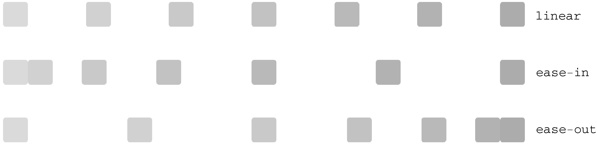

定时函数背后的数学原理就是**贝塞尔曲线（Bézier curve）**，

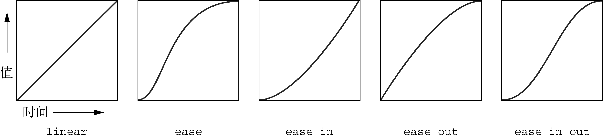

可以使用cubic-bezier()函数定义自己的贝塞尔曲线。可以通过开发者工具或者**cubic-bezier 在线网站**获取你想要的贝塞尔曲线

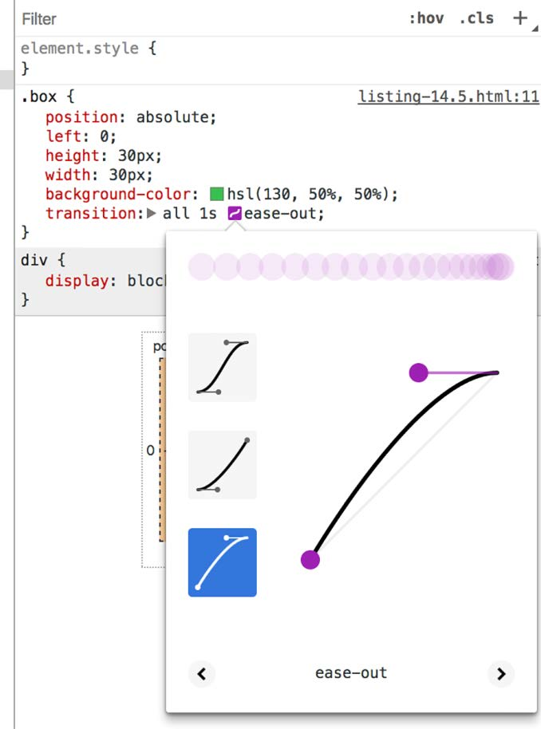

> 可以在下列场景中分别使用这三种函数：
>
> - 线性——颜色变化和淡出、淡入效果
> - 减速——用户发起的变化。这样用户就可以看到快速发生的反馈，及时响应输入，然后元素慢慢过渡到最终状态。
> - 加速——系统发起的变化。这样元素就可以慢慢引起用户注意，然后速度越来越快直到完成最终变化。

还有一类定时函数——**阶跃**

> steps()函数的实际应用并不常见css-tricks 网站的文章 *Clever Uses for Step Easing* 中的清单可以提供一些灵感。

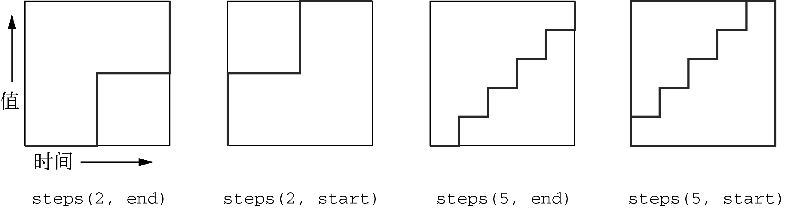

也可以使用简写属性 transition。该简写属性接受四个参数值，分别代表四个过渡属性 transition-property、transition-duration、transition-timing、function 和 transition-delay。

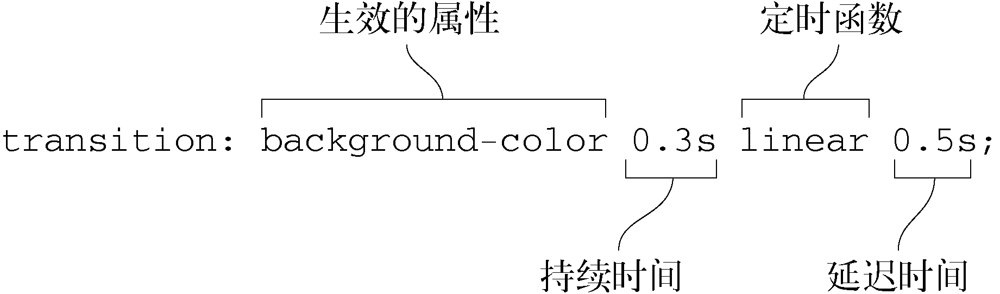

~~~css
transition: opacity 0.2s linear,
 		   visibility 0s linear 0.2s;
~~~

## 变换

transform属性用来改变页面元素的形状和位置，其中包括二维或者三维的旋转（Rotate）、平移（Translate）、缩放（Scale）和倾斜（Skew）。

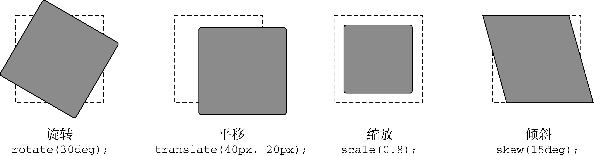

~~~css
transform : rotate(15deg) translate(15px, 0);
~~~

一定要注意变换的顺序！上述代码是先旋转，再平移。

使用变换的时候要注意一件事情，虽然元素可能会被移动到页面上的新位置，但它不会脱离文档流。这是很重要的，举个例子：缩放可以等价于设置宽高，但是设置宽高会使得浏览器重新计算布局，而缩放不会有这种问题。而且变换不能作用在``或者`<a>`这样的行内元素上

变换是围绕基点（point of origin）发生的。基点是旋转的轴心，也是缩放或者倾斜开始的地方，不包括平移。但可以通过 transform-origin 属性改变基点位置，基点默认在元素中心的。

~~~css
transform-origin : right center;
transform-origin : 100% 50%;
~~~

> 上述是等价的，也可以使用 px、em 或者其他单位的长度值来指定基点。按照我的经验，使用top、right、bottom、left 和 center 这些关键字，在大部分项目中就够用了。

浏览器计算好了页面上哪些样式应用于哪些元素上之后，需要把这些样式转化成屏幕上的像素，这个过程叫作**渲染（rending）**。渲染可以分为三个阶段：**布局**、**绘制**和**合成**。

- 在第一个阶段布局中，浏览器需要计算每个元素将在屏幕上占多大空间。任何时候改变一个元素的宽度或高度，或者调整位置属性（比如 top 或者 left），或者移除添加元素，浏览器必须**重排（reflow）**页面，元素的布局都会重新计算。

- 布局之后是**绘制**。这个过程就是填充像素：描绘文本，着色图片、边框和阴影。这是在内存中绘制，并不会真正显示在屏幕上。绘制会在页面上生成很多的**图层（layers）**。在某些特殊情况下，个别元素会拥有自己的图层，并且浏览器会将该图层发送到**图形处理器（graphics processing unit，GPU）**进行绘制，而不是像主图层那样使用 CPU 绘制。这就是我们经常提到的硬件加速（hardware acceleration），因为需要依赖于计算机上的某些
	硬件来推进渲染速度。多个图层就意味着需要消耗更多的内存，但好处是可以加快渲染。

	> opacity 和 transform 这两个属性如果发生改变，需要的渲染时间就会非常少。当我们修改元素的这两个属性之一时，浏览器就会把元素提升到其自己的绘制图层并使用 GPU 加速。因为元素存在于自己的图层，所以整个图像变化过程中主图层将不会发生变化，也无须重复的重绘。

- 在**合成（composite）**阶段，浏览器收集所有绘制完成的图层，并将它们显示在屏幕上，合成过程需要按照特定顺序进行，以确保图层出现重叠时，正确的图层显示在其他图层之上。

>will-change属性可以添加对渲染图层的控制。will-change：transform将会告知浏览器我们将要改变元素的transform属性，这通常意味着元素将会提升到自己的图层上进行绘制。除非遇到性能问题，否则不要盲目添加该属性到页面，因为它会占用很多的系统资源。

## 三维变换

这里不再介绍，一是因为对于图像学的知识了解不够，二是实际项目中对于三维变换的需求很少。只需知道perspective函数将会产生三维变换即可。

## 动画

关键帧（keyframe）是指动画过程中某个特定时刻。我们定义一些关键帧，浏览器负责填充或者插入这些关键帧之间的帧图像。

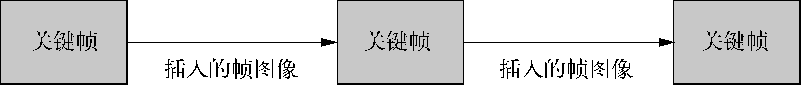

CSS中的动画包括两部分：用于创建动画的@keyframes规则，以及为元素添加动画的animation属性。下面是一个例子

~~~css
@keyframes over-and-back {
     0% {
         background-color: hsl(0, 50%, 50%);
         transform: translate(0);
     } 
     50% {
     	transform: translate(50px);
     } 
     100% {
         background-color: hsl(270, 50%, 90%);
         transform: translate(0);
     } 
}

.box {
    animation : over-and-back 1.5s linear 3;
}
~~~

其中animation属性是以下几个属性的简写

- animation-name：指定要添加的动画，即@ketframes
- animation-duration：动画持续时间
- animation-timint-function：定时函数（见二维变换一小节）
- animiation-iteration-count：动画重复次数，可以设置为infinite关键字，即无限次重复

此外，可以使用animation-delay 属性推迟动画开始的时间。该属性行为和transition-delay类似。

动画执行前或执行后，在@keyframes中定义的动画样式（在）都不会应用到元素上，，这会给用户的交互体验带来割裂感。为了修正这一行为，CSS提供了animation-fill-mode属性，有以下属性值：

- none，默认行为
- backwards，在动画执行之前，浏览器就会取出动画中第一帧的值，并把它们应用在元素上；
- forwards 会在动画播放完成后仍然应用最后一帧的值
- 使用 both 会同时向前和向后填充

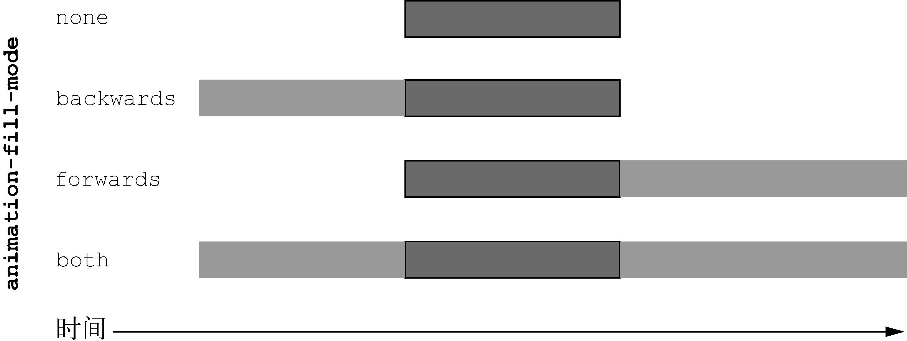

>如果出现样式层叠，那么动画中设置的规则比其他声明拥有更高的优先级，@keyframes规则有更高的优先级来源，这就确保了关键帧中所有的声明可以互相配合完成动画，而不用关注动画之外对这个元素可能应用了哪些样式。

> 可以考虑使用预定义关键帧动画集，推荐一个优秀的网站：animista。它提供了非常大的动画库可供选择，包含像果冻一样的弹跳、滚动和摇晃等效果。
