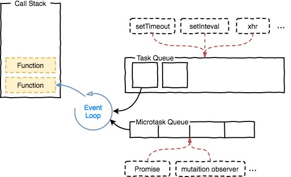

# 杂项

## 事件循环：微任务和宏任务

一定要认识到Javascript是解释型语言，不是编译型语言，它不会把源代码都刨析一遍而将所有的任务都放在队列中，而是在执行过程中一个一个放入的。

Javascript是单线程运行的，而异步需求是通过事件循环机制来解决的。

当调用栈为空时，任务循环处理模型会循环执行以下步骤：

- **宏任务队列（macrotask queue）**出队，将任务放在调用栈中并执行它
- 然后依次将**微任务队列（microtask queue）**出队，将任务放在调用栈中并执行它

以下函数创建宏任务：I/O、setTimeout、setInterval、script代码本身。它们都是非阻塞的！

而这些函数会创建微任务：Promise.then catch finally。

注意：new Promise中的执行器是同步代码。

