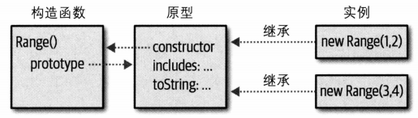

# JavaScript 面向对象机制

[TOC]

## 概述

JavaScript中的对象是一个属性的无序集合，每个属性都有名字和值。因此可以把对象看为从字符串到值的映射，这与“散列”、“字典”、**"关联数组"**相似。实际上，经常将对象当作关联数组来使用。

但JavaScript中的对象可以从其他对象中继承属性，这个其他对象称为其**原型**。为了与继承过来的属性相区分，JavaScript将非继承属性称为**“自有属性”**。

JavaScript中的对象是引用类型、可修改的。

对对象的操作包括：创建、设置、查询、删除、测试、枚举

每个属性除了有名字和值之外，还有三个属性特性（property attribute）：

- writable（可写）：是否可以设置属性的值
- enumerable（可枚举）：是否可以在for/in循环中返回属性的名字
- configurable（可配置）：是否可以删除该属性，以及是否可以修改该属性特性

很多 JavaScript 内置对象拥有只读、不可枚举或不可配置的属性。不过，默认情况下，我们所创建对象的所有属性都是可写、可枚举和可配置的。·																																																																					

## 原型

几乎每一个JavaScript对象都有另一个与之相关联的对象，这另一个对象被称为原型（prototype），并从原型中继承属性。

通过对象字面量创建的对象都有相同的原型——`Object.prototype`。使用构造函数创建的对象，它们的原型是`构造函数.prototype`。例如，通过new Array()所创建的对象是以`Array.prototype`为原型的。

`Object.prototype`是为数不多的没有原型的对象，因为它不继承任何属性。而大多数内置构造函数的原型都是`Object.prototype`。因此通过new Array()创建的对象从`Date.prototype`以及`Object.prototype`中继承属性。

实际上对象通过其prototype属性创建了一个用于继承属性的链表，这被称作**原型链**。但是大多数对象都没有prototype属性（**只有函数对象才有prototype属性**），即便不能通过代码访问到对象的原型，JavaScript继承机制任然照常运作，这背后的工作原理就是元编程。

## 创建对象

### 对象字面量

~~~javascript
var symbol = Symbol('2');
let book = {
    "main title" : "JavaScript",
    for : "all audiences",
    author : {
        firstname : "David",
        surname : "Flanagan"
    },
    [Symbol('1')] : 2,
    [symbol] : 3,
}
~~~

最后一个逗号会自动忽略，这是一种编程风格。每次对字面量求值都会创建一个新的、不一样的对象。**符号不能直接作为属性名**，除非放在[]中，[]代表可计算的属性。

ES6对字面值扩展了对象字面量语法（都是语法糖），下面将讲解这些扩展

简写属性（仅适用于标识符）

~~~javascript
let x = 1, y = 2;
let o = {x, y};
let o = {x : x, y : y};	//等价形式
o.x + o.y // 3
~~~

简写方法（就是省略掉了分号与funciton关键字而已）

~~~javascript
let square = { 
    area : function() { return this.side * this.side;},
	side : 10
}

let square = {
    area() { return this.side * this.side;},
	side : 10
}
const METHOD_NAME = "m";
const symbol = Symbol();
let weirdMethids = {
	"method With Spaces"(x) { return x + 1};
    [METHOD_NAME](x) { return x + 2; },
    [symbol](x) { return x + 3;}
}
~~~

可计算的属性名，需放在中括号中。

~~~javascript
const PROPERATY_NAME = "p1";
function computePropertyName() { return "p" + 2; }
let p = {
	[PROPERTY_NAME] : 1
    [computePropertyName()] : 2
    [Symbol("description")] : 2
	//Symbol('description') : 2 error
}
~~~

可以使用...扩展操作符把已有对象复制到新对象中，与Object.assign相似。

~~~javascript
let position = {x : 0, y : 0};
let dimensions = {width : 100, height : 75};
let rect = {...position, ...dimensions};
rect.x + rect.y + rect.width + rect.height	//175
~~~

注意如果有同名属性，那么属性值由靠后的决定。

### 构造函数

new关键字后跟一个函数调用，将这个函数调用称为构造函数。JavaScript为内置对象提供了构造函数，我们也可以自己定义构造函数

~~~JavaScript
let o = new Object();
let a = new Array();
~~~

### Object.create()

Object.create()用于创建一个新对象，并使用其第一个参数作为新对象的原型：

~~~javascript
let o1 = Object.create({x : 1, y : 2});
let o2 = Object.create(null);
let o3 = Object.create(Object.prototype);
~~~

注意o2将会创建没有任何属性的对象，甚至连prototype、toString属性都没有。而o3是一个普通的空对象。

Object还可以接受可选的第二个参数，用于描述新对象的属性。

Object.create()的一个简单实现

~~~javascript
function _create(o) {
    let F = function() {}
    F.prototype = o;
    return new F();
}
~~~

## 查询、设置、删除属性

通过.或者[]来查询对象的属性，.访问符的右操作数必须是一个简单的标识符。而[]访问符，其中的操作数期望着字符串或者符号

~~~javascript
let o1 = {
    "cold water" : "MaiDong";
}
o1["cold water"] //只能通过这种方式访问到cold water属性，点访问符是不可以的
~~~

下面讨论继承对属性的影响。JavaScript对象除了有一组“自有属性”外，同时也从它们原型对象中继承了一组属性。**查询（读取）属性时会用到原型链。但是设置（写入）属性时却不影响原型链，即只会在原始对象上创建或设置属性，而不会修改该原型链中的对象，此时会屏蔽原型链中同名的属性（这是因为会优先找到它）。这是一个很重要的Javascript特性！！**

~~~javascript
let p = Object.create(Object.prototype);
p.y = 2;
let q = Object.create(p);
q.z = 3;

p.y = 10;
console.log(q.y);		//10
q.y = 1;
console.log(p.y)		//10
~~~

如果查询不到属性，则表达式返回undefined。但是继续查询null或undefined的属性是错误的，会抛出TypeErr异常。推荐使用?.运算符避免这种问题。

而且设置属性并不总是会成功的，以下情况会失败的

- 只读属性
- 对象原本没有该属性，且对象的extensible特性为false。

在严格模式下，设置属性失败会抛出TypeError，在非严格模式下，这些失败是静默的

通过delete操作符从对象中移除属性，操作数应该是一个属性访问表达式。

~~~javascript
delete book.author
delete book["main title"];
~~~

delete操作符只会删除自有属性，不能删除继承属性以及configurable特性为false的属性。

## 测试属性 & 枚举属性 & 扩展对象 & 序列化对象

测试属性就是查询一个属性是否在该对象中，不管它的值是否为undefined。可以认为是查询（读取）属性的子步骤。

有in操作符、hasOwnProperty()、propertyIsEnumberable()来测试属性

~~~javascript
let o = {x : 1, y : undefined}
"x" in o 	//true
o.hasOwnProperty("x")	//对继承属性返回false
o.propertyIsEnumberable("x")		//在hasOwnProperty属性的基础上，进一步判断该属性是否可枚举
~~~

Object.keys()，返回对象可枚举、自有的、字符串类型的属性数组

Object.getOwnPropertyNames()，返回自有的、字符串类型的属性数组

Object.getOwnPropertySymbols()，返回自有的、符号类型的属性数组

Reflect.ownKeys()，返回自有的属性数组

它们先列出非负整数形式的字符串，再按添加顺序列出字符串类型的属性，最后按添加顺序列出符号类型的属性。

使用Object.assign()来**扩展对象**。该方法接受两个或多个对象作为其参数，第一个参数是目的对象，而其余参数都是源对象。它会把源对象中可枚举的自有属性（包括符号类型的属性）按参数顺序依次复制到目的对象，注意！同名属性会被覆盖。

**对象序列化（serialization）**是把对象的状态转换为字符串的过程，之后可以从中恢复对象的状态。

通过函数JSON.stringify()和JSON.parse()序列化和恢复JavaScript对象。JSON是JavaScript语法的子集，其中包括对象、数组、字符串、有限数值（Infinity会序列化为null）、true、false、null。无法序列化的对象，比如函数、undefined等会直接忽略掉。再API一大章中会详细介绍这两个函数的高级特性。

~~~javascript
let o = {
	x : 1,
    y : {
        z : [false, null]
	}
}
let s = JSON.stringify(o);
let p = JSON.parse(s);
~~~

## 对象方法

所以的对象（除Object.create(null)）都会继承自Object.property，Object.property中有几个方法：

- toString
- toLocaleString
- valueOf
- toJSON

## 访问器属性

JavaScript还支持对象定义访问器属性，即获取方法（getter）、设置方法（setter）

~~~JavaScript
let o = {
	dataProp : value,
    
    get accessorProp() { return this.dataProp; }, 
    set accessorProp(value) { this.dataprop = value;},
    set [expression](value) { this.dataprop = value;},
}
~~~

访问器的方法名就是属性名，可以是符号类型的也可以是字符串类型的，与数据属性别无二致。访问器属性也是可以继承的。

## 类和构造函数

> 建议能组合就不继承（favor composition over inheritance）。

JavaScript的基于原型的继承机制与C++、Java的基于类的继承机制有着本质区别。当且仅当两个对象继承同一个原型对象时，它们才是一个类的**实例**。

通过工厂方法定义类

~~~javascript
function Range(from, to) {
	let object = Object.create(Range.method);
    object.from = from;
    object.to = to;
    return object
}

//object的原型对象
Range.method = {
    includes(x) { return this.from <= x && x <= this.to; }
    *[Symbol.iterator]() {
        for (let x = Math.ceil(this.from); x <= this.to, x++) yield x;
    }
}
let r = range(1, 3);
~~~

使用构造函数定义类

~~~javascript
function Range(from, to) {
    this.from = from;
    this.to = to;
}
Range.prototype = {
	//这种是重写了prototype属性，因此没有constructor属性，记得添加上
}
Range.prototype.include = function(x) { }	//在prototype属性的基础上进行扩展
~~~

这样做的理由是通过new构造的对象，其原型是构造函数的.prototype。这种做法和第一种的区别仅仅在于命名原型对象的方式。第一种方式的命名太过随意，而第二种方式的强制命名为prototype。用箭头函数定义的函数没有prototype属性，因此不能作为构造函数来使用。

> 在函数体内，可以使用特殊表达式new.target判断当前函数是否作为构造函数来调用的。

**其中构造函数就充当了类的标识**

instanceof标识符用于判断左操作符的原型对象是否是右操作符的prototype属性

~~~javascript
function Strange() { }
Strange.prototype = Range.prototype;
new Strange() instanceof Range	//true
~~~

函数的isPrototypeOf方法用于判断参数的原型对象是不是函数本身

~~~javascript
range.methods.isPrototypeOf(r);	
~~~

每个普通的Javascript函数（除箭头函数、生成器函数、异步函数）都有一个prototype属性。这个prototype属性中又自带constructor属性，其值指向函数对象本身。

~~~javascript
function fun() { }
console.log(fun === fun.prototype.constructor);	//true

let o = new fun();
o.constructor === fun 		//true
~~~

ES6引用class关键字来定义类，实际上就是语法糖，它并未改变JavaScript基于原型的本质。

~~~javascript
class Range {
    construcot(from, to) {
		this.from = from;
    }
    
    includes(x) { return this.from <= x && x <= this.to; }
}
let r = new Range(1, 3);

let square = class { constructor(x) { this.area = x * x;}};
//类定义的表达式形式，
//类名可以省略，如果提供了类名，那么只能在表达式内部访问到。
//一般这种形式用在return语句中
~~~

使用class有以下几点需要注意：

- class不允许使用对象字面值的形式定义成员，只能在class定义**任何简写形式**以及**可计算属性**的函数。
- 可以省略构造函数，那么编译器会隐式为你生成空构造器。
- **类声明不会被提升**
- 构造器必须用constructor关键字作为名字

class中支持用static关键字定义静态方法，此时静态方法直接作为构造函数本身的属性，而不是构造函数.prototype中的属性。

~~~javascript
static parse(s) { }
Range.parse(s)
//new Range().parse(s)	error
~~~

~~ES6并未规定字段（与面向对象中的属性同义）的定义语法，因此~~

~~~JavaScript
class Span {
    constructor() { this.a = 0; this.b = 0};		//实例字段
}
Span.c = 0;			//定义静态字段
~~~

最新ES6标准定义了字段的语法

static声明静态字段，#定义私有变量。字段的命名也支持可计算属性

~~~JavaScript
class Complex {
	#r = 0;
	#i = 0;

	constructor(real, imaginary) {
		this.#r = real;
		this.#i = imaginary;
	}

	plus(that) {
		return new Complex(this.#r + that.#r, this.#i + that.#r);
	}

	times(that) {
		return new Complex(this.#r * that.#r - this.#i * that.#i,
							this.#r * that.#i + this.#i * that.#r);
	}

	static sum(c, d) { return c.plus(d); }
	static product(c, d) { return c.times(d); }

	get real() { return this.#r; }
	get imaginary() { return this.#i; }
	get magnitude() { return Math.hypot(this.#r, this.#i); }
	toString() { return `{${this.#r}, ${this.#i}}`; }
}
~~~

> 如何实现私有字段的呢？推测是属性特性

## 继承

ES6之前的标准做法

~~~JavaScript
function Span(start, span) {
	if (span >= 0) {
        this.from = start;
        this.to = start + span;
    } else {
        this.to = start;
        this.from = start + span;
    }
}
Span.prototype = Object.create(Range.prototype);  //在原型对象A上设置其原型对象，这样才能形成继承链
//你也可以手动设置Span.__proto__ 形成继承链，而不使用Object.create，例如

//function PrimeStudent() { }
//function student() { }
//PrimeStudent.prototype.__proto__ = student.prototype;
//let a = new PrimeStudent;
//console.log(a instanceof student);

Span.prototype.constructor = Span;				 //不想继承Range.prototype.constructor
Span.prototype.toString() = function() {}		//覆盖父类的方法
//ES6之前没简单的办法允许子类调用父类的方法和构造函数。
~~~

这样就形成了一个继承链:

实例对象可以通过`__proto__`（已弃用）访问到原型对象

ES6通过extends、super创建子类

~~~javascript
class TypeMap extends Map {				//extends自动将__proto__设置为父类的prototype
	constructor(keyType, valueType, entries) {
		if (entries) {
			for (let [k, v] of entries) {
				if (typeof k !== keyType || typeof v != valueType) {
					throw new TypeError('Wrong type for entry [${k}, ${v}]');
				}
			}
		}

		super(entries);			//super()，调用父类的构造函数，即__proto__.constructor
		this.keyType = keyType;
		this.valueType = valueType;
	}
	set (key, value) {
		return super.set(key, value);		//super.引用父类，即__proto__
	}
}
~~~

使用extends关键字需要注意到以下几点：

- 如果使用extends关键字定义了一个类，那么这个类的构造函数必须使用super()来调用父类构造函数。而且在调用构造函数之前，不准使用this，这是为了确保父类属性优先被初始化。
- new.target引用的是被调用的构造函数。所以使用super调用父类构造函数时，父类构造函数通过new.target获取子类构造函数。

如何在Javascript中定义抽象类

~~~javascript
class AbstractClass {
	AbstractMethod() { throw new Error(“Abstract method)；}    
}
~~~

