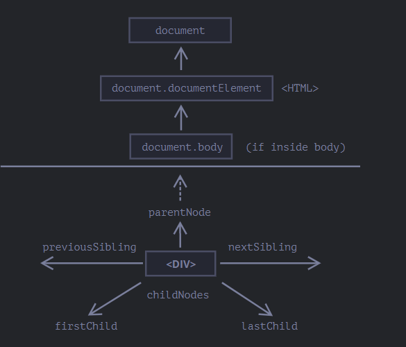
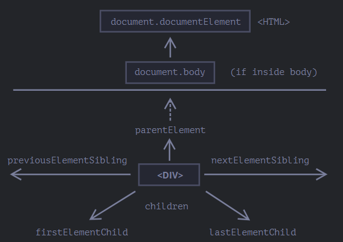
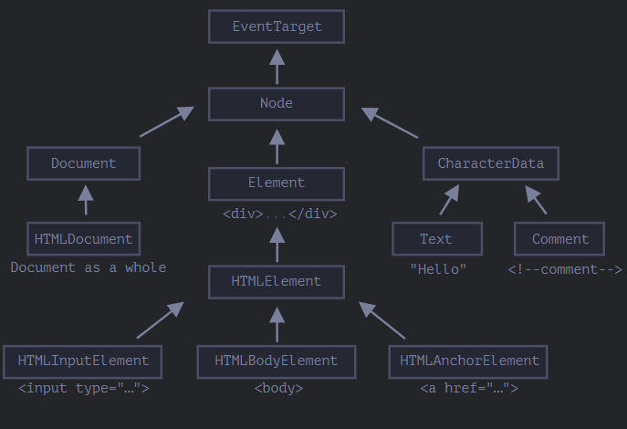

# Javascript Web

[TOC]

## 基本部分

现在，我们来讨论以浏览器为平台的Javascript。

Javascript在浏览器运行时，有一个**window全局对象**，任何顶级函数、var变量声明都会成为window全局对象的属性。此外，它还代表了浏览器窗口。

**文档对象模型（Document Object Model）**，简称 DOM，描述文档的结构、操作和事件。`document` 对象是页面的主要“入口点”。我们可以使用它来更改或创建页面上的任何内容。[https://dom.spec.whatwg.org](https://dom.spec.whatwg.org/)。

> 另外也有一份针对 CSS 规则和样式表的、单独的规范 [CSS Object Model (CSSOM)](https://www.w3.org/TR/cssom-1/)，这份规范解释了如何将 CSS 表示为对象，以及如何读写这些对象。我们很少需要从 JavaScript 中修改 CSS 规则（我们通常只是添加/移除一些 CSS 类，而不是直接修改其中的 CSS 规则）

**浏览器对象模型（Browser Object Model）**，简称 BOM，表示由浏览器（主机环境）提供的用于处理文档（document）之外的所有内容的其他对象。例如

- [navigator](https://developer.mozilla.org/zh/docs/Web/API/Window/navigator) 对象提供了有关浏览器和操作系统的背景信息
- [location](https://developer.mozilla.org/zh/docs/Web/API/Window/location) 对象允许我们读取当前 URL
- 各种浏览器函数：`setTimeout`，`alert`，`location` 等

每个 HTML 标签都是一个对象，标签内的文本也是一个对象。

~~~html
<!DOCTYPE HTML>
<html>
<head>
  <title>About elk</title>
</head>
<body>
  The truth about elk.
</body>
</html>
~~~

DOM 将 HTML 表示为标签的树形结构。它看起来如下所示：

标签被称为 **元素节点**（或者仅仅是元素）。元素内的文本形成 **文本节点**，它总是树的叶子。此外注释作为**comment 节点**也会添加到DOM中，**甚至标签之间的空白符也会作为文本节点添加到DOM Tree中**。

### 遍历DOM

用于遍历的属性称为**导航（navigation）属性**。

***本节介绍的所有属性都是实时的、只读的***

`<html> = document.documentElement`

`<body> = document.body`

`<head> = document.head`

需要导航方法或者搜索方法来获取其他标签。

脚本无法访问在运行时不存在的元素。尤其是，如果一个脚本是在 `<head>` 中，那么脚本是访问不到 `document.body` 元素的，因为浏览器还没有读到它。

> 规范下术语：子节点指的是直接子元素。而子孙节点是所有后代元素，子元素，子子元素。祖先，是指父亲、父亲的父亲....

**childNode**属性列出所有子节点，包括文本节点，注意**甚至标签之间的空白符也会作为文本节点添加到DOM Tree中**。childNodes实际上是一个类数组的可迭代对象。

~~~javascript
for (let i = 0; i < document.body.childNodes.length; i++) {
      alert( document.body.childNodes[i] ); 
}

elem.childNodes[0] === elem.firstChild
elem.childNodes[elem.childNodes.length - 1] === elem.lastChild
~~~

下一个兄弟节点在 `nextSibling` 属性中，上一个是在 `previousSibling` 属性中。可以通过 `parentNode` 来访问父节点。

有时候，我们只关心元素节点。为此DOM提供了以下方法：

- `children` —— 仅那些作为元素节点的子代的节点。
- `firstElementChild`，`lastElementChild` —— 第一个和最后一个子元素。
- `previousElementSibling`，`nextElementSibling` —— 兄弟元素。
- `parentElement` —— 父元素。

这里有一个细节需要值得注意：parentElement、parentNode。这两个属性只对document.documentElement有区别

~~~javascript
alert( document.documentElement.parentNode ); // document
alert( document.documentElement.parentElement ); // null
~~~

此外，可以用于特定元素的导航属性，例如表格。

<table> 元素支持 (除了上面给出的，之外) 以下属性:

- `table.rows` —— `<tr>` 元素的集合。
- `table.caption/tHead/tFoot` —— 引用元素 `<caption>`，`<thead>`，`<tfoot>`。
- `table.tBodies` —— `<tbody>` 元素的集合（根据标准还有很多元素，但是这里至少会有一个 —— 即使没有被写在 HTML 源文件中，浏览器也会将其放入 DOM 中）。

**`<thead>`，`<tfoot>`，`<tbody>`** 元素提供了 `rows` 属性：

- `tbody.rows` —— 表格内部 `<tr>` 元素的集合。

**`<tr>`：**

- `tr.cells` —— 在给定 `<tr>` 中的 `<td>` 和 `<th>` 单元格的集合。

### 搜索元素节点：getElement\*，querySelector\*

| 方法名                   | 搜索方式     | 可以在元素上调用？ | 实时的？ |
| ------------------------ | ------------ | ------------------ | -------- |
| `querySelector`          | CSS-selector | ✔                  | -        |
| `querySelectorAll`       | CSS-selector | ✔                  | -        |
| `getElementById`         | `id`         | -                  | -        |
| `getElementsByName`      | `name`       | -                  | ✔        |
| `getElementsByTagName`   | tag or `'*'` | ✔                  | ✔        |
| `getElementsByClassName` | class        | ✔                  | ✔        |

- `elem.matches(css)` 用于检查 `elem` 与给定的 CSS 选择器是否匹配。
- `elem.closest(css)` 用于查找与给定 CSS 选择器相匹配的最近的祖先。`elem` 本身也会被检查。
- 如果 `elemB` 在 `elemA` 内（`elemA` 的后代）或者 `elemA==elemB`，`elemA.contains(elemB)` 将返回 true。

目前为止，最常用的是 `querySelector` 和`querySelectorAll`。

**获取指定ID的标签**

- document.getElementById('id')
- 以`id` 命名的全局变量，如果与Javascript中的变量重名，则屏蔽这个全局变量。这种方式不推荐

**获取与给定 CSS 选择器匹配的所有元素****

~~~JavaScript
let elements = document.querySelectorAll('ul > li:last-child')
~~~

注意也可以匹配伪类:hover :active。`document.querySelectorAll(':hover')` 将会返回鼠标指针正处于其上方的元素的集合（按嵌套顺序：从最外层 `<html>` 到嵌套最多的元素。**这个是最常用的选择函数！**此外，`document.querySelector(css)` 调用会返回给定 CSS 选择器的第一个元素。

### 节点属性：type、tag、content

不同的DOM节点可能有不同的属性。标签 `<a>` 相对应的元素节点具有链接相关的（link-related）属性，标签 `<input>` 相对应的元素节点具有与输入相关的属性。但是所有这些标签对应的 DOM 节点之间也存在共有的属性和方法。因为所有类型的 DOM 节点都形成了一个单一层次的结构（single hierarchy）。该层次结构（hierarchy）的根节点是 [EventTarget](https://dom.spec.whatwg.org/#eventtarget)，[Node](https://dom.spec.whatwg.org/#interface-node) 继承自它，其他 DOM 节点继承自 Node。

- [EventTarget](https://dom.spec.whatwg.org/#eventtarget) —— 是一切的根“抽象（abstract）”类。

	该类的对象从未被创建。它作为一个基础，以便让所有 DOM 节点都支持所谓的“事件（event）”

- [Node](http://dom.spec.whatwg.org/#interface-node) —— 也是一个“抽象”类，充当 DOM 节点的基础。

	它提供了树的核心功能：`parentNode`，`nextSibling`，`childNodes` 等（它们都是 getter）。`Node` 类的对象从未被创建。但是还有一些继承自它的其他类（因此继承了 `Node` 的功能）。

- [Document](https://dom.spec.whatwg.org/#interface-document) 由于历史原因通常被 `HTMLDocument` 继承（尽管最新的规范没有规定）—— 是一个整体的文档。

	全局变量 `document` 就是属于这个类。它作为 DOM 的入口。

- [CharacterData](https://dom.spec.whatwg.org/#interface-characterdata) —— 一个“抽象”类，被下述类继承：

	- [Text](https://dom.spec.whatwg.org/#interface-text) —— 对应于元素内部文本的类，例如 `
Hello
` 中的 `Hello`。
	- [Comment](https://dom.spec.whatwg.org/#interface-comment) —— 注释类。它们不会被展示出来，但每个注释都会成为 DOM 中的一员。

- [Element](http://dom.spec.whatwg.org/#interface-element) —— 是 DOM 元素的基础类。

	它提供了元素级导航（navigation），如 `nextElementSibling`，`children`，以及搜索方法，如 `getElementsByTagName` 和 `querySelector`。

	浏览器不仅支持 HTML，还支持 XML 和 SVG。因此，`Element` 类充当的是更具体的类的基础：`SVGElement`，`XMLElement`（我们在这里不需要它）和 `HTMLElement`。

- 最后，[HTMLElement](https://html.spec.whatwg.org/multipage/dom.html#htmlelement) —— 是所有 HTML 元素的基础类。我们大部分时候都会用到它。

	它会被更具体的 HTML 元素继承：

	- [HTMLInputElement](https://html.spec.whatwg.org/multipage/forms.html#htmlinputelement) —— `<input>` 元素的类，
	- [HTMLBodyElement](https://html.spec.whatwg.org/multipage/semantics.html#htmlbodyelement) —— `<body>` 元素的类，
	- [HTMLAnchorElement](https://html.spec.whatwg.org/multipage/semantics.html#htmlanchorelement) —— `<a>` 元素的类，
	- ……等。

>大多数浏览器在其开发者工具中都支持这两个命令：`console.log` 和 `console.dir`。
>
>- `console.log(elem)` 显示元素的 DOM 树。
>- `console.dir(elem)` 将元素显示为 DOM 对象，并列出其全部属性。

`nodeType` 属性提供了另一种“过时的”用来获取 DOM 节点类型的方法。我们只能读取 `nodeType` 而不能修改它。

它有一个数值型值（numeric value）：

- 对于元素节点 `elem.nodeType == 1`，
- 对于文本节点 `elem.nodeType == 3`，
- 对于 document 对象 `elem.nodeType == 9`，
- 在 [规范](https://dom.spec.whatwg.org/#node) 中还有一些其他值。

> 一般用instanceof操作符来
>
> 判断类型

给定一个 DOM 节点，我们可以从 `nodeName` （定义在Node类）或者 `tagName` （定义在Element类）属性中读取它的标签名。

[innerHTML](https://w3c.github.io/DOM-Parsing/#the-innerhtml-mixin) 属性允许将元素中的 HTML 获取为字符串形式。我们也可以修改它。因此，它是更改页面最有效的方法之一。如果 `innerHTML` 将一个 `
~~~

在 `div.outerHTML=...` 中发生的事情是：

- `div` 被从文档（document）中移除。
- 另一个 HTML 片段 `
A new element
` 被插入到其位置上。
- `div` 仍拥有其旧的值。新的 HTML 没有被赋值给任何变量。

`innerHTML` 属性仅对元素节点有效。其他节点类型，例如文本节点，具有它们的对应项：`nodeValue` 和 `data` 属性。

假设我们有一个用户输入的任意字符串，我们希望将其显示出来。使用 innerHTML，我们将其“作为 HTML”插入，带有所有 HTML 标签。使用 textContent，我们将其“作为文本”插入，所有符号（symbol）均按字面意义处理。比较两者：提供了对元素内的 **文本** 的访问权限：仅文本，去掉所有 `<tags>`。

~~~JavaScript

~~~

### 特性和属性（Attributes and properties）

当一个元素有 `id` 或其他 **标准的** 特性，那么就会生成对应的 DOM 属性。**而且它们两者之间是实时同步的**。

> 注意：
>
> - HTML的class特性对应的属性是className
>
> - 但这里也有些例外，例如 `input.value` 只能从特性同步到属性，反过来则不行

~~~JavaScript

~~~

当然，我们可以自定义元素的属性：

~~~JavaScript
document.body.myData = { name : 'Caesar', title : 'Imperator'};
document.body.sayTagName = function() {};
Element.prototype.sayHi = function() {};	//为所有元素添加
~~~

对于标签的非标准特性，我们可以通过以下方法进行访问：（以下有更好的dataset属性）

- `elem.hasAttribute(name)` —— 检查特性是否存在。
- `elem.getAttribute(name)` —— 获取这个特性值。
- `elem.setAttribute(name, value)` —— 设置这个特性值。
- `elem.removeAttribute(name)` —— 移除这个特性。

我们也可以使用 `elem.attributes` 读取所有特性：属于内建 [Attr](https://dom.spec.whatwg.org/#attr) 类的对象的集合，具有 `name` 和 `value` 属性。

注意：对参数name对大小写并不敏感。

我们使用非标准的特性，但是可能会与之后HTML添加的标准特性命名冲突。为了避免这种情况，HTML规范提供了`data-*`特性供程序员使用。它们可在 `dataset` 属性中使用。

~~~html

~~~

像 `data-order-state` 这样的多词特性可以以驼峰式进行调用：`dataset.orderState`。

非标准特性更容易管理。我们可以轻松地更改状态：在CSS中也能访问到这些非标准特性。

### 修改文档

- 创建新节点的方法：

	- `document.createElement(tag)` —— 用给定的标签创建一个元素节点，
	- `document.createTextNode(value)` —— 创建一个文本节点（很少使用），
	- `elem.cloneNode(deep)` —— 克隆元素，如果 `deep==true` 则与其后代一起克隆。

- 插入和移除节点的方法：

	- `node.append(...nodes or strings)` —— 在 `node` 末尾插入，
	- `node.prepend(...nodes or strings)` —— 在 `node` 开头插入，
	- `node.before(...nodes or strings)` —— 在 `node` 之前插入，
	- `node.after(...nodes or strings)` —— 在 `node` 之后插入，
	- `node.replaceWith(...nodes or strings)` —— 替换 `node`。
	- `node.remove()` —— 移除 `node`。

	文本字符串被“作为文本”插入。

- 这里还有“旧式”的方法：

	- `parent.appendChild(node)`
	- `parent.insertBefore(node, nextSibling)`
	- `parent.removeChild(node)`
	- `parent.replaceChild(newElem, node)`

	这些方法都返回 `node`。

- 在 `html` 中给定一些 HTML，`elem.insertAdjacentHTML(where, html)` 会根据 `where` 的值来插入它：

	- `"beforebegin"` —— 将 `html` 插入到 `elem` 前面，
	- `"afterbegin"` —— 将 `html` 插入到 `elem` 的开头，
	- `"beforeend"` —— 将 `html` 插入到 `elem` 的末尾，
	- `"afterend"` —— 将 `html` 插入到 `elem` 后面。

另外，还有类似的方法，`elem.insertAdjacentText` 和 `elem.insertAdjacentElement`，它们会插入文本字符串和元素，但很少使用。

- 要在页面加载完成之前将 HTML 附加到页面：

	- `document.write(html)`

	页面加载完成后，这样的调用将会擦除文档。多见于旧脚本。

### 样式与类

### 元素大小和滚动

### window大小和滚动

### 坐标

## 事件

### 事件概述

### 冒泡和捕捉

### 事件委托

### 默认行为

### 创建自定义事件

## UI事件

### 鼠标事件

### 移动鼠标

### 鼠标拖放事件

### 指针事件

### 键盘

### 滚动

## 

