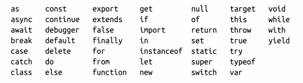
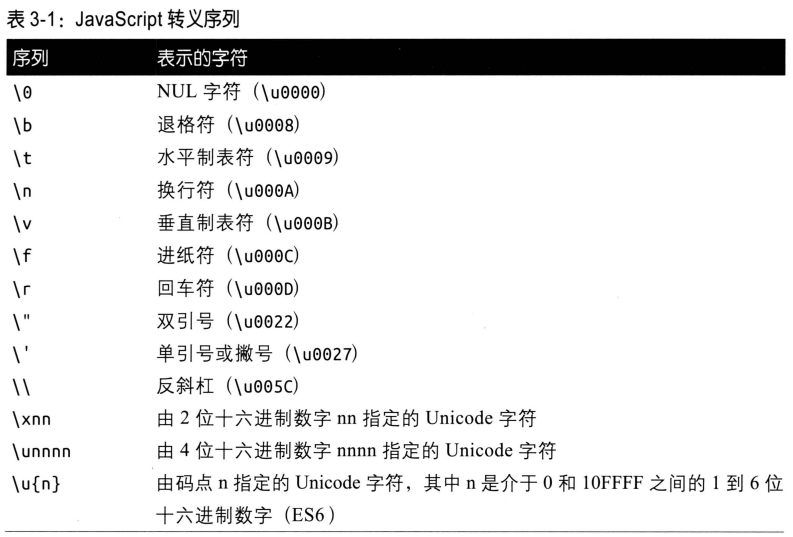
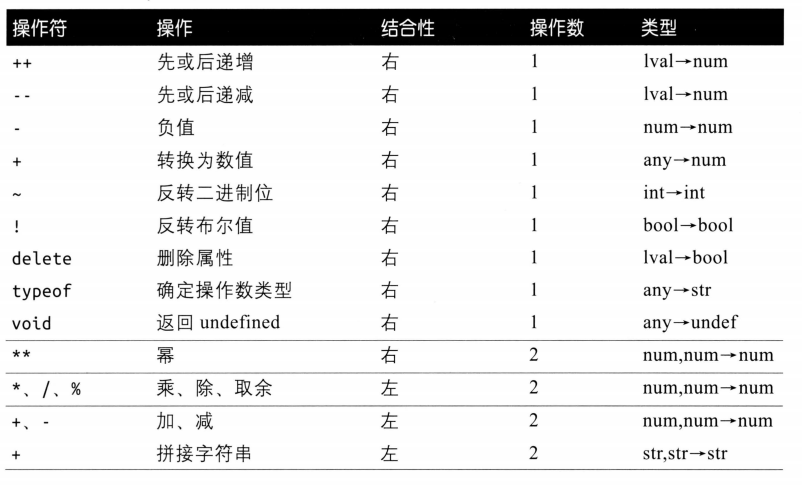
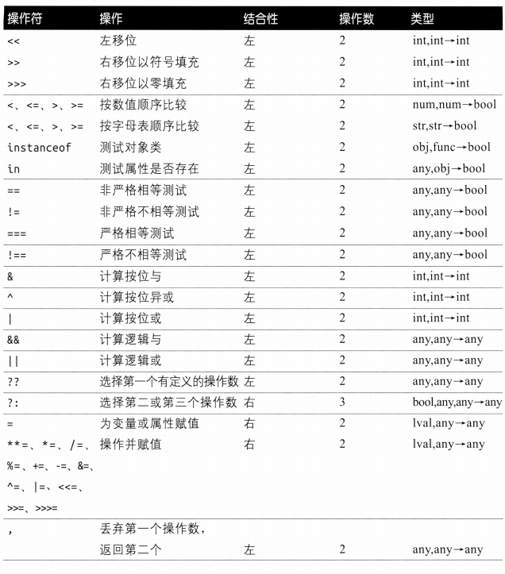

# Javascript 基本语法

[TOC]

> 为了保证向后兼容，无论一个特性的问题有多严重，也不能把它删除。但在 ES5之后，程序可以选择切换到 JavaScript 的严格模式，在这种模式下，一些早期的语言错误会得到纠正。通过use strict指令显式切换，或者使用新的语言特性（例如 class）隐式切换。

## 词法结构

> 何为词法结构？编程语言的词怯结构是一套基本规则 ，规定了如何使用这门语言编写程序，例如如何命名、注释的定界符，以及如何分隔程序的语句， 等等。

JavaScript 区分大小写。

JavaScript 忽略程序记号 token 之间的空格以及换行符。除了常规空格\u0020，JavaScript也将制表符、各种 ASCII 制符和 Unicode 间格视为空格，

JavaScript 支持两种注释 

~~~javascript
//
/* */
~~~

**字面量(literal）**是直接出现在程序中的数据，下面这些都是字面值：

~~~JavaScript
12
1.2
"Hello World"
true
null
~~~

**标识符**必须以字母、下划线、美元符号开头，后续字符中可以有数字

~~~javascript
i
my_variable_name
_dummy
$str
~~~

JavaScript关键字（保留字）如下：

有些关键字可以在特定上下文中当作标识符使用，但还是不推荐这么做。

>由于历史原因或者考虑到将来某个版本的设计，不推荐使用这些作为标识符：enum、implements、interface、package、private、protected、public、arguments、eval
>

JavaScript使用Unicode字符集编写的，考虑到可移植性，还是推荐仅使用ASCII字符集。有些计算机系统对于Unicode字符支持的并不是很好，因此JavaScript定义了转义序列（以\u开头，后跟4个十六进制）使得仅使用ASCII字符来表示Unicode字符。

~~~javascript
let A\u00e9 = 1;
let Aé = 1;	//等价
~~~

>如果你在程序中使用了非 ASCII 字符， 必须知道Unicode允许用多种编码方式表示同一个字符。例如， 字符串“ ”可以被编码 Unicode 字符 u00e9，也可以被编码为一个常规ASCII字符“e“后跟一个重音标记 u0301。看上去一样，但二进制编码却不一样，Javascript因此也会认为它们是不同的。所以在使用Unicode时，务必保证Unicode标准化。

JavaScript只在下一个非空格字符无法被解释为当前语句的一部分时才把换行符当作分号

~~~javascript
let a
a
=
3
console.log(a)

let a; a = 3; console.log(a)
~~~

**一定要在任何时候都要添加分号**。例如

~~~JavaScript
let y = x + f
(a + b).toString()

let y = x + f(a + b).toString();

~~~

更多未加分号而造成匪夷所思的现象，就不再介绍了其它情况了

## 类型系统

JavaScript类型可以分为两类：**原始类型**、**对象类型（引用类型）**。

原始类型包括数值、文本字符串、布尔真值、null、undefined、symbol。本质上还是对象，但是其对象值就是对象本身。这所以这么说是因为可以在原始类型上调用方法，这一点是由解释器在内部用指令实现的，在语法层面上实现不了，这点和Java中String对象的+运算是相似。

~~~javascript
let x = 1;
x.toString();
~~~

对象类型（引用类型）包括对象、数组、Map、RegExp、Date、Error等。其中对象是属性的无序集合，其中每个属性都有一个名字和一个值。数组是一种特殊的对象类型，是值的有序集合。此外，Javascript是一门函数式语言，因此函数和类也是特殊的对象类型。其对象值是对象的引用。

在内存管理方面，JavaScript解释器会执行自动垃圾收集。

JavaScript的对象类型是**可修改的（mutable）**，而原始类型是**不可修改的（immutable）**。这里的可修改指的是可以动态添加属性/元素

~~~javascript
let x = [1, 2];
x[3] = 10;

let y = {
    x : 1
}
y.x = 2;
~~~

JavaScript还支持类型的自动转换，这和动态类型并不冲突。

### 原始类型

JavaScript主要用数值类型**Number**表示近似实数（遵循IEEE 754）。

ES2020为JavaScript定义新的数值类型**BigInt**，用于表示64位整数。

JavaScript中的字符串用**String**类型表示，其元素是16位的。一般操作String中的16位值，而不是字符，并且有些UTF-16字符的编码可能不是16位的。但是**在迭代字符串时（for/or或...操作符），迭代的是字符而不是16位值**。

~~~javascript
let euro = "€";
let love = "❤";
euro.length //1
love.length //2
~~~

JavaScript还为String类型提供了丰富的API，注意String类型不可修改，因此s.toUpperCase()会返回一个新的字符串。访问字符串的元素只能通过方括号语法

~~~javascript
let s = "Hello, World";
s[0];
~~~

JavaScript中支持模板字符串字面量，用反引号\`创建。它会

- 对其中所有的表达式`${expression}`求值
- 并将这些表达式的值转换为字符串
- 然后再将这些字符串与反引号中的字面量结合起来

~~~javascript
let name = "Bill";
let greeting = `Hello ${name}.` //greeting = "Hello Bill"
~~~

此外，模板字符串字面量有一个强大的特性——**标签化模板字面量（tagged template literal）**。如果模板字面量前有个函数名foo，那么插值（${expression}）以及字面量中的其他字符串都会被当成参数传递给该函数foo，举个例子

~~~javascript
function foo(string, value1, value2) {
    //string = ['java', 'script'] value1 = a value2 = b;
    return expression;
}

foo2`Java${a}script${b}`;
~~~

可以对HTML或SQL转义然后插入到文本。

**null**与**undefined**。null是语义上的不存在，类似空指针nullptr，而undefined是编程上的不存在，例如变量未经初始化，对象并未声明，函数没明确返回值，参数未被赋予实参等。

> undefined是一个预定义的全局常量，而null是关键字。这在实践中并不重要

要理解符号**Symbol**，必须先要认识到Object是一个属性的无序集合，而每个属性都要有一个名字。属性名可以是一个字符串（ES6之前一直必须是）或者是一个符号。

Symbol没有字面量，要获取到一个Symbol值，需要调用Symbol(string)函数。这个函数永远不会返回相同的值，即使每次传入的参数都是一样的，利用这个特性，**可以为对象创建唯一的属性名**。Symbol.for(string)会创建一个全局符号，相同的参数会返回相同的值。符号的toString方法返回这种形式的字符串"Symbol(string)"，而Symbol.keyFor()会直接返回“string”

~~~javascript
let s = Symbol.for("shared");
let t = Symbol.for("shared");
s === t						//true
s.toString();				//"Symbol(shared)"
Symbol.keyFor();			//"shared"
~~~

### 对象类型

**`全局对象`**是**一个**特殊的对象值（实例），由JavaScript解释器定义。全局对象中的属性可以在程序中的任何地方使用。其属性包括

- 全局常量：undefined、Infinity、NaN
- 全局函数：isNaN()、parseInt()、eval()
- 构造函数：Date()、RegExp()、String()、Object()
- 全局对象：Math、JSON、Number（由原始类型封装而成对象类型）

> 最好将这些全局标识符视为关键字

在Node中，全局对象有一个名为global属性，其值为全局对象本身。在浏览器中Window对象充当全局对象，其window属性值为Window对象本身。工作线程有自己的全局对象。ES2020定义了globalThis作为任何上下文中引用全局对象的标准方式，Node、浏览器等都遵循这一规定。全局对象就像库函数API一样。

### 类型转换

JavaScript中的任何值都可以转换为布尔值，下列值会转换为false：undefined、null、0、NaN、“”。其他的值都转换为true。

在期望数值的上下文中，其他类型会尽量转换，如果转换无意义，则转换为NaN。在期望String的上下文中，其他类型都能转换为字符串。

| 值           | 转换为字符串 | 转换为数值 | 转换为布尔值 |
| ------------ | ------------ | ---------- | ------------ |
| undefined    | "undefined"  | NaN        | false        |
| null         | "null"       | 0          | false        |
| true         | "true"       | 1          |              |
| false        | "false"      | 0          |              |
| ""           |              | 0          | false        |
| "1.2"        |              | 1.2        | true         |
| "one"        |              | NaN        | true         |
| 1            | "1"          |            | true         |
| Infinity     | "Infinity"   |            | true         |
| -Infinity    | "-Infinity"  |            | true         |
| NaN          | "NaN"        |            | false        |
| {}           |              |            | true         |
| []           | ""           | 0          | true         |
| [9]          | "9"          | 9          | true         |
| ['a']        | 使用join()   | NaN        | true         |
| function(){} |              | NaN        | true         |

~~~javascript
10 + "obejects"			//10 objects
"7" * "4"				//28
let n = 1 - "x"			//n = "NaN"
~~~

某些JavaScript操作符会执行隐式类型转换，利用这一点可进行显式类型转换：

~~~javascript
x + ""
+x
!!x
x - 0
~~~

或者调用Boolean()、Number()、String()函数实现显式类型转换

~~~java
Number("3")		//3
String(false) 	//false
~~~

除null、undefined之外所有类型都有toString()方法。Number类定义的toString()可以接受一个参数，作为基数或底数

~~~javascript
let n = 17;
let binary = "0b" + n.toString(2);
~~~

对象类型到原始类型的转换，根本就是每个类型都会继承toString()或者valueOf()方法

### 字面值

Number的字面量

~~~javascript
0
0xff
0b10101
0o377

//[digits][.digits][(E|e)[(+|-)]digits]
3.14
.333333
6.02e23

let billion = 1_000_000_000;
let fraction = 0.123_456_789; 
~~~

BigInt字面值

~~~javascript
123n
0b11111n
~~~

String

~~~javascript
//"" '' ``
""
'testing'
"3.14"
`"Sge said 'hi'", he said.`
"Wouldn't you prefer O'Reilly's book"

//多行字符串拼接
"one"
+ "two";

"one\
two\
three"
~~~

注意反引号定界符（\`）是ES6的特性。而且ES5允许`\ `将一个字符串字面量拆成多行

字符串中的转义序列以反斜杠（\）开头。

RegExp字面值，一对斜杠之间的文本构成正则表达式字面量，这对斜杠后跟字母用于修改模式的含义

~~~javascript
/^HTML/;
/[1-9][0-9]*/;
/\bjavascript\b/i;
~~~

布尔类型只有两个字面值`true`、`false`

### 变量声明

变量通过let关键字声明：

~~~javascript
let i ;
let sum = 1, sum2 = 2;
~~~

常量通过const关键字声明：

~~~javascript
const i = 10;
~~~

常量必须经过初始化，而且给常量重新赋值会抛出TypeError。

let、const都有**块级作用域**的。var变量具有**函数级作用域**，它们都有**作用域屏蔽规则**

通过var声明的全局变量是全局对象的属性，但不可被delete操作符删除。而let、const声明的全局变量和常量不是全局对象的属性。

var多次声明同名变量是合法的，而let在同一作用域中声明全局变量是非法的。

var声明最不同寻常的特性就是**作用域提升（hoisting）**，变量的声明被转移到了函数顶部，而初始化仍在原始代码位置中。

> ***不推荐在生产环境中使用var变量***

ES6实现了一种复合声明的语句——**解构赋值（destructuring assignment）**，这允许函数一次返回多个值

~~~javascript
let [x, y] = [1, 2]

let [x, y] = foo(r, theta)
function foo(r, theta) {
	return [r * Math.cos(theta), r * Math.sin(theta)];
}

let o = {x : 1, y : 2};
for (const [name, value] of Object.entries(o)) {
	console.log(name, value);	
}
~~~

左侧多余的值会被设置为undefined、右侧多余的值会被忽略。左侧变量列表中可以包含额外的逗号，以跳过右侧的某些值。如果想把右侧多余的值收集到一个变量中，那么在左侧最后一个变量前添加...

~~~javascript
let [x, y] = [1];
[x, y] = [1, 2, 3];
[x, ,y] = [1, 2, 3, 4];
[x, ...y] = [1, 2, 3, 4]; 	//y = [2, 3, 4]
~~~

**右侧必须是可迭代的对象**。上述例子中右侧都是数组。

~~~JavaScript
let transparent = {r : 0.0, g : 0.0, b : 0.0};
let {r, g, b} = transparent;			//此时创建了r g b变量
~~~

如果右侧是普通对象而不是数组，则左侧变量名必须与某个解构对象的属性名相同，否则将会被赋予undefined。如果不想赋值为undefined，可以另指定默认值

~~~javascript
let {sin1 : sin2 = 3, cos = 2} = Math;			//sin2 = 3, cos = function cos
~~~

注意到创建变量的名字必须是对象的属性名，但是以冒号分割的标识符对可以解除这一限制，第一个标识符是要解构其值的属性名，第二个标识符是要把值赋给它的变量名。

~~~JavaScript
let {sin, cos, x} = Math		//x = undefined

//let sin1;
let {sin : sin1} = Math;		//创建了sin1变量
~~~

可以把对象其余的属性收集到以...开头的最后一个元素中

~~~javascript
let {x, ...args} = {x : 1, y : 2, z : 3};	//args = {y : 2, z : 3}
~~~

更复杂的解构

~~~javascript
let points = [{x : 1, y : 2}, {x : 3, y : 4}, [1, 2]]
let [{x:x1, y:y1}, {x:x2, y:y2}, [x3, x3]] = points
~~~

## 运算符 & 表达式

### 运算符

JavaScript提供算术运算符+、-、*、/、%、**（取幂）。此外还通过Math对象提供一组函数和常量，以支持更复杂的数学运算。

~~~javascript
Math.pow(2, 53)
Math.ceil(.6)
Math.PI
~~~

JavaScript在算术上遇到溢出、被零除时都不会发生错误，而是计算出特殊值**Infinity**、**NaN（Not a Number）**。其中只有在计算无意义时，例如`0/0`或者`Infinity / Infinity` `0 + NaN`时，才会计算出NaN，其余情况一律是Infinity。JavaScript预定义了全局常量以对应NaN与Infinity，或者通过Number对象获取这些值：

~~~JavaScript
if (x === Infinity)
let y = Number.POSITIVE_INFINITY
~~~

> 下溢出有两种情况，一种是下溢出到零（Number.MIN_VALUE / 2），另一种是下溢出到无穷（-Number.MAX_VALUE * 2）

注意，非数值NaN与任何值比较都不相等，即使和它自己比较。因此想要判断某个数是否为NaN必须写成

~~~JavaScript
x != x
Number.isNaN(x)
~~~

此外-0与+0相比是相等的，但是参与到运算中会有一些微妙的作用

~~~javascript
1 / 0 === 1 / -0    //false -Infinity != Infinity
0 === -0 			//true
~~~

由于BigInt与Number在不同的场合下都有不错的表现，因此JavaScript只是简单地**不允许在使用算术操作符时混用这种类型的操作数**。而比较运算符的操作数类型可以混用BigInt与Number

~~~javascript
1 < 2n  //true
~~~

此外，位操作符可以作用于BitInt操作数。而Math对象的任何函数都不接受BitInt操作数。

算术运算符作用于字符串，那么将会把字符串拼接起来，这是内置的特性。此外，比较运算符作用于字符串时，实际上比较的是16位序列。

~~~JavaScript
let msg = "Hello, " + "world";
~~~

==运算符不推荐在生产环境中使用，因为它会进行类型转换，而严格相等操作符只要两个操作数的类型不一样，那么就会返回false。

比较运算符对于对象类型来说是无意义的。即使两个对象拥有完全相同的属性和值，它们也不相等

~~~javascript
let o = {x : 1}, p = {x : 1}
o === p 				//false
let a = [], b = []
a === b					//false
~~~

根本原因是对象是引用类型，只有当对象值（引用）相同时，两个对象才相等

~~~javascript
let a = []
let b = a;
a === b;
~~~

若想复制或比较一个对象本身，那么必须考虑它们的全部属性

~~~javascript
function equalArrays(a, b) {
    if (a === b) return true;
    if (a.length !== b.length) return false;
    for (let i = 0; i < a.length; i++) 
        if (a[i] !=== b[i]) return false;
   	return true;
}
~~~

lval即左值，在JavaScript中代表变量、对象属性、数组元素。优先级是从高到低排序的。注意属性访问和调用表达式的优先级高于上述任意一个运算符。

操作符的优先级和结合性规定了表达式中操作的执行顺序，但是它们没有规定子表达式的求值顺序。例如

~~~javascript
w = x + y * z
~~~

w与x+y*z是=的两个子表达式，但是谁先被求值却不一定。结合性解决的是多个相同运算符之间谁先运算的问题，例如x\*x\*x，而不是x\*x。

**in**操作符其他左操作数是字符串、符号，期待右侧操作数是对象。如果左侧的值是右侧对象的属性名，则in返回true。

~~~javascript
let x4 = [1, 2];
console.log("1" in x4);		//true
~~~

**instanceof**左操作数是一个对象，右操作数是一个构造函数。`o instanceof f`在求值时，会在o的原型链中查找f.prototype的值。

??操作符，如果左操作数不是null或undefined则立即返回左操作数，否则返回右操作数。

typeof操作符返回字符串，该字符串是操作数的类型名称

~~~javascript
typeof true //"boolean"
~~~

JavaScript可以通过全局函数eval()对字符串求值，这是一个强大的语言特性，但是在实际项目当中几乎用不到。如果给他传入任何非字符串值，那么他直接返回该值。eval尝试将该字符串当成代码解析，解析失败的话就会抛出SyntaxError。

它通过eval()执行的代码包含在该次调用的执行环境中，因此被执行的代码具有与该执行环境相同的作用域链。

~~~javascript
let x;
eval("x = 2;");
console.log(x); // x = 2;
~~~

如果eval()被“eval”之外的其他名字调用时，他应该把字符串当成顶级全局代码来求值，但不会在使用后修改该调用函数的局部变量，因此也就不会妨碍局部优化。

~~~javascript
const geval = eval;
let x = "global", y = "global"
function f() {
	let x = "local";
    eval("x += changed;");
    return x;
}
function g() {
    let y = "local";
    geval("y += changed;");
    return y;
}

console.log(f(), x);
console.log(g(), y);
~~~

delete删除对象中的属性，有意义的一点是，如果delete数组中间的元素，那么这个数组的长度不会发生改变，但是会成为一个稀疏数组。

~~~javascript
let o = {x : 1, y : 2};
delete o.x;

let a = [1, 2, 3];
delete a[2];
~~~

不可配置属性是不可被delete。其返回值是boolean，某些情况下会抛出异常。

### 表达式

最简单的表达式被称为主表达式（primary expression），例如字面值、关键字（true、this）、变量、常量、全局对象属性。此外还有对象和数组初始化程序表达式、函数定义表达式、属性访问表达式、调用表达式、对象创建表达式。

`?.`和`?.[]`的条件式属性访问是JavaScript最新的特性 。a?.b，如果a是null或者undefined，那么整个表达式立即停止求值（短路求值）并返回undefined。此外，还有条件式调用`?.()`，如果函数表达式是null或者undefined，那么整个表达式立即（短路求值）返回undefined

~~~javascript
function square(x, log) {
	log?.(x);
    return x * x;
}
~~~

## 语句

表达式语句，是具有副作用的表达式。

~~~javascript
counter++;
greeting = "Hello " + name;
delete o.x;
~~~

复合语句与空语句

~~~javascript
{
     
}
;
~~~

条件语句

~~~javascript
if (expression) 
    statement
 else if (expression) 
    statement
 else 
    statement

switch (expression) {
    case expression : 
        statement
        break;
    default : statement
}
~~~

注意case的值可以是任意表达式且在运行时求值，这与Java、C++在编译期求值是有所不同的，但是性能会更低。

循环语句

~~~javascript
while (expression)
    	statement;

do 
    statement
 while (expression)
    
for (initialize;test;increment)
    	statement

for (let variable of object) 
	statement

for (let variable in obeject)  
~~~

for语句中的循环变量可以是const的，只要确保在循环体内不会被重新赋值即可。

for/of中的object必须是可迭代对象，否则会抛出TypeError。现在只需知道数组、字符串、集合、映射是可迭代的就行了。这种迭代是“实时的”，在statement修改object会立即反应到下一次迭代当中。

for/in循环将对象属性名赋给variable，for/in循环并不会遍历不可枚举属性以及符号，遍历时还包括继承属性。

跳转语句break、continue、yield、throw、return

语句标签

~~~javascript
identifier : 
	statement
~~~

语句标签只在定义它的语句中有效，而且标签名可以与函数名、变量名重名，因为它们并不在同一个命名空间中。break、continue语句可以带标签。

~~~JavaScript
lable : while (expression) {
    continue lable;
}
~~~

异常

~~~javascript
try {
    //正常情况下try块里的语句会依次执行，但是遇到throw语句，那么立即处理异常
} catch (e) {
    //当且仅当try块抛出异常时，才会执行这个块中的语句，这里的e和函数形参相似。
    //可以重新抛出异常，提交给上一层执行环境中，此时会立即退出当前执行环境
} finally {
    //无论何种情况，这个块会必定执行
    //1）break、continue、return
    //2）try
    //3）catch、或者catch重新抛出throw
}
~~~

如果产生了异常而没有捕获，则自动提交给上一层环境。

还有with语句，现在已经废除，不在介绍。

debugger语句设置调式断点。

## 数组 

在JavaScript，数组是有序属性集合。

数组是一种特殊的Javascript对象，因此数组索引更像是字符串类型的属性名，只不过是整数形式的。

JavaScript数组实系数的，即元素不一定具有连续的索引，中间可能有空位。

数组是无类型限制的，即数组中的元素可以是任意类型，元素之间的类型可以不同。ES6增加“定型数组”（typed array）。它和C++数组的实现相似

### 创建数组

**数组字面量**

~~~javascript
let primes = [2, [2, 3, 4], "string", true, {x : 1, y : 1,},];
let sparse = [1, , , , 2]			//创建一个稀疏数组，undifined
~~~

最后一个分号会被忽略掉。

**扩展操作符**（在对象字面值中也有类似的用法）

~~~javascript
let a = [1, 2, 3]
let b = [0, ...a, 4];		//深赋值a
let letters = [..."hello world"];
[...new Set(letters)];
~~~

扩展操作符可用于任何可迭代的对象，

Array构造函数

~~~javascript
let a = new Array();
let a = new Array(10);		//注意，仅仅会分配空间，甚至连索引都没建立
let a = mew Array(5, 4)		//a = [5, 4]
~~~

Array.of 工厂方法

~~~javascript
Array.of ()	//[]
Array.of (0) //[0]
Array.of(5, 4) //[5, 4]
Array.from(iterable)	//等价于[...iterable]
Array.from(iterable, map())	
~~~

### 访问、添加、删除、迭代数组元素 

只要理解数组是特殊的对象就可以了，它会继承Array.property，其余和普通对象没什么不同。同时你使用小于$2^{32} - 1$非负整数作为索引时，数组会有特殊的行为。

对数组元素使用delete操作符并不会修改length属性，也不会将高索引位的元素向下移动来填充被删除属性的空性，这就是导致数组稀疏的原因。稀疏数组中空闲位置所对应的索引是被移除的。

第一，它会维护一个不变式（invariant）——数组无论稀疏与否，任何元素的索引都不会大于或等于数组的length。因此length属性设置为小于当前值的非负整数n，那么任何索引大于或等于n的数组元素都会从数组中删除。而且给索引为i的数组元素赋值，而i大于或等于length，那么length就会被设置为i+1。

~~~javascript
let letters = [..."HelloWorld"];
for (let letter of letters) {

}

for (let [index, letter] of letters.entries()) {
	
}

letters.forEach(letter => {
	uppercase += letter.toUpperCase();
})
//forEach方法会自动跳过undefined
//流式编程会详细介绍这一点。

~~~

### 数组的迭代器方法（流式编程） & 其他方法

数组的迭代器方法接受两个参数，第一个参数是对元素处理的函数，第二个参数（可选）。这些迭代器方法都会自动忽略掉undefined元素。对元素处理的函数可以接收三个参数：数组元素的值、数组元素的索引、数组本身，一般我们只需第一个参数，其余两个参数可以忽略掉。

> 尽量避免在迭代器方法中函数参数的副作用会影响原数组的元素！

forEach会遍历数组中的每个元素，会跳过undefined元素

~~~javascript
let data = [1, 2, 3, 4];
data.forEach(value => {
    sum += value;
});
data.forEach(function (v, i, a) { a[i] = v + 1});
~~~

map方法对原数组处理后返回一个新数组。如果数组是稀疏的，那么返回的数组与原始数组一样稀疏：长度相同，缺失的元素也相同。

~~~javascript
let data = [1, 2, 3, ,4];
console.log(data.map(x => x * x));		//[1, 4 ,9, ,16]
console.log(data);					   //[1, 2, 3, ,4]
~~~

filter方法对原数组进行筛选，保留这样的元素，作为断言函数的参数而函数返回true。它会自动跳过undefined元素

~~~javascript
let a = [5, 4, 3, 2, 1];
a.filter(x => x < 3);
a.filter((x, i) => i % 2 == 0)
~~~

find()与filter()类似，不过找到第一个使断言函数返回true的元素后就直接返回该元素，如果找不到那么就返回undefined。

~~~JavaScript
let a = [1, 2, 3, 4, 5];
a.find(x => x % 5 === 0);
~~~

every()对考察所有的数组元素，若全都通过则返回true。some()与every()类似，不过只需一个元素满足条件就返回true

~~~javascript
let a = [1, 2, 3, 4, 5];
a,every(x => x < 10);		//true
a.some*(x => x > 4)			//true
~~~

reduce()使用我们指定的函数归并数组元素，最终并产生一个值。它接受两个参数，第一个参数是归并函数，第二个参数是初始值，省略掉则数组的第一个元素作为初始值。

~~~javascript
let a = [1, 2, 3, 4];
a.reduce((x, y) => x * y, 2)	//48
~~~

归并函数的第一个参数是之间计算的结果。

reduceRight与reduce类似，不过是从高索引低索引进行处理的。

flat()打平数组

~~~javascript
let a = [1, [2, [3, [4]]]];
a.flat(1);	//[1, 2, [3, [4]]]
a.flat(2);	//[1, 2, 3, [4]
a.flat(3);	//[1, 2, 3, 4]
a.flat(4);	//[1, 2, 3, 4]
~~~

`a.flatMap(f)`等价于`a.map(f).flat()`，但是前者效率远高于后者。

concat返回一个新的数组，并不会修改调用它的数组，并且它会打平一层

~~~javascript
let a = [1, 2, 3];
a.concat(4, 5);				//[1, 2, 3 ,4 ,5]
a.concat([4, 5], [6, 7]);	//[1, 2, 3 ,4 ,5]
a.concat(4, [5, [6, 7]]);	//[1, 2 ,3 ,4, 5, [6, 7]]
~~~

数组还使用push、pop、shift、unshift函数实现栈和队列操作

unshift用于在数组开头添加一个或多个元素，已有元素的索引会相应地向更高索引移动，井返回数组的新长度 shift 删除并返回数组的第一个元素，所有后续元素都会向下移动一个位置。

数组还定义了几个处理连续区域的方法。

~~~javascript
slice()
splice()
fill()
copyWhitin()
indexOf()
lastIndexOf()
includes()
sort()
reverse()
join()
~~~

### 类数组对象

只要该对象具有length属性，并且该length属性是非负整数，同时具有整数形式的属性名，那么该对象就是类数组对象。

~~~javascript
let a = {"0" : "a", "1" : "b", "2" : "c", length : 3};
Array.prototype.join.call(a, "+");
~~~

数组的方法有意设计成“泛型”算法，但是类数组对象的原型并不是Array.property，可以通过使用Function.call()方法来解决。					  

