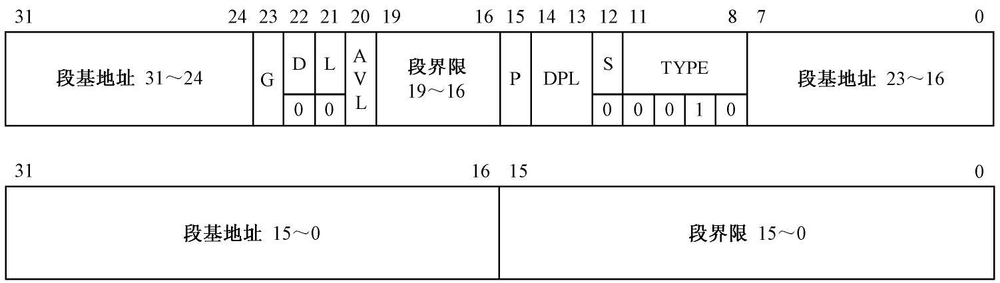
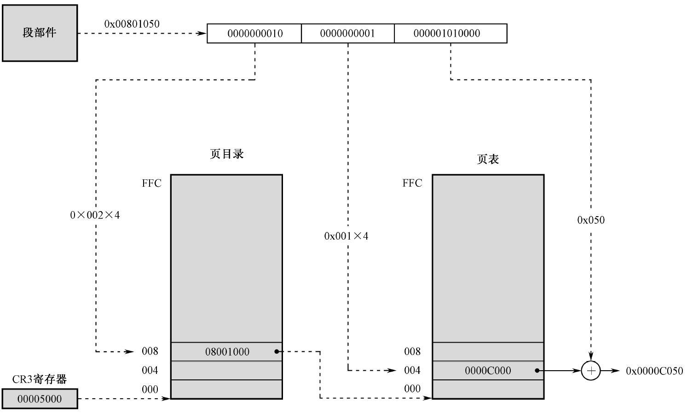

# 保护模式

[TOC]

## 段

**段描述符（Segment Descriptor）**存放着某个段（内存区域  ）的元信息，占8个字节。其格式如下：

- 段基地址：由于要兼容80286处理器的16位保护模式，对该段基地址进行了分段处理。从理论上讲，段基地址可以是0 ~ 4GB的任意地址，但是从程序优化角度考虑，推荐选择16位字节对齐的地址。

- 段界限：用于限制段的扩展范围，即说明了段内有效数据的偏移量最值。

- G：粒度（Granularity），G为0时，段界限以字节为单位，为1时，以4KB为单位。

- D/B：默认操作数大小、默认栈指针大小、上部边界（Upper Bound）。该位决定处理器是运行在16位保护模式下还是32位保护模式下。设置为1，则处理器运行在32位上

- L：64位代码段标志，预留给64位处理器，在32位上设置为0即可。

- AVL：预留给软件使用，从硬件上不做解释。

- P：段存在位（Segment Present），描述符所对应的段是否在内存上，用于虚拟内存机制。为0时，说明不在，会产生一个异常中断。

- DPL：描述符等级，访问该段所具备的最低特权级，特权级从低到高分别为3、2、1、0。

- S：描述符的类型，0表示是一个系统段，1表示是代码段或者数据段。

- TYPE：共四位，描述符的子类型，同时说明段的特征

	

- X：代表是否可执行，用于区分数据段以及代码段的
- E：数据段的方向
- W：是否可写
- C：是否为依从（Conforming）代码段，在特权转移时中起作用
- R：是否可读，例如，通过mov指令访问该内存区域
- A：已访问位，访问该描述符时，处理器自动将该位设置为1，清零的工作由软件负责。经常通过定期“监视”该位的状态来统计该描述符的访问频率。在虚拟内存管理中，访问频率是一个重要的参数。

注：在实际编程中，段描述符受到小端序的影响。

~~~asm
;0x00cf92000000ffff
mov dword [ebx + 0x00], 0x0000ffff
mov dword [ebx + 0x04], 0x00cf9200

mov word [ebx + 0x00], 0xffff
mov word [ebx + 0x02], 0x0000
mov word [ebx + 0x04], 0x9200
mov word [ebx + 0x06], 0x00cf
~~~

当两个甚至更多的描述符都指向同一段时，把其他的描述符称为**别名（alias）**。别名的一个应用就是两个程序共享一块内存，但是具有不同的读写权限。

**全局描述符表寄存器（Global Descriptor Table Register）**由32位的**全局描述符表线性基地址**与16位的**全局描述符表边界**两部分组成。其中，前者保存的是`GDT`的起始线性地址；后者保存的是`GDT`的边界，数值上等于表的大小减一，即有效数据最后一个字节的偏移量。

全局描述符表寄存器

该表最大`64KB`（16位无符号数），而一个`SD`占8字节，故一个`GDT`可存放`8192`个`SD`。此外Intel处理器规定禁止访问`GDT`中第一个描述符，否则将引发异常中断。

GDT与GDTR关系图

进入保护模式前的内存映像

这里稍微解释一下，主引导程序共`0x200（512）`个字节，而其起始地址为`0x7c00`，故可以将`GDTR`放在`0x7c00 + 0x200 = 0x7e00`处。理论上，`GDTR`可以扩展到物理地址`0x7e00 + 64KB = 0x17dff`处，这并不会超出实模式下的最大可访问内存地址`0xfffff`以及内存的映射地址范围`0x00000 - 0x9ffff`。

### 第21根地址线A20

在8086中，地址会出现**wrap-around现象**（从0xfffff绕回到0x00000）。为了向后兼容8086，80286采用了A20Gate来控制对A20地址线的访问。如果Gate为1，则任意使用A20；若Gate为零，则A20强制为零，虽然这样能兼容8086程序，但是这样我们在保护模式下可访问地址就不连续了。进入保护模式之前，必须将A20地址线打开。操作方法及其原理如下：

端口0x92中第二个比特设置为1，或者端口0x60中第一个比特设置为1（不推荐），则A20地址线有效。

不推荐适用端口0x60的原因有：

- 老式键盘控制器很有可能被USB控制器取代。
- 还得等待键盘处于空闲状态。

### 内存访问

在32位上，新增了两个段寄存器GS、SS，以及为每个段寄存器配备了**描述符高速缓存器**。

在保护模式中，段寄存器称为**段选择器**，保存的并不是段的偏移地址，而是**段选择子**，其格式如下：

- **描述符指示器（Table Indicator）**：为0时，表示描述符在GDT中。为1时，表示在LDT中。
- **请求特权级（RPL）**。

值得注意的是，在实模式下，仍然会用到缓冲器，此时缓冲器中的段基地址是段选择子左移4位的结果。进入保护模式后，这些内容仍残余着，故要立即刷新段选择子。此外处理器在进入保护模式后，执行的第一条指令应当是跳转或者过程调用指令，以清空流水线和乱序执行的结果，并串行化处理器。

~~~asm
jmp dword 0x0010:flush 	;刷新cs
mov eax, 0x0008
mov es, eax
mov fs, eax
;... 刷新其他段
~~~

内存地址的计算：

- 首先根据段选择子计算出段描述符（TI = 0）的内存地址，计算方法如下：` 段选择子中的描述符索引 * 8 + GDTR中的全局描述符表线性基地址`。

  

  

  ​	若以下情况都通过，则将GDT中对应的段描述符加载到描述符高速缓存中。只要不改变此段选择器中的内容，则不必重复执行此步骤，而是**直接访问缓冲器中的内容**即可，以加速内存的访问。

  - 若`索引号 * 8 + 7 `超出段界限（整个描述符都必须在段界限之内），则抛出**异常13**，并且段选择器的内容保持不变。

  - 段的类别检查：描述符的类别是否和段寄存器的用途匹配，规则如下图所示

  	

  	N表示判断失败，则抛出异常。Y表示判断成功

  - P位，P=0时（段被定义但不在内存中），处理器引发异常中断11。

  - 特权级别的检查

  

- 接着判断指令中的偏移地址超出界限，则产生异常中断。否则将指令中的偏移地址与缓冲器内提供的段基地址相加，正常访问内存单元。

	

	- 若TYPE中的E位是1，即段向下扩展，则根据 `偏移地址 > 段界限 * 粒度 `判断是否超出界限。这里有一个有意思的现象，即偏移量只要大于段界限 * 粒度即合法，所以访问范围是`段界限 ~ 0xffffffff`。举个例子，设栈堆的线性基地址为0x00007C00，而段界限为0xFFFFE，粒度为4kb。处理器将会检查ESP是否在`0xFFFFF000 ~ 0xFFFFFFFF`之间（计算过程见P215），那么ESP与线性基地址相加得栈堆的实际地址范围，即`0x00006C00 ~ 0x00007BFF`。一般先将ESP初始化为0。

		
		
		

	
	
	- 段向上扩展，则根据 $偏移地址 \leq 段界限 * 粒度$ 判断是否超出界限。段向下扩展，根据 $偏移地址 \geq 段界限 * 粒度 + 1$ 判断是否超出界限。`+1`为了将向下扩展的段与向上扩展的段进行隔离。
	
	- 这里需要说明一下`段界限 * 粒度`。粒度是4kb时，计算公式是`(段界限 + 1) * 1000 - 1`，即`段界限 * 1000 + 0xFFF`。粒度是字节时，计算公式是`段界限 * 1`。
	
	- 此外，在访问的指令时必须满足
	
		$0 \leq （EIP + 指令长度 - 1） \leq$ 段界限，也就是说指令整体必须位于段界限内。同时这一条规则对于数据的访问也适用，必须考虑操作数的尺寸。这样就严格保证了在段内访问，防止段溢出攻击。
	
- 对于描述符`TI = 1`的情况简单描述下。此时不再使用GDTR中的线性基地址来计算，而是使用LDTR中内部描述符高速缓存中的LDT线性基地址来计算，其他步骤都是相同的。

## 门

**门（Gate）**：门是另一种形式的描述符，用于描述可执行代码的，可安装在`GDT`或者`LDT`中。门有以下类型：

- 调用门（Call-Gate）
- 任务门
- 中断/陷阱门

### 调用门

调用门用于在不同特权级的程序之间进行控制转移，通常描述一个例程，且保存在`GDT`中。该描述符的格式如下：

- 段内偏移量：例程所在代码段的偏移量
- TYPE：1100，固定值
- 参数个数：见下面的描述
- P：在调用门中，该位作为有效位，普通的段描述符该位解释不同，通常为1。一个使用该位的例子是统计使用频率：初始设置为0，访问该门时会产生异常中断，通常会调用中断处理程序进行处理并将该位置为1，然后在例程中进行统计操作，最后在例程中再将该位设置为0。
- DPL：调用门描述符中的DPL（决定下限）和选择子中的DPL（决定上限）共同决定哪些程序可以访问该门，规则如下：数值上要满足：`目标代码段的DPL <= CPL(RPL) <= 调用门描述符的DPL`

### 任务门

任务门用于任务切换中，保存在中断描述符表中，该描述符的格式如下：

- P是有效位，设置为0时，则不允许通过此门实施任务切换
- DPL，任务门描述符的特权级，由中断而调用任务门时，DPL可能会失效，即处理器不按特权级施加任何保护。由非中断方式调用任务门时，DPL生效。此时，与数据段的检查规则一样，要满足 `CPL（RPL） <= 任务门描述符的DPL`

### 中断陷阱门

中断门、陷阱门的格式相同，但是通过中断门进入中断处理程序时，EFLAGS寄存器的IF位被处理器自动清零，已禁止嵌套的中断，当中断返回时，再从栈中恢复EFLAGS的状态。而陷阱的优先级较低，当通过陷阱门进入中断处理程序时，EFLAGS的IF位不变。

注意：EFLAGS寄存器的IF位仅影响硬件中断，对于NMI、异常、int n等不去作用。

## 特权级

在分段机制的基础上，Intel处理器引入了特权级，并由固件执行特权级保护机制。

特权级分为以下四级：

特权级别的类型有以下四种：

- **DPL**：`描述符特权级`，在段描述符中。段描述符总是指向它所描述的目标对象（资源），因此DPL实际上就是该目标对象（资源）的特权级。

- **CPL（Current Privilge Level）**：`当前特权级`，是`CS`段选择子中的`RPL`，即是一种特殊的RPL。其他的段寄存器都可以由`MOV`指令进行修改，而`CS`段寄存器只能由`CALL`等转移指令隐式修改。

	​	值得注意的是，当应用程序调用系统服务时，它处于全局空间中，此时`CPL = 0`，而执行自己的私有代码段时，`CPL = 3`。

	​	有些指令（例如：hlt、lgdt等）必须在`CPL = 0`的环境中才能执行，称它们为**特权指令（Privileged Instructions）**。

	​	`CPL`的特权检查是十分严格的。一般来说，控制转移只允许发生在两个特权级别`CPL`相同的代码段之间。但是可以通过以下两种方法放宽这种检查：

	- **依从代码段**：将高级别的代码段定义为依从的，即将`TYPE`字段的`C`位设置为`1`，这样就允许低级别转移到该代码段，这样必须在数值上满足`CPL >= 目标代码段的DPL`。当控制转移到依从代码段上执行时，不改变当前特权级`CPL`，也就是说依从代码段不是在它的`DPL`特权级上运行，而是在调用程序的特权级上运行。在任何时候都不允许将控制从较高的特权级别代码段转移到较低的特权级，这是因为高级别的代码段不信任不可靠的低级别代码段。不推荐使用这种方式，因为高特权级别程序必须把相应例程的地址暴露给应用程序，怀有恶意的程序员通过分析该地址，进而对特权级程序实施攻击。
	- **门（Gate）**：门是另一种形式的描述符，用于描述可执行代码的。门有多种类型，这里不多介绍。将**调用门（Call Gate）**的段选择子作为操作数，此时使用`jmp far`指令，可以将控制通过门转移到比`当前特权级高的`  `依从的`代码段，但是无法直接返回到调用点！，一般用于保证不会再返回调用点处的情景，例如任务完成时。而使用`call far`指令，可以将控制通过门转移到比`当前特权级高的` 代码段，同时可通过`retf`指令返回到调用点。在任何时候都不允许将控制从较高的特权级别代码段转移到较低的特权级（除了`retf`指令）。更多讨论请见`调用门`一小节。依从代码段的规则依旧适用于调用门的讨论。

- **RPL（Requested Privilege Level）**：`请求特权级`。引入RPL的意图是“确保特权代码不会代替应用程序访问一个段，除非应用程序自己拥有访问该段的权限”，本质上就是处理**访问者**（段选择子，`RPL`）与**受访者**（段描述符，`DPL`）之间的关系。这需要操作系统以及硬件之间的配合，其中硬件负责检查特权级，而操作系统有义务保证访问者拥有合适的请求权限，即确保RPL的有效性，这一点通过`arpl`指令实现。高级别的程序有权访问低级别程序的数据段，反之则禁止。

	应用程序可能恶意修改段选择子的`RPL`部分，如果操作系统不介入，那么处理器是无法分辨正确的请求者，这样应用程序可以随心所欲修改系统数据段了。因此`x86`体系结构中引入了`arpl`指令，操作系统使用该条指令确保段选择子的`RPL`与请求者的身份相符。

	~~~asm
	arpl r/m16, r16
	~~~

	该指令执行时，比较两个操作数中的RPL字段，若目的操作数的RPL在数值上小于源操作数的`RPL`，则设置ZF位，并且使目的操作数的RPL与源操作数的RPL相同。否则ZF清零。操作系统从当前栈中取得应用程序的代码段选择子作为该条指令的源操作数，而应用程序给出的段选择子作为目的操作数。这一点的合法性来自于`CS`的`RPL`不能通过`mov`指令修改，只能通过`call`、`jmp`指令隐式修改。

	

- **I/O PL**：I/O特权级。操作系统不希望应用程序私自访问外部设备。为了限制程序对I/O设备的访问，引入了**I/O特权级**，用EFLAGS寄存器中`IOPL位（位12、13）`来指定当前任务的**IO特权级**。在数值上若满足`CPL <= IOPL`，则程序可以访问任何硬件端口。否则不可访问硬件端口，但是可以根据TSS中的`I/O位许可串`访问特定的端口。`I/O位许可串（I/O Permission Bit String）`中每一个bit映射到一个端口，若该bit位为1，则禁止访问该端口，为0，则可以访问该端口。Intel处理器最多可以访问到`65536`个端口，若`I/O PBS`长度小于`8KB`（`65536 bit`），则未说明的bit一律视为`1`。

	

	此外，执行以下指令`popf	  iret	cli	sti`则在数值上必须满足`CPL <= IOPL`，否则对于popf、iret指令来说，会产生中断；对于cli、sti不会产生中断，但不会改变标志寄存器的IF位。这是因为驱动程序（级别1、2）需要执行该指令，但是应用程序（级别3）禁止执行，所以才有上述的限制。

	

总结以下访问的规则：

- 如果直接转移到非依从的代码段，则数值上必须满足`CPL(RPL) = 目标代码段的DPL`
- 如果转移到依从代码段，则数值上`CPL(RPL) >= 目标代码段的DPL`
- 如果访问数据段，则数值上`CPL <= 目标数据段的DPL 且 RPL <= 目标数据段的DPL `
- 如果访问栈，则数值上`CPL=目标数据段的DPL 且 RPL=目标数据段的DPL `。
- 若不满足上述条件，则抛出异常

   

## 任务        

一个正在执行的**程序（Program）**副本称为**任务（Task）**。每个任务包括两个部分：

- **全局部分**：所有任务之间共有的例程库（系统服务）与数据
- **私有部分**：每个任务各自的数据与代码

所谓的**全局部分**或者**私有部分**，实际是在内存上的地址划分，即**全局地址空间**或**私有地址空间**。全局空间是由**GDT**来指定的，而局部空间是由**局部描述符表（LDT）**来指定的。在处理器中会额外的添加一个**LDTR**硬件，用于保存当前任务LDT的段选择子（出于安全性考虑，不保存LDT的基地址）。

这里再讨论一下任务的虚拟空间地址。从理论上讲，GDT最多定义8192个段（不考虑0号段不可用），而每个段的最大长度是4GB、因此GDT可以映射到$2^{13} \times 2^{32} = 2^{45}$字节的全局地址空间，即`32TB`。同理一个任务的LDT也可以映射到`32TB`的局部地址空间，因此一个任务就有`64TB`的地址空间。但实际上，Intelx86处理器只有32个地址线，因此最多映射到`4GB`的地址空间。

此外，为了实现**多任务切换**机制，必须以某种方式保存旧任务的运行状态（各个寄存器等），以便当下次重新执行此任务时，能够恢复之间的状态。为此，每个任务都用一个额外的内存区域来保存运行状态，这段内存称为**任务状态段（Task State Segment）**。TSS具有固定的格式：

TSS一般是104个字节，但是可以包含至多8KB的`I/O位许可串`。因为端口是按字节编址的，举个例子，在in指令中使用ax操作数，会连续读取两个8bit端口的内容，所以`I/O位许可串`最后一个字节必须是`0xFF`，以防止越界访问。

`I/O映射基地址`给出了`I/O位许可串`相对于TSS起始处的偏移量（以字节为单位），若`I/O映射基地址`大于TSS的段界限，说明没有`I/O映射基地址`。

`T`是调试位：`T`设置为`1`时，则当发生任务切换时，将产生一个异常中断。

`CR3`与虚拟内存有关，此处不做过多讨论。

在处理器中额外添加了**TR**（Task Register）硬件，用于保存当前任务TTS的段选择子（出于安全性考虑，不保存TTS的基地址）。当发生任务切换时，首先将旧任务的状态（GS、FS、EFLAGS、EAX等寄存器）保存到由TR指向的TTS中。更新TR，将其指向新任务的TTS，最后从TTS中恢复新任务的状态。

TR描述符高速缓存器中保存着TSS的线性基地址，用于加速内存的访问，LDTR同理。GDTR没有也不需要这种高速缓存器。

任务的`LDT`以及`TSS`本质上就是一个内存段。与`GDT`一样，它们由操作系统统一管理，因此称它们为**系统段**，在`GDT`段描述符中的`S`位反应了这一特性。Intel处理器要求每个任务的`LDT`与`TSS`都必须在`GDT`中安装相应的描述符，这样可以对`LDT`以及`TSS`做特权检查，防止用户私自修改这部分内容而造成安全问题。这就是`LDTR`以及`TR`中仅在缓存器中保存基地址的原因。

`LDTR`的更新发生在

- 手动更新：执行`lldt`指令
- 自动更新：任务切换时

`TR`的更新发生在

- 手动更新：执行`ltr`指令
- 自动更新：任务切换时

TSS选择子、LDT选择子与段选择子的格式一样。但描述符有送区别：

- LDT描述符的格式

	

- TSS描述符的格式

	
	
	
	
	TYPE字段中的B位表示的是当前任务是否在忙（Busy）。

这里需要强调一下调用门与`TTS`之间的关系：在使用调用门改变`CPL`时（Call），栈段的特权级必须同当前特权级保持一致，因此程序必须定义多个（具体数量取决于特权级别）级别不同的栈段。这样做一方面防止栈空间不足而导致不可预料的错误，另一方面避免栈数据的交叉引用。这些额外的栈会在操作系统加载程序时自动在`LDT`中创建（在任务局部空间内创建），并且在`TSS`中保存，而程序员不必关心这些栈。在`CPL`改变时，处理器相关固件会根据程序的`TSS`自动切换栈。此外还需考虑对于参数的影响，参数一方面可由寄存器进行传递，这一点我们无需考虑，另一方面，参数可由栈进行传递，当栈切换时，处理器固件根据调用门中的参数个数位，自动地将旧栈中的参数拷贝到新栈当中。

从上述讨论中概括出两个重点：

- 栈切换由处理器固件自动执行。
- 只有改变CPL时，才会执行栈切换操作。

栈切换的具体过程如下（一）：

- 根据调用门描述符中目标代码段的`DPL`从`TSS`中获取相应特权级别栈堆的信息，包括栈指针以及栈选择子。在此期间，对于任何违反特权级别（段描述符的DPL不和预期）的以及段界限（段描述符的界限与栈指针冲突）的行为，处理器都会产生异常中断（`无效TSS`）

- 将旧的`SS`和`ESP`保存到临时寄存器中。
- 把新的栈选择子和栈指针保存到`SS`和`ESP`寄存器中，即切换到新栈
- 将旧的`SS`与`ESP`从临时寄存器中压入到新栈中
- 再根据调用门描述符的参数个数字段，从旧栈中将素有参数都复制到新栈中。
- 将旧的`CS`和`EIP`压入到新栈中
- 从调用门描述符中将新的`CS`与`EIP`保存到相应的寄存器中

栈切换的具体过程如下（二）：

- 根据栈中的`CS`决定是否在返回时改变特权级别。同时实施特权级别检查，不允许返回到特权级别更高的代码段。

- 如果`retf`指令是带参数的，则相应地跳过栈中的参数部分。一旦检测出违反段界限（过多跳过参数部分）的行为，则产生中断异常。

- 如果在返回时需要改变特权级，则将栈中的ESP与SS弹出，即切换到调用者的栈

- 如果`retf`指令是带参数的，则切换到旧栈中还要再次跳过栈中的参数部分

- 如果在返回时需要改变特权级，则切换栈后根据DS、ES、FS、GS的内容获取到相应的段描述符。要是任何一个段描述符的DPL高于CPL，即在数值上`段描述符的DPL < 返回后的新CPL`，那么将数值`0`传送到该段寄存器。

	特权级别的检查只发生将段选择子代入到段寄存器时，在此之后的内存访问就不再做检查。如果特权程序在执行过程中使用了自己的数据段，但返回时未对段寄存器做修改，那么应用程序仍然可以通过段寄存器该可以访问到系统数据段。

	~~~asm
	mov ds, ax			;进行特权检查
	mov edx, [0x2000]	 ;不进行特权检查
	~~~
	
	对于特权级程序来说，安全的做法是对数据段进行栈操作：

	~~~asm
	push ds
	mov ds, ax
	;...
	pop ds
	retf
	~~~
	
	如果特权程序不这么做，一定有它的道理，处理器无权干涉。为了解决这个问题，就采用了本条规则。

	特别值得注意的是：处理器并不会自动修改任务状态段中的`SS0`、`ESP0`等字段。
	
	
	
	
	
	## 任务切换

一定要区分`特权级之间的控制转移`与`任务切换`。

任务切换有两种基本的方式：

- 协同式
- 抢占式，此时需要`TCB`（Task Control Block，任务控制块）。

任务切换的方法：

- 中断：在保护模式下，中断描述符表取代了实模式下的中断向量表。中断描述符表中保存的是**门描述符**，包括**中断门**、**陷阱门**、**任务门**。中断发生时，处理器将`中断号 * 8`作为中断描述符表的索引，获取到门描述符。对于中断门以及陷阱门来说，本质上仍是任务内的控制转移行为，即转移到任务的全局空间执行系统级的管理工作。如果是`任务门`，那么性质就截然不同了，就必须进行任务切换。更详尽的阐述请见`门`一小节。
- `call`、`jmp`指令：跳转到`GDT中的TSS描述符`、`GDT中的任务门描述符`、`LDT中的任务门描述符`时。
- `iret`指令：在`EFLATS`中`NT`位置为`1`的条件下，执行该条指令。

在任务切换时，处理器执行以下步骤：

- 获取新任务的TSS选择子：

	- CALL或JMP的操作数直接是TSS选择子。
	- CALL或JMP的操作数是任务门选择子，再从任务门描述符中获取到TSS选择子。
	- IRET且NT = 1，从当前TSS中的任务链接域中直接获取。
	- 异常中断，从中断描述符表中获取任务门，再从任务门描述符中获取到TSS选择子

- 进行检查

	- 特权检查。由于异常、中断（除`int `n指令）、`iret`而进行的任务切换，忽略TSS描述符的`DPL`与目标任务门的`DPL`。除此之外的任何情况都要满足  `CPL（RPL） <= 任务门描述符的DPL`
	- 检查`TSS描述符`是否有效（`P=1`）以及界限是否有效（` >= 103`）。
	- 检查任务是否可用，对于`iret`要求忙 (`B = `1) ，请他情况要求不忙（`B = 0`）
	
- 按下表对TSS任务链接域、B位、NT位进行修改：

	

	- NT位，如前所述，常规的中断处理过程以及异常引起的任务切换，尽管它们的性质不同，但是都要使用`iret`指令返回，显然它们的返回类型是不同的，因此需要用到EFLAGS中的NT位（Nested Task Flag，任务嵌套标志）做区分。处理器会根据NT位，执行不同的行为，完成期望的返回操作。
	- B位：表示当前任务是否在执行或者挂起。处理器根据此位来保证任务不可重入。所谓的任务不可重入就是任务禁止切换到自身，否则任务状态会遭到破坏。
	- TSS任务链接域：保存嵌套任务的TSS线性基地址。0表示当前任务没有被其他任务嵌套。

- 将旧任务的状态保存到旧的TSS中，然后用新任务的TSS加载任务寄存器TR。在此之前发生了不可恢复的错误，则处理器返回到执行发起任务切换的那条指令之前的状态。
- 根据新的TSS，加载相关的信息，例如LDTR、PDBR、EFLAGS、EIP等。在此发生不可恢复性的错误，则架构状态被破坏。
  - 架构：对用户公开的处理器规格与构造
  - 架构状态：处理器内部各种构建在不同条件下所建立的确定状态。当处理器处于一种状态时，再产生一个条件，使处理器的状态发生改变，即进入另一种确定的状态。否则就意味着架构状态被破坏
- 处理器提交任务接换，即开始执行新任务。在此提交点处发生不可恢复性的错误，则产生一个异常中断。

	

## 虚拟内存

尽管操作系统可以用软件实现内存管理，但太过于复杂，由处理器固件进行内存管理，可以使效率最大化。

### 分页机制

在分段机制下，处理器的`段部件`将段地址与偏移量作为输入，将它们相加所得到的线性地址作为输出。此时，线性地址就是真实的物理地址。但在分页机制下，将整块内存划分为大小相同的页，页的默认单位是`4KB`（ARMv8-A还支持`16KB`和`64KB`），推荐`4KB`内存对齐。在`4GB`内存下，可划出`1048576`个`4KB`的页。

而Intel处理器始终开启段管理机制，在任何时候都无法关闭。在开启分页机制下，程序仍然是按照分段模式组织编码的。但是需要操作系统建立起段（虚拟空间）与页面（物理空间）之间的映射，页面的分配、管理与线性地址空间是没有任何关联的，因此，在应用程序角度下，只需考虑线性地址空间（虚拟地址空间），即每个程序都拥有自己的`4GB`虚拟内存空间。

以上就是基本的**段页式内存管理机制**。

基本的段页式内存管理示意图

因为前面提及过任务的虚拟内存空间是4GB的，因此映射表的大小为`4GB / 4KB * 4B = 4MB`，内存开销有点大。因此需要压缩这张表的大小，自然而然考虑到按需动态扩张的方法，但是由于某种原因（稍后介绍）表必须完全定义，故这种方法并不可行。实际上，处理器设计了**层次化的分页结构**以解决这种问题，这种方法的主要手段是用**页目录表**以及**页表**取代单一的映射表，即1048576个页面组织在1024个页表中，每个页表有1024个页表项，每一个页表项对应一个页面，而这1024个页表组织在一个页目录中，每一个页目录项对应一个页表。

操作系统会按需分配页表，但是页表的数量有个临界值，超过这个临界值，那么这种方法比原始方式所占用的内存空间会更多，换而言之，资源的额外开销很大。但是在绝大多数情景下程序的内存使用率不会很高，所以这种方法已经足够优秀了。此外，多级页表的方式增加了对内存的访问次数，系统运行效率会下降，可以通过以下方法优化此参数：

- Large Page
- TLB
- Paging Structure Caches

多级页表实质上是一种用时间换取空间的技术，在系统设计时，要找到时间与空间的平衡点。

页目录、页表和页的对应关系

页表项以及页目录项的格式如下：

- P：为1时，表示页表或者页面在内存中
- RW：读写位。为0时，这样的页只能读取，否则可读可写
- US：用户管理位。为1时，允许所有特权级别的程序访问。为0时，只允许特权级别为0，1，2的程序访问
- PWT：页级通写位，和高速缓存有关
- PCD：页级高速缓存禁止位，和决定是否启用高速缓存策略
- A：访问位，在访问时有处理器固件自动设置
- D：脏位，有处理器固件设置
- PAT：页属性支持位，
- G：全局位，影响高速缓存。
- AVL：在硬件上不做任何解释，预留给软件使用。

页表物理基地址是20位的，即强制页表4KB内存对齐，其低12位全为0。

不难发现，页表项以及页目录项的格式限制了对于线性地址的划分，即页表或页目录的表项数，在某些情况情况下表项数不合理，对于内存的利用就不够充分，系统运行效率就会下降。同时也限制了多级页表的实现。实际上处理器在硬件上支持更复杂的分页机制，例如Intel的`PAE`（Physical Address Extension）模式、`IA-32e paging`。请参阅[虚拟地址转换[三] - 多级页表](https://zhuanlan.zhihu.com/p/64978946)

`CR3`，也称之为`PDBR`（Page Directory Base Register，页目录基址寄存器），它保存着当前任务页目录的物理基地址的高20位。其格式如下：

以上述层次化的分页结构（二级页表）为例，简单阐述以下线性地址与物理地址之间的转换。

段部件给出线性地址` 0x00801050`，将其截成三段`0000000010B`、`0000000001B`、`000001010000B`。首先`0000000010B`是页目录的索引，乘上`4`（项的大小）得到在页目录中的偏移量，再与`CR3`相加得到相应的页目录项，从中获取到页表的物理基地址`0x08001000`。然后将`0000000001`乘上`4`，再与页表的物理基地址相加，得到相应的页表项，从中获取到页面的物理基地址。最后将页面的物理基地址与**页内偏移量**`000001010000`相加，得到真正要访问的物理地址。多级页面的地址转换步骤与之类似，不再阐述。这里有个值得注意的细节，在页目录项中只保存了页表高`20`位的物理基地址，在实际计算中要先对其左移`3`位。

操作系统在更新页目录或者页表时，必须获取到它们的物理地址。可以在内存某处保存它们的物理地址（不推荐），或者在页目录的最后一个表项中填写它自身的物理基地址，这样形成一个自引用，通过访问线性地址`0xFFF....`从而获取到页目录、页表中的某一项。

在多段模型下，段内元素的偏移量都是相对段的开始处的，因此，不管在多段模型下的程序加载到哪里，程序都是可以浮动和重定位。而平坦模式实际上是一整块大段，这样一来代码段、数据段、栈段描述符的基地址都固定在`0x00000000`。因此在平坦模式下，编程思路非常清晰，减少程序员的心智负担。然而代价就是必须借助重定位表实现程序的重定位和浮动，幸好这是操作系统以及链接器的工作，程序员不必操心。

任务是分为局部和全局的，在与分页机制互动下，必须将程序的线性地址空间划分为局部线性空间以及全局线性空间，所有任务的全局线性空间都映射到内核物理空间内。在加载程序时，内核将自己的局部空间用于创建任务的局部空间，然后再进行复制工作。

  

## 中断与异常

**中断（Interrupt）**

- 硬中断：由外部硬件设备发出的中断信号引发的。硬中断的发生与处理器的执行是异步的，当中断发生时，处理器要执行完当前指令后才能会该中断进行处理
- 软中断：由`int n`指令引发的。

**异常（Exception）**实际上就是处理器内部的中断，表示在执行指令时遇到了错误情况，异常根据产生原因（来源）可以分为以下三种：

- **程序错误异常**：处理器执行指令过程中，检测到程序中的错误，并由此引发的异常。例如` div 0`、 `无效TSS等
- **软件异常**：这类一场通常由`into`、`int3`、`bound`指令引起。这些指令允许在当前检查实施异常处理的条件是否满足。
- **机器检查异常**：它具体依赖于处理器型号，无论如何，处理器提供了一种对硬件芯片内部和总线进行检查的机制，当检测到有错误时，将引发此类异常。

按照异常的性质或者严重性，又可以分为以下三种：

- **故障（Faluts）**：可以纠正的错误。当从中断返回时，将重新执行引起故障的那条指令。当故障发生时，处理器把状态恢复到引起故障那条指令之前的状态。
- **陷阱（Traps）**：陷阱通常用于调试。当从中断返回时，将执行引起陷阱那条指令的下一条指令。
- **终止（Aborts）**：致命的错误。通常，由操作系统终止任务的执行。

在Intel处理器保护模式下的中断和异常向量分配：

当中断发生时，硬件中断向量由IO中断控制器芯片自动给出，软中断由指令中的操作数给出。异常发生时，NMI （2）与异常向量是由处理器自动给出。

在保护模式下，操作系统要维护一张**中断描述符表（Interrupt Descriptor Table， IDT）**，包括任务门、陷阱门、中断门。处理器内部有个**中断描述符表寄存器IDTR**、保存着中断描述符表在内存中的线性基地址和界限，为了利用高速缓存使处理器性能最大化，建议IDT内存8字节对齐。

当发生中断异常时，处理器用向量 * 8的结果去访问IDT，从中获取到相应的描述符，进而执行中断例程。

处理器同样要对终端异常处理程序进行特权级保护。在数值上 必须满足` 目标代码段的DPL < 当前CPL <= 门描述符的DPL（如果检查的话）`，违反此规则将会引发常规保护异常（#GP）。不过中断和异常处理程序的特权级保护也有一些特别之处：

- 因为向量中没有RPL字段，故不检查RPL
- 软中断`int n`以及软件异常`int3`、`into`引发的中断和异常需要做门描述符的DPL检查，其余情况则不需要。这主要防止应用程序访问只为内核服务的例程，例如页故障。

如果通过陷阱门、中断门进行控制转移时，则栈的使用情况如下：

- 特权级改变
- 特权级不改变

对于某些异常，处理器在转入异常处理程序之前，一定会从当前栈中压入一个称为错误代码的数值，帮助程序进一步诊断异常产生的原因，通常意味着异常和特定的段选择子有关。格式如下：

- EXT：异常由外部事件引发的。EXT = 1时，表示由NMI、硬件中断引起的
- IDT：IDT = 1，表明索引部分（3 ~ 15）是指向IDT的，否则指向GDT或者LDT
- TI：在IDT = 0时才有意义，TI = 1表示指向LDT，否则指向GDT
- 段描述符。

如果发生故障、陷阱、中断，只需调门中断门、陷阱门处理相应的异常即可，因为程序的状态并未遭到破坏。但是如果发生终止，则说明程序状态遭到严重破坏，此时再调用中断门、陷阱门可能做无用功，因为调用中断门仅仅是控制转移，仍然在状态坏死的程序内部进行处理。此时，可以调用任务门，原因如下：

- 任务的整个执行环境可以在TSS中保存起来
- 由于任务切换，可以使用一个全新的特权级栈0，有效地防止了因当前任务的特权级栈0遭到破坏而使系统崩溃。
- 拥有一个独立的线性地址空间

但是在任务切换时，处理器要保存大量机器状态以及做额外的检查工作，相比调用中断门，这十分耗时。此外因中断和异常发起任务切换时，将错误代码（如果有的话）压入到新任务的栈中。

## 体系结构的扩展

 32位处理器的内存寻址方式

IA-32指令格式

值得注意的是：在使用`ESP`时，默认使用`SS`作为超越前缀

 ### 控制寄存器

- cr0

- cr1

- cr2

- cr3

## 指令的扩展

### MOV

movzx，将源操作数无符号扩展到目的操作数中。movsx，类似于movzx，但是有符号扩展。

~~~asm
movzx r16 r/m 8
movzx r32 r/m 8/16
~~~

### call & ret

call指令有四个版本：

- 相对近调用
- 间接绝对近调用
- 直接绝对远调用
- 间接绝对远调用

~~~asm
call imm				;没有关键字则默认为near
call near r/m			;
call far 段选择子 ： 偏移地址
call far m				 ;内存的前4位是偏移地址，而后2位是选择子
~~~

近调用（call near）指令，操作数的含义是偏移地址，执行该指令时，处理器会自动将EIP压入栈中。执行**ret**将栈顶元素弹出到`EIP`上

绝对远（call far）指令，操作数的含义`段选择子 ： 偏移地址`，执行指令时，处理器会自动将`CS ： EIP`压入栈中。执行**retf**指令将栈顶上两个元素弹出到`CS ： EIP`  。注意：如果段选择子是调用门、任务门的话，则忽略偏移地址；如果是代码段选择子的话，就应用偏移地址。

此外，`ret`支持16位的立即数，表示在弹出`EIP`之后，再弹出`imm`个字节。`retf`指令同理。在通过栈传递参数后要返回时，这种用法比较便捷。

~~~asm
ret imm16
retf imm16 
~~~

### PUSH & POP

无论立即数用何种修饰符（byte、word、dword），PUSH时，一律将符号扩展到32位再PUSH，此时ESP减4。而对于通用寄存器、内存地址来、段寄存器来说，修饰符word以及dword可以起作用，此时ESP减2或4，但默认是双字大小，段寄存器会无符号扩展。当pop 段寄存器时，会先弹出32位，再截断至16位给段寄存器。

pushad: 将所有的32位通用寄存器压入堆栈。

pushf：将EFLAGS寄存器压入到堆栈中。

### xchg交换指令

用于交换两个操作数的内容

~~~asm
xchg r/m, r
xchg r, m
~~~

### lgdt & sgdt 

加载全局描述符表到`GDTR`中，加载的内容是32位的**全局描述符表线性基地址**与16位的**全局描述符表边界**

~~~asm
lgdt m48
~~~

加载`TTS`到`TR`中，加载的内容是`段选择子`

~~~asm
ltr r/m16
~~~

加载`LDT`到`LDTR`中，加载的内容是`段选择子`

~~~asm
lldt r/m16
~~~

执行ltr、lldt指令时，处理器会检查描述符的有效性，在将LDT选择子加载到LDTR寄存器后，处理器用该选择子访问GDT中相应的LDT描述符，将段界限和段基地址加载到LDTR描述符高速缓存器部分。CS、SS、DS、ES、FS、GS寄存器的当前内容不受该指令的影响。

### bswap

字节交换指令，交换一个32位寄存器内的字节，第一个字节与第四个交换，第二个字节与第三个字节交换

~~~asm
bswap r32
~~~

### 伪指令

equ，用于定义常数，将标号替换为数值，但是不占用任何存储空间

~~~asm
core_code_seg_sel equ 0x0387;使用标号core_code_seg_sel 就是在使用立即数0x0387，在编译时进行替换，并不会占用内存空间。
~~~

