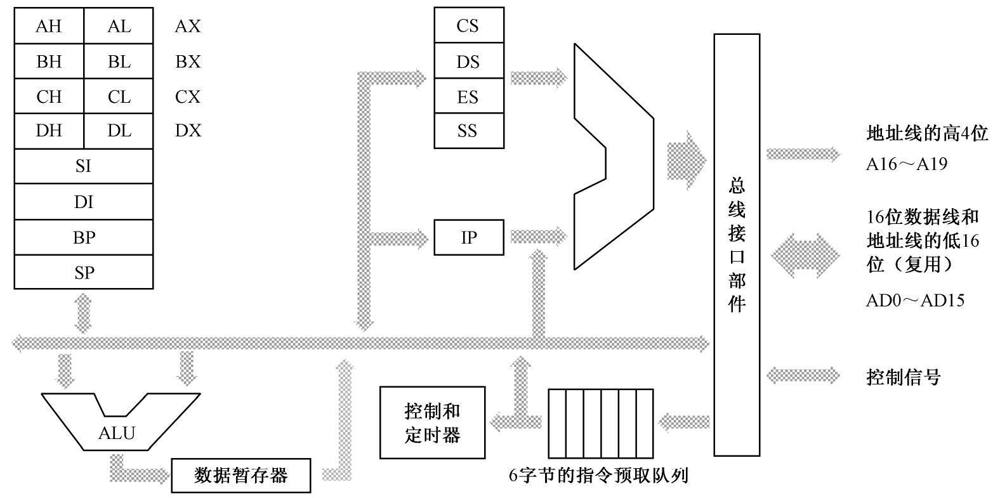
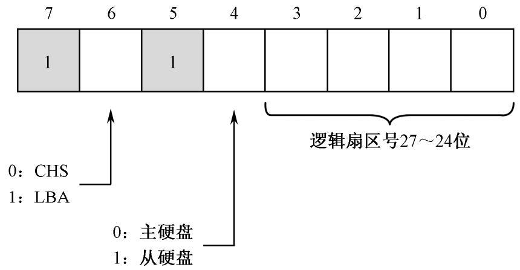
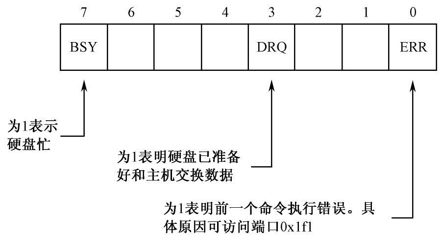
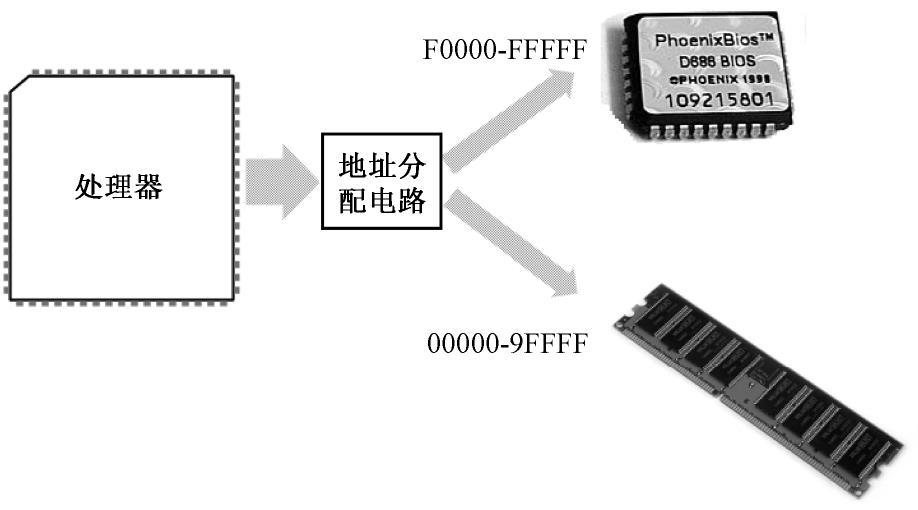
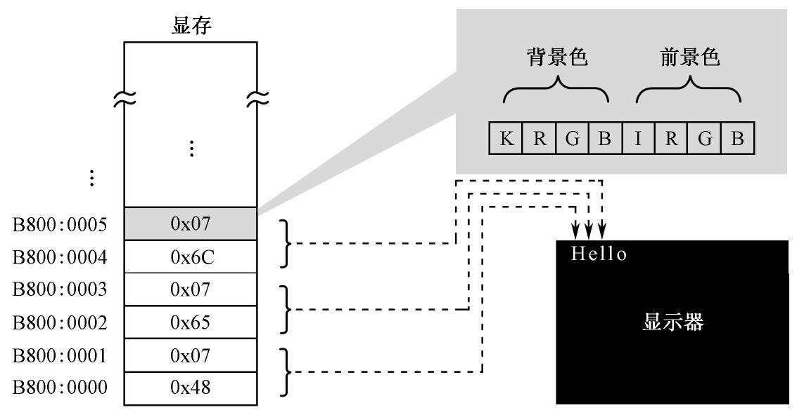
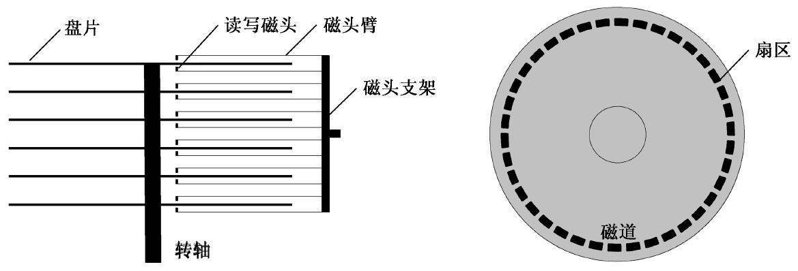
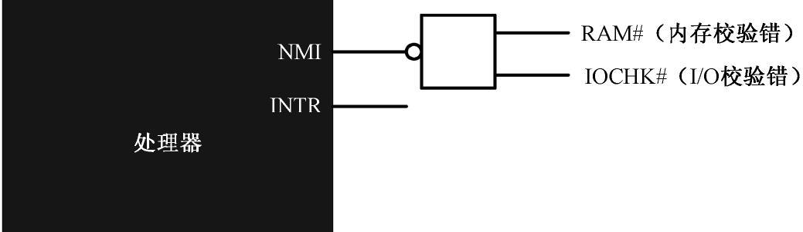

[TOC]

# 实模式

## x86体系结构模型 —— 8086 16位处理器 

8086处理器内部组成框图

8086的通用寄存器：

AX：累加寄存器

BX：基址寄存器

CX；计数器

DX：数据寄存器

SI：源索引寄存器（Index Register）

DI ：目的索引寄存器

BP：指针寄存器，指向栈中的任意一个位置（相对于栈底的偏移量），打破栈先进后出访问的限制，在高级语言中，通常用此实现对函数参数的访问。其数值是相对于栈底所偏移的字节数。

SP：栈堆指针寄存器，指向栈顶的下一个位置，其数值是相对于栈底所偏移的字节数。

段寄存器：

- CS：代码段寄存器，指向代码段的起始地址
- DS：数据段寄存器
- ES：附加段寄存器
- SS：栈段寄存器，指向栈底位置
- IP：指令指针寄存器，指向段内偏移的字节数

注意：

- Intel处理器禁止将一个立即数MOV到段寄存器中。而段寄存器可以与通用寄存器或内存单元随意搭配。

- Intel处理器禁止同时将两个内存单元作为操作数

- Intel处理器仅允许两个数据长度相同的对象作为操作数，编译器会根据寄存器隐式推断出操作数长度，若无法推断，则必须显示指出操作数的长度。

- 只能通过跳转指令显式修改IP寄存器，而MOV指令不能。

  

  

### 寻址方式

- 寄存器寻址，操作数在寄存器中
- 立即数寻址，操作数硬性编码在指令中
- 内存寻址
  - 直接寻址，偏移地址由立即数形式给出
  - 基址寻址，偏移地址由基址寄存器BX、BP给出，允许添加偏移量
  - 变址寻址，偏移地址由变址寄存器DI、SI给出，允许添加偏移量
  - 基址变址寻址，编译地址由基址寄存器与变址寄存器共同给出，允许添加偏移量

~~~x86
;仅考虑源操作数的寻址方式
mov ax, bx					;寄存器寻址
mov ax, 0x7c0				;立即数寻址
mov ax, [0x07c0]			;直接寻址				
mov ax, [bx]				;基址寻址
mov ax, [di + label]		 ;变址寻址，附有以标号形式给出的偏移量
mov ax, [cs : bx + di + 3] 	  ;基址变址寻址，附有段超越前缀以及偏移量
~~~

注：

- 一个指令中可能涉及多种寻址方式
- 标号本质上是在编译期所确定的数值
- 段超越前缀显式选择段寄存器，默认段寄存器一般是DS，但是当基址寻址的寄存器是BP时，默认段寄存器是SS。

### 汇编地址、逻辑地址、物理地址

- 物理地址：(段地址 << 4) + 偏移地址

- 逻辑地址为：段地址 ：偏移地址

注：仅在16位实模式下的地址计算。

## 指令

所有关于指令操作数的讨论都是在16位下的

### 批量数据传送 MOVS

MOVS类指令，源数据串由DS:SI指定；目的地址由ES:DI指定；每次执行后都会修改SI、DI的内容，正方向则SI、DI加1/2（取决于指令版本），反之则减1/2。MOVS版本有：MOVSB（传送一个字节）、MOVSW（传送一个字）。

指令前缀rep（repeat），重复执行指令，每次执行后CX内容减一，直至CX内容为零。

cld指令，将方向标志设置为0，即MOVS正方向传送（SI、DI加）。

std指令，将方向标志设置为1，即MOVS反方向传送（SI、DI减）。

### LOOP

先将寄存器CX内容减一，然后判断CX是否为零。如果CX内容不为零，则转移到指定位置执行，否则顺序执行后面的指令。

### PUSH & POP

pop、push指令的操作数是（通用或段）寄存器或者内存单元。push指令执行时，先将SP减去对应操作数的长度，然后将数据传送到逻辑地址SS:SP处。pop指令执行时，先将逻辑地址SS:SP处数据传送到指定位置，然后SP加上对应操作数的长度。

### IN、OUT

Intel提供独立编址的端口，并通过IN、OUT指令进行访问。IN指令表示从端口读入数据到CPU中，源操作数必须是DX寄存器或8位立即数（对应两个不同的机器码），表示端口号；目的操作数必须是AX或AL，用于存放要读取的数据。OUT指令表示从CPU向端口写入数据，目的操作数必须是DX寄存器或8位立即数（对应两个不同的机器码），表示端口号；源操作数必须是AX或AL，用于存放要写入的数据。

~~~
in ax, dx
in ax, 0x8f
out dx, ax
out 0xff, al
~~~

#### 关于硬盘的处理

最开始采用LBA28，即用28个bit表示扇区号。假设每个扇区有512Byte，则LBA28可以管理128GB硬盘。现在采用LBA48，可以管理256PB（131072TB）硬盘。

在这里介绍用LBA28访问硬盘：

- 0x01f0端口（16bit）：数据端口，存放数据的。
- 0x01f1端口：错误寄存器，包括硬盘驱动器最后一次执行命令后的状态

- 0x01f2端口（8bit）：访问扇区的数量。若值为零，表示要读取256个扇区。此外每访问一次，值减一。如果在访问过程中发生错误，则值表示尚未访问的扇区数。
- 0x01f3、0x1f4、0x1f5、0x1f6：起始LBA扇区号。0x01f3存放0 ~ 7位，0x01f4存放8 ~ 15位，0x01f5存放16 ~ 23位，0x01f6的低四位存放24 ~ 27位。此外0x1f6高四位的含义见下图：

端口0x01f6各位的含义

- 0x01f7：既是命令端口，又是状态端口。命令端口时，0x20表示读命令，0x30表示写命令。状态端口的部分各位含义见下图：

	

 

#### 关于显卡的处理

显卡内部的寄存器十分多，必须通过索引寄存器`0x3d4`指定一个要访问的寄存器。显卡的光标寄存器的索引值为`0x0e`、`0x0f`。其中0x0e寄存器提供光标位置的高8位。指定了寄存器之后，可以通过数据端口`0x3d5`来对它进行读写。

### 伪指令

db、dw、dd，注意小端模式对dw，dd数据的影响，即自动按小端字节序排列数据。

equ

### hlt

停机指令，处理器进入低功耗状态，当接受一个外部中断时就恢复执行。

### JMP

这是无条件转移指令，有以下五种版本：

- 相对短转移：操作数是一个8位立即数，偏移量范围：-128 - 127，修饰符short。
- 相对近转移：操作数是一个16位立即数，修饰符near
- 间接绝对近转移：操作数是一个16位通用寄存器或者内存单元，修饰符near
- 直接绝对远转移：以段地址 ：偏移地址的形式给出，修饰符far
- 间接绝对转移：操作数是一个16位内存单元，指令从给出的地址取出两个字，分别代替段寄存器（CS）和指令指针寄存器（IP）修饰符far
- 若在前两种版本中省略修饰符，则根据立即数判断。后三个版本修饰符不可省略。

~~~asm
jmp short 0x80
jmp near 0x8000
jmp near ax
jmp far 0x0000:0x7c000
jmp far [bx + si + 0x7c]
~~~

注意以上的偏移量都是有符号数，而地址却是无符号数。从理论上已证明有符号数与无符号数相加，仍然可以解释为无符号数。

## 中断与外设

### 外设

处理器通过物理地址访问外部设备，同时地址分配电路将物理地址映射到相应的设备上。

 8086系统的内存空间分配 

DRAM：0x00000 - 0x9FFFF

ROM-BIOS：0xF0000 - 0xFFFFF

显卡：0xB8000 - 0xBFFFF

显卡基本的工作模式有：文本模式、图形模式。在文本模式，屏幕上的每个文字对应着显存中两个连续字节。第一个字节是字符的ASCII代码。后一个字节是字符的属性，其分为两部分，低四位IRGB决定了前景色，而低四位KRGB决定了背景色。I是亮度位，为0时显示正常亮度，为1时显示为高亮。K是闪烁位，为0时不闪烁，为1时闪烁。

字符代码以及字符属性示意图 

BOOT过程：每当处理器加电或者RESET引脚上的电平升高后，处理器会执行硬件初始化，以及以及一个可选的内部自测试（Build-in Self-Test，BIST）。对于Intel8086来说，初始化将CS内容置为0xFFFF，其他所有的寄存器内容都为0x0000，此时第一条指令的地址就是0xFFFF0，也就是位于ROM-BIOS中。该条指令通常是一个跳转指令，例如`jmp 0xF000: 0xe05b`。跳转后，继续执行其他的汇编代码完成硬件诊断、初始化等工作。此外，ROM还提供了一套基本的软件例程，比如从键盘读入、向显卡写入等。最后ROM-BIOS将读取硬盘主引导区内容（也可以是光盘、U盘等外设），并将硬盘主引导区内容载入到内存地址`0x0000:0x7c00`处，然后执行跳转指令到该地址处。注：一个有效的主引导扇区，其最后两个字节一定是`0x55 0xAA`。

注：关于为什么是0x7c00这个地址，请参阅[为什么主引导记录的内存地址是0x7C00？ - 阮一峰的网络日志 (ruanyifeng.com)](https://www.ruanyifeng.com/blog/2015/09/0x7c00.html)

在处理器的视角下，并无数据类型一说。对它而言，所有数据都是二进制串。但对程序员来说，需要对这些二进制串做出断言，并从主观上解释这些数据。无符号数以及有符号数的加减算法是相同的，ADD、SUB指令只需一个版本即可。而他们的乘除算法有所差异，故DIV指令需要提供两个版本（div、idiv），其中idiv是有符号版本的。

硬盘中有多个磁盘，这些磁盘有着共同的转轴，而电动机驱动着高速旋转，以Round Per Minute（RPM）参数衡量转速。每个磁盘上都有两个磁头（Head），通常用磁头指代磁面。磁头都有编号，从第一个磁盘的上面开始编号，并且从零开始。每个磁头通过磁头臂固定在同一个磁头支架上，由步进电动机带动这些磁头在磁盘上一起移动。步进电动机由脉冲驱动，每次旋转一个固定的角度，即步进一次，此外磁头移动到数据所在磁道需要的时间称为寻道时间。每个磁头旋转一周所形成的轨迹称为磁道（Track）。同时每个磁面上的同一个磁道（同心圆）又可以形成一个圆柱，称为柱面（Cylinder），柱面从磁面最边缘到中心，并且从零开始编号。磁道进一步划分为扇区（Sector），扇区从1开始编号。扇区之间用间缝分隔。每个扇区分为两个部分：扇区头、数据区，其中扇区头包括了该扇区的元信息。

硬盘有两种访问模式：CHS、逻辑块地址（LBA）。在CHS中，要给出（磁头号、磁道号、扇区号）。在LBA中，中央处理器直接给出要访问的逻辑扇区号，剩下的地址转换工作交给硬盘接口处理。

硬盘结构示意图

扩展阅读：

- [分区4K对齐那些事，你想知道的都在这里 (diskgenius.cn)](https://diskgenius.cn/exp/about-4k-alignment.php)

- [每个磁道上的扇区数一样吗？_lwoyvye的博客-CSDN博客_](https://blog.csdn.net/lyh__521/article/details/46795201)

	

### 中断

中断可以分为：

- 外部硬件中断

	- 不可屏蔽中断（Non Maskable Interrupt）：当处理器的NMI引脚高电平有效，且维持4个时钟周期时，Intel处理器才能识别到不可屏蔽中断。由于触发NMI的事件对于CPU来说都是严重致命的，故NMI被赋予了统一的中断号2。
	- 可屏蔽中断：

	

	

- 内部中断

## 分段

下面讨论在16位实模式下的分段机制：

在汇编语言中，用以下语句进行分段处理：

~~~asm
SECTION mbr align=16 vstart=0x7c00
~~~

SECTION或SEGMENT是关键字用于定义段，其后面跟段名。而align指定了各个段汇编地址的对齐方式，用一个例子说明:

~~~asm
section data1 align=16
	db 0x55				//段的汇编地址 0x00
section data2 align=16
	db 0x55				//段的汇编地址 0x16
section data3 align=16
	db 0x55				//段的汇编地址 0x32
~~~

若未指明vstart子句，则标号的汇编地址从程序开头进行计算。若指定了，则标号从段开始计算，并考虑vstart给出的偏移值。此外可以通过section.name.start获取到段的汇编地址。

首先，应用程序必须按照与加载器的约定定义重定位表，下面给出重定位表的例子：

~~~asm
SECTION header vstart=0                     ;定义用户程序头部段
    program_length  dd program_end          ;程序总长度[0x00]

    ;用户程序入口点
    code_entry      dw start                ;偏移地址[0x04]
                    dd section.code_1.start ;段地址[0x06]

    realloc_tbl_len dw (header_end-code_1_segment)/4
                                            ;段重定位表项个数[0x0a]

    ;段重定位表
    code_1_segment  dd section.code_1.start ;[0x0c]
    code_2_segment  dd section.code_2.start ;[0x10]
    data_1_segment  dd section.data_1.start ;[0x14]
    data_2_segment  dd section.data_2.start ;[0x18]
    stack_segment   dd section.stack.start  ;[0x1c]

    header_end:
~~~

加载器对重定位表进行处理，将计算后得到的段地址填入其中。

程序要访问段时，通过重定位表中的标号获取到段地址并将其传入到段寄存器即可`mov cs [code_1_segment]`。编写程序时，因为段都是连续的，故[imm]、[bx + si + 0x42]都将从段的开头开始考虑。而[label]本质上就是[imm]，但是label与汇编地址息息相关，故要慎重考虑，只有在处理标号时，才考虑汇编地址。
