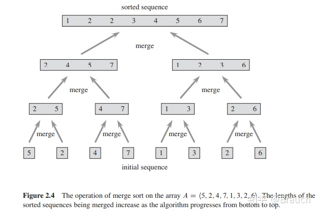
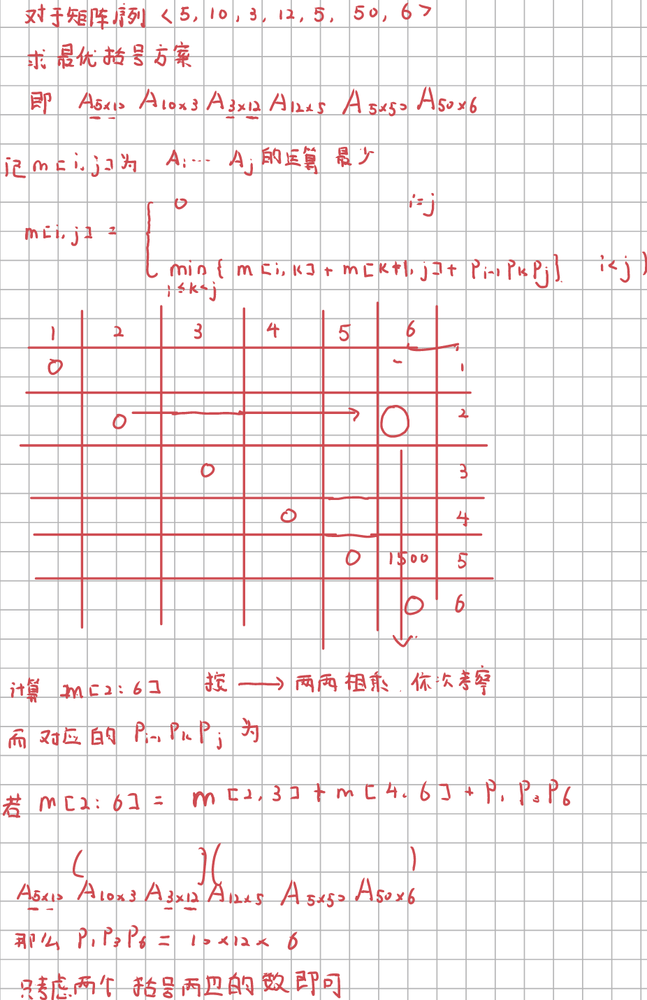
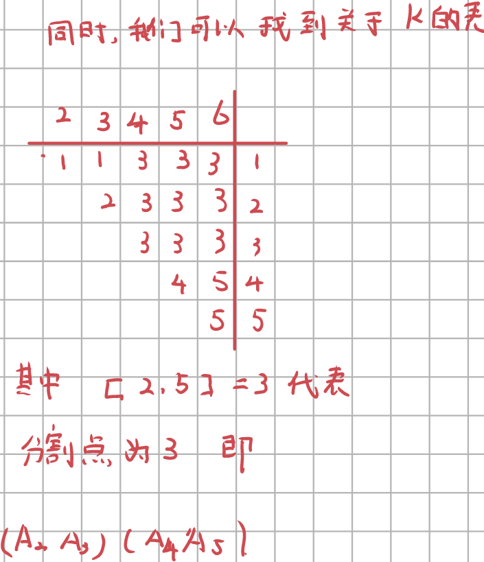
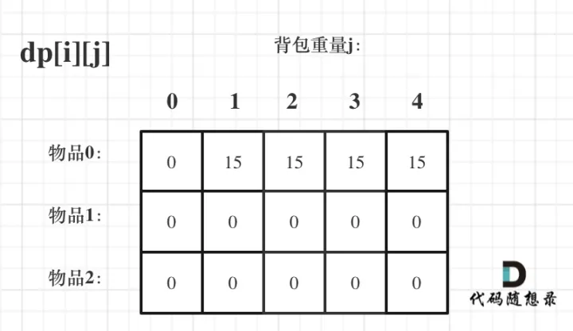
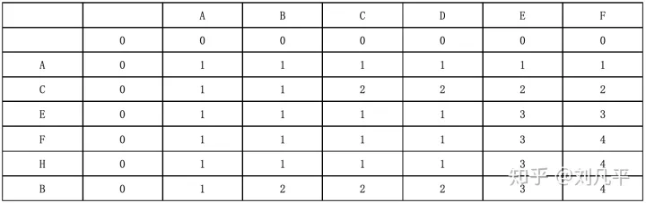
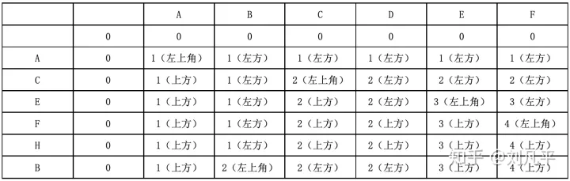
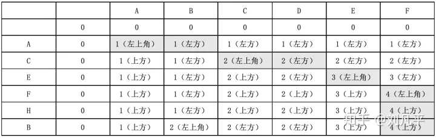
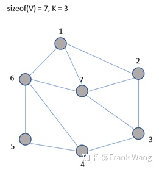
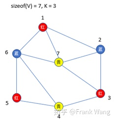

[TOC]

## 最短路径

思想：一个优先队列，一个dist记录当前节点到源节点的距离，一个path记录路径中上一个节点。

每次迭代从优先队列中选出权重最小的点，然后将该点的边添加到优先队列中。

只能处理正权边。

~~~~c++
#include <iostream>
#include <queue>
#include <set>
#include <utility>
using namespace std;

struct Graph {
    int V;                  //V is # of vertices
    vector<pair<int, int>>* adjList;
};

Graph* createGraph(int n) {
    Graph* graph = new Graph;
    graph->V = n;
    graph->adjList = new vector<pair<int, int>>[n]();
    return graph;
}

void addEdge(Graph* graph, int src, int dest, int weight) {
    graph->adjList[src].push_back(pair<int, int>(dest, weight));
}

struct compare{
    bool operator()(const pair<int, int> &lhs, const pair<int, int> &rhs) {
        return lhs.second > rhs.second;
    }
};

int main()
{
    Graph *graph = createGraph(8);
    addEdge(graph, 3, 1, 4);
    addEdge(graph, 3, 6, 5);
    addEdge(graph, 4, 3, 2);
    addEdge(graph, 1, 4, 1);
    addEdge(graph, 1, 2, 2);
    addEdge(graph, 2, 4, 3);
    addEdge(graph, 4, 5, 2);
    addEdge(graph, 4, 6, 8);
    addEdge(graph, 4, 7, 4);
    addEdge(graph, 7, 6, 1);
    addEdge(graph, 4, 5, 2);
    addEdge(graph, 5, 7, 1);
    addEdge(graph, 2, 5, 10);

    int dist[8];
    int path[8];
    for (int i = 1; i < 8; i++) {
        dist[i] = INT32_MAX;
        path[i] = 0;
    }

    dist[3] = 0;
    priority_queue<pair<int, int>, vector<pair<int, int>>, compare> que;
    que.push(pair<int, int>(3, 0));
    while (!que.empty()) {
        int v = que.top().first;
        int w = que.top().second;
        que.pop();
        for (auto itr = graph->adjList[v].begin();
            itr != graph->adjList[v].end();
            itr++) {
            int vv = itr->first;
            if (dist[vv] > dist[v] + itr->second) {
                dist[vv] = dist[v] + itr->second;
                path[vv] = v;
                que.push(pair<int, int>(vv, dist[vv]));
            }
        }
    }
    for (int i = 1; i < 8; i++) {
        cout << dist[i] << " ";
    }
    cout << endl;
    for (int i = 1; i < 8; i++) {
        cout << path[i] << " ";
    }
    cout << endl;
}
~~~~

## Prim

思想：每次迭代选择与集合最近的点，将该点添加到集合中，注意不能构成环

~~~c++
#include <iostream>
#include <queue>
#include <set>
#include <utility>
using namespace std;

struct UndirectedEdge {
    int v1;
    int v2;
    int weight;
    UndirectedEdge(int v1, int v2, int weight) : v1(v1), v2(v2), weight(weight) {}
};

struct Graph {
    int V;                  //V is # of vertices
    vector<UndirectedEdge>* adjList;
};

Graph* createGraph(int n) {
    Graph* graph = new Graph;
    graph->V = n;
    graph->adjList = new vector<UndirectedEdge>[n]();
    return graph;
}

void addEdge(Graph* graph, int src, int dest, int weight) {
    graph->adjList[src].push_back(UndirectedEdge(src, dest, weight));
    graph->adjList[dest].push_back(UndirectedEdge(dest, src, weight));
}

int main()
{
    Graph *graph = createGraph(8);
    addEdge(graph, 3, 1, 4);
    addEdge(graph, 3, 6, 5);
    addEdge(graph, 4, 3, 2);
    addEdge(graph, 1, 4, 1);
    addEdge(graph, 1, 2, 2);
    addEdge(graph, 2, 4, 3);
    addEdge(graph, 4, 5, 7);
    addEdge(graph, 4, 6, 8);
    addEdge(graph, 4, 7, 4);
    addEdge(graph, 7, 6, 1);
    addEdge(graph, 4, 5, 7);
    addEdge(graph, 5, 7, 6);
    addEdge(graph, 2, 5, 10);

    
    bool isIn[8];
    int dist[8];
    for (int i = 1; i < 8; i++) {
        isIn[i] = false;
        dist[i] = INT32_MAX;
    }

    dist[1] = 0;
    //算法实现与Prim算法有些区别，这里使用dist来记录当前节点与生成树的最小距离
    //这样无需再维护额外的数据结构，简化了算法的实现

    for (int i = 1; i < 8; i++) {
        int min = INT32_MAX;
        int index = 0;
        for (int i = 1; i < 8; i++) {
            if (isIn[i] == false && dist[i] < min) {
                min = dist[i];
                index = i;
            }
        }
        isIn[index] = true;
        for (auto itr = graph->adjList[index].begin(); 
            itr != graph->adjList[index].end(); 
            itr++) {
            if (dist[itr->v2] > itr->weight) dist[itr->v2] = itr->weight;
        }
    }
}
~~~

## Kruskal

思想：每次迭代选取权重最小的边，注意边上两点不能在同一个森林中

~~~c++
#include <iostream>
#include <queue>
#include <set>
#include <utility>
using namespace std;

struct UndirectedEdge {
    int v1;
    int v2;
    int weight;
    UndirectedEdge(int v1, int v2, int weight) : v1(v1), v2(v2), weight(weight) {}
    bool operator>(const UndirectedEdge &lhs) const {
        return this->weight > lhs.weight;
    }
};

int parent[8];
int getParent(int i) {
    int l = parent[i];
    while (l != parent[l]) l = parent[l];
    return l;
}
bool judge(int i, int j) {
    return getParent(i) == getParent(j);
}
void merge(int i, int j) {
    int l = getParent(j);
    parent[l] = getParent(i);
}

int main()
{
    for (int i = 1; i < 8; i++) {
        parent[i] = i;
    }
    
    priority_queue<UndirectedEdge, vector<UndirectedEdge>, greater<UndirectedEdge>> que;
    que.push(UndirectedEdge(3, 1, 4));
    que.push(UndirectedEdge(3, 6, 5));
    que.push(UndirectedEdge(4, 3, 2));
    que.push(UndirectedEdge(1, 4, 1));
    que.push(UndirectedEdge(1, 2, 2));
    que.push(UndirectedEdge(2, 4, 3));
    que.push(UndirectedEdge(4, 5, 7));
    que.push(UndirectedEdge(4, 6, 8));
    que.push(UndirectedEdge(4, 7, 4));
    que.push(UndirectedEdge(7, 6, 1));
    que.push(UndirectedEdge(4, 5, 7));
    que.push(UndirectedEdge(5, 7, 6));
    que.push(UndirectedEdge(2, 5, 10));

    while (!que.empty()) {
        UndirectedEdge edge = que.top();
        que.pop();
        if (!judge(edge.v1, edge.v2)) {
            merge(edge.v1, edge.v2);
            cout << edge.v1 << " -- " <<edge.v2 << endl;
        }
    }
}
~~~

## 活动安排问题 贪心算法

设在区间$[a,b]$上，有$n$个子区间$[s_i, f_i]$。选取出最多个不重叠区间。

贪心策略：按$f_i$升序排列，从最小的选取。

~~~c++
#include <algorithm>
#include <iostream>
using namespace std;
struct Activity {
    int id;
    int begin;
    int end;
};

bool cmp(const Activity &a, const Activity &b) {
    return a.end < b.end;
}

int main()
{
    Activity activities[11] = {
        {1, 2, 13},
        {2, 5, 9},
        {3, 0, 6},
        {4, 1, 4},
        {5, 6, 10},
        {6, 12, 14},
        {7, 8, 12},
        {8, 5, 7},
        {9, 3, 8},
        {10, 8, 11},
        {11, 3, 5}
    };
    sort(activities, activities + 11, cmp);
    
    int end = 0;
    printf("%d : [%d %d)\n", activities[0].id, activities[0].begin, activities[0].end);
    for (int i = 1; i < 11; i++) {
        if (activities[i].begin >= activities[end].end) {
            printf("%d : [%d %d)\n", activities[i].id, activities[i].begin, activities[i].end);
            end = i;
        }
    }
}
~~~

## 第k小元素问题（舍伍德）

舍伍德算法**总能求得问题的一个解**，且所求得的解**总是正确的**。当一个确定性算法在**最坏情况下的计算复杂性与其在平均情况下的计算复杂性有较大差别时**，可在这个确定性算法中引入随机性将它改造成一个舍伍德算法，消除或减少问题的好坏实例间的这种差别（精髓所在）。

## KMP

https://zhuanlan.zhihu.com/p/83334559

暴力的：

~~~c++
#include <iostream>

int main()
{
    char pat[] = "aaab";
    char txt[] = "aaacaaab";
    int M = 4;
    int N = 8;

    for (int i = 0; i <= N - M; i++) {
        int j = 0;
        for (; j < M; j++) {
            if (pat[j] != txt[i + j]) break;
        }
        if (j == M) {
            printf("%d\n", j);
            return 1;
        }
    }
    printf("-1");
}
~~~

~~~c++
#include <iostream>
#include <string>
using namespace std;
const int N = 125;
class KMP {
    public :
    //dp[i][j] 表示状态i遇到字符j时的转移状态
        KMP(string pat) : pat(pat) {
            int M = pat.length();
            dp[0][pat[1]] = 1;
            int X = 0;
            //X 与 j 公共前缀
            //a b e a b b e a b e
            //X X           Y Y
            //  X             j
            for (int j = 1; j < M; j++) {
                for (int c = 0; c < N; c++) {
                    if (pat[j] == c) {
                        //状态推进
                        dp[j][c] = j + 1;
                    } else {
                        //状态回退
                        dp[j][c] = dp[X][c];
                    }
                }
                X = dp[X][pat[j]];          //关键
            }
        }

        int search(string txt) {
            int M = pat.length();
            int N = txt.length();
            int j = 0;
            for (int i = 0; i < N; i++) {
                j = dp[j][txt[i]];
                if (j == M) return i - M + 1;
            }
            return -1;
        }
    private :
        string pat;
        int dp[10][N];
};

int main(int argc, char* argv[])
{
    
    return 0;
}
~~~

求next数组：

~~~c
a b e a b b e a b e
0 0 0 1 2 0 0 1 2 3
                j
//例如求next[j], 找最先出现的b，然后观察它俩前缀和是否一样就行。
~~~

## 单纯形法

## 网络最大流

思想：

- 找到一条从源点到终点的一条简单路径
	- 该路径上每个权重减去瓶颈权重
	- 权重为0，则删除
	- 添加反向路径，权重为瓶颈权重

最小割与最大流关系：在最大流的residual graph上（不考虑反向路径）若与源点可达的点构成一个点集。

两个点集之间的路径权重和就是最小割的容量。

## 合并排序

~~~c++
#include <iostream>
#include <vector>
using namespace std;
int N = 8;
vector<int> merge(vector<int> a)
{
    const int l = 0;
    const int r = a.size() - 1;

    vector<int> ret;
    if (l == r) return a;
    if (l < r) {
        int mid = (l + r) / 2;
        vector<int> tmp;
        tmp.assign(a.begin(), a.begin() + mid + 1);
        vector<int> b = merge(tmp);

        tmp.assign(a.begin() + mid + 1, a.begin() + r + 1);
        vector<int> c = merge(tmp);

        size_t i = 0, j = 0; 
        while (i < b.size() && j < c.size()) {
            if (b[i] < c[j]) ret.push_back(b[i++]);
            else ret.push_back(c[j++]);
        }
        while (i < b.size()) ret.push_back(b[i++]);
        while (j < c.size()) ret.push_back(c[j++]);
    }
    return ret;
}

int main(int argc, char *argv[])
{
    vector<int> a({3, 2, 6, 1, 7, 10, 1, 4});
    for(auto i : merge(a)) {
        cout << i << " ";
    }
    cout << endl;
    return 0;
}
~~~

## 

## 矩阵链乘

根据此表，我们可以打印出括号

~~~c++
print(s, int i, int j)
{
    if (i == j) print Ai
    else {
        print("(")
        print(s, i, s[i][j])
        print(s, s[i][j] + 1, j)
        print(")")
    }
}
~~~

## 0-1背包问题

记$dp[i][k]$为在限重为$k$中任取前$i$个物品的最大价值
$$
dp[i][k] = \ 
\begin{cases}
&max\{dp[i - 1][k], dp[i - 1][k - weight[i]] + value[i]\}   &k >= weight[i]\\
&dp[i - 1][k]											    &k < weight[i]
\end{cases}
$$
初始化：

~~~c++
#include <iostream>
#include <cstring>
using namespace std;

int main(int argc, char* argv[])
{
    int value[] = {15, 20, 30};
    int weight[] = {1, 3, 4};
    int dp[3][5];
    memset(dp, 0, sizeof(int) * 15);
    for (size_t i = 1; i < 5; i++) {
        dp[0][i] = 15;
    }
    for (size_t i = 1; i < 3; i++) {
        for (size_t j = 1; j < 5; j++) {
            if (j >= weight[i])
                dp[i][j] = max(dp[i - 1][j], dp[i - 1][j - weight[i]] + value[i]);
            else dp[i][j] = dp[i - 1][j];
        }
    }
    for (size_t i = 0; i < 3; i++) {
        for (size_t j = 0; j < 5; j++) {
            cout << dp[i][j] << "  ";
        }
        cout << endl;
    } 
    cout << endl;
    return 0;
}
~~~

## 最长公共子序列

对于给定的两个字符串“ABCDEF”和“ACEFHB”，计算它们的最长公共子序列"ACEF"，步骤如下：

回溯 将左上角的对应的字符取出即可

状态$c[i][j]$表示字符串X前i个与字符串Y的前j个的最大公共子序列。
$$
c[i][j] = 
\begin{cases}
&0						 &i = 0 \or j = 0\\
&c[i-1][j-1] + 1		&i,j>0 \and X[i] = Y[j]\\
&max\{c[i][j-1],c[i-1][j]\} &i,j>0 \and X[i] \not= Y[j]\\
\end{cases}
$$

~~~c++
#include <iostream>
#include <stack>
using namespace std;

int main(int argc, char *argv[])
{
    string X = "acefhb";
    string Y = "abcdef";
    int dp[X.size()][Y.size()];
    int map[X.size()][Y.size()];
    for (size_t i = 0; i < X.size(); i++) dp[i][0] = 1;
    for (size_t i = 0; i < Y.size(); i++) dp[0][i] = 1;

    for (size_t i = 1; i < X.size(); i++) {
        for (size_t j = 1; j < Y.size(); j++) {
            if (X[i] == Y[j]) {
                dp[i][j] = dp[i - 1][j - 1] + 1;
                map[i][j] = 0;
            } else {
                dp[i][j] = max(dp[i - 1][j], dp[i][j - 1]);
                map[i][j] = dp[i - 1][j] > dp[i][j - 1] ? 1 : 2;
            }
        }
    }
    for (size_t i = 0; i < X.size(); i++) {
        for (size_t j = 0; j < Y.size(); j++) {
            cout << dp[i][j] << " ";
        }
        cout << endl;
    }
    
    int i = X.size() - 1;
    int j = Y.size() - 1;
    stack<char> s;
    while (i >= 0 && j >= 0) {
        if (map[i][j] == 0) {
            s.push(X[i]);
            i--, j--;
        } else if (map[i][j] == 1) i--;
        else j--;
    }
    while (!s.empty()) {
        cout << s.top();
        s.pop();
    }
    cout << endl;
    return 0;
}
~~~

## 部分背包

贪心策略

~~~c++
#include <iostream>
#include <algorithm>
using namespace std;
struct Cost {
    double cost;
    int weight;
    int id;
};

bool cmp(const Cost &l, const Cost &r)
{
    return l.cost < r.cost;
}
int main(int argc, char* argv[])
{
    int value[] = {20, 8, 19, 2};
    int weight[] = {10, 24, 52, 12};
    const int N = 80;
    Cost cost[4];
    for (int i = 0; i < 4; i++) {
        cost[i].cost = (value[i] * 1.0) / (weight[i] * 1.0);
        cost[i].weight = weight[i];
        cost[i].id = i;
    }
    sort(cost, cost + 4, cmp);
    double total = 0.0;
    for (size_t i = 0; i < 4; i++) {
        if (total + cost[i].weight > N) {
            cout << "take " << cost[i].id << " " << N - total << '\n';
            break;
        } else {
            cout << "take " << cost[i].id << " " << cost[i].weight << '\n';
        }
        total += cost[i].weight;
    }
    return 0;
}
~~~

## 最优装载 分支界限

## 01背包 分支限界

## TSP 分支限界

## 着色问题（m叉着色树）

## 第k小元素问题（Sherwood）

## 大规模皇后问题（Las Vegas）

## 主元素问题（Monte Carlo）

## 非线性方程数组 随机

## 有序表管理 随机

## MillerRabin+Pollard 随机

## 迷宫（深搜递归 深搜迭代 广搜）

## n皇后问题（递归、迭代）

## 最优装载问题（子集树）

## TSP问题（排列树）

## 图着色问题

给定一个[无向连通图](https://link.zhihu.com/?target=https%3A//baike.baidu.com/item/%E6%97%A0%E5%90%91%E5%9B%BE/1680427)G=(V, E)，其中V为顶点集合{1, 2, …, n}，E为边集合。图着色问题即为用K种颜色为图的顶点着色，每个顶点着一种颜色。要求G的每条边相连的两个顶点着不同颜色。

以下图为例，图中顶点数为7，颜色数为3。

## TopK问题（第k小问题 or第k大问题）

堆加遍历

~~~c++
#include <iostream>
using namespace std;
const int N = 100;
int min_heap[N];
int size = 0;
int top(int *h) { return h[1]; }
void pop(int *h) {
    int ele = h[size--];
    int i, child;
    for (i = 1; i * 2 <= size; i = child) {
        child = 2 * i;
        if (child != size && h[child+1] < h[child]) child++;        //修正child
        if (ele > h[child]) h[i] = h[child];				      //判断与子节点的关系
        else break;
    }
    h[i] = ele;
}
void push(int *h, int ele) {
    h[++size] = ele;
    size_t k;
    for (k = size; h[k/2] > ele; k/=2) h[k] = h[k/2];			//判断与父节点的关系
    h[k] = ele;
}

int main(int argc, char* argv[])
{
    min_heap[0] = INT32_MIN;
    int k = 4;
    int a[] = {3, 6, 10, 7, 2, 75, 46, 73, 12, 96, 42, 25, 56, 19};
    push(min_heap, a[0]);
    push(min_heap, a[1]);
    push(min_heap, a[2]);
    push(min_heap, a[3]);
    for (size_t i = 4; i < 14; i++) {
        if (a[i] > top(min_heap)) {
            pop(min_heap);
            push(min_heap, a[i]);
        }
    }
    cout << top(min_heap) << endl;
    return 0;
}
~~~

## QuickSort（也应用三路分区）

~~~c++
#include <iostream>
#include <vector>
using namespace std;
int partition(int array[], int l, int r)
{
    int X = array[l];
    int start = l;
    while (l < r) {
        //while的顺序是很重要的，它影响最后一个元素的收敛
        while (l < r && array[r] >= X) r--;
        while (l < r && array[l] <= X) l++;
        if (l < r) swap(array[l], array[r]);
    }
    swap(array[l], array[start]);
    return l;
}

void quickSort(int array[], int l, int r)
{
    if (l < r) {
        int q = partition(array, l, r);
        for (int i = l; i <= r; i++) {
            cout << array[i] << " ";
        }
        cout << endl;
        quickSort(array, l, q - 1);
        quickSort(array, q + 1, r);
    }
} 

int main(int argc, char* argv[])
{
    int array[] = {3, 2, 6, 1, 7, 10, 1, 4};
    quickSort(array, 0, 7);
    for (auto i : array) {
        cout << i << " ";
    }
    return 0;
}
~~~

## 打印n个矩阵相乘的所有顺序

~~~c++
#include <iostream>
#include <vector>
#include <string>
using namespace std;

int f(int n)
{
    int num = 0;
    if (n == 1) return 1;
    for (int i = 1; i != n; i++) {
        num += f(i) * f(n - i);			//递归式
    }
    return num;
}

vector<string> make_brackets(int i, int j)
{
    vector<string> ret = vector<string>();
    if (i == j) {
        ret.push_back(string("A") + to_string(i));
    } else if (i == j - 1) {
        ret.push_back(string("(") + string("A") + to_string(i) + string("A") + to_string(j) + string(")"));
    } else {
        for (int k = i; k < j; k++) {
            vector<string> lhs = make_brackets(i, k);
            vector<string> rhs = make_brackets(k + 1, j);
            for (size_t s = 0; s < lhs.size(); s++) {
                for (size_t t = 0; t < rhs.size(); t++) {
                    ret.push_back(string("(") + lhs[s] + rhs[t] + string(")"));
                }
            }
        }
    }
    return ret;
}
int main()
{
    for (auto s : make_brackets(1, 6)) {
        for (size_t i = 1; i < s.size() - 1; i++) {
            cout << s[i];
        }
        cout << endl;
    }
    return 0;
}
~~~

