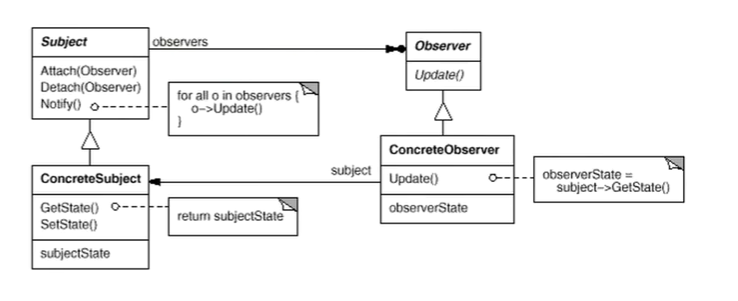
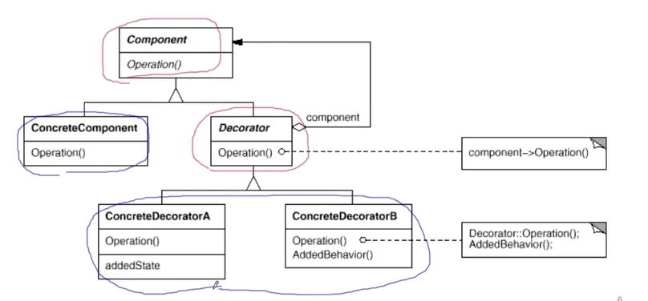
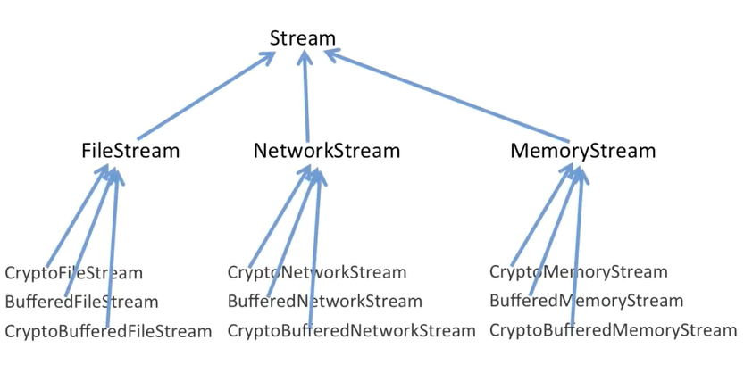
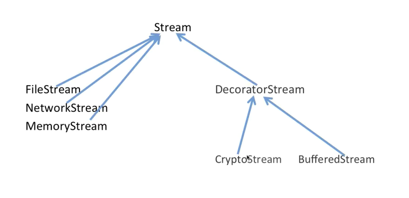

#  软件设计思想、方法与模式

[TOC]

## 概述

**《设计模式：可复用面向对象软件的基础》**

面向对象的底层思维包括语言构造、编译模型、内存模型与运行时机制等，是可以与计算机沟通。而抽象思维包括面向对象、组件封装、设计模式、架构模式等，是将真实的世界抽象为程序代码。

面向对象的三大机制（底层思维）：

- 封装：隐藏内部实现
- 继承：复用现有代码
- 多态：改写对象行为

软件设计复杂的根本原因：变化，例如客户需求的变化、技术的变化等

处理软件复杂性的手段：

- 分解：分而治之，将复杂的大问题分解为多个简单的小问题。结构化语言都具备这种手段，但复用性较差。
- 抽象：由于不能全部掌握复杂的对象，我们选择忽略它的非本质细节，而去处理泛化或理想化的对象模型。

==软件设计的目标：复用==

变化是复用的天敌！面向对象设计的最大优势在于： 抵御变化！

> 注意：面向对象中的复用性是指二进制层面的复用性，而不是源码方面的。而且扩展性以虚函数的形式表现出来

重新认识面向对象（抽象思维）：

- 隔离变化：从宏观层面，面向对象的构建方式更能适应软件的变化，能将变化所带来的影响减为最小。
- 各司其职：从微观层面，更强调各个类的“责任” 。多态调用就能体现一点。

==设计原则 $\gt$ 设计模式==

面向对象设计原则：

- **依赖倒置原则（DIP）**：
	- 高层模块（稳定）不应该依赖于底层模块（变化），二者都应该依赖于抽象（稳定）。
	- 抽象（稳定）不应该依赖于实现细节（变化），而实现细节应该依赖于抽象（稳定）。
	
- **开放封闭原则（OCP）**：
	- 对扩展（以虚函数形式表现）开放，对更改封闭。
	- 类模块应该是可扩展（以虚函数形式表现）的，但是不可修改。
	
- **单一职责原则（SRP）**：
	- 一个类应该仅有一个引起它变化的原因。
	- 变化的方向隐含着类的责任。
	
- **Liskov替换原则（LSP）**：
	- 子类必须能够替换它们的基类（IS-A）。
	
- **接口隔离原则（ISP）**：

	- 不应该强迫客户程序依赖他们不用的方法，接口应该小而完备。
	- 一个类对另一个类的依赖应该建立在最小的接口上。

- **优先使用对象组合，而不是类继承**

	继承在某种程度上破坏了封装性，子类父类之间的耦合度较高。而组合只要求被组合对象具有良好的定义接口，耦合程度低。

- **封装变化点**

	使用封装来创建对象之间的分界层，一侧变化不会对另一侧产生不良影响，从而实现松耦合。
	
- **针对接口编程，而不是针对实现编程**
	
	客户只需直到对象所具有的接口即可，而无需知道对象的具体类型。减少系统中各部分的依赖关系，从而实现“高内聚、松耦合”的类型设计方案。
	
	一般来说，业务类实现为接口类型，像工具类（例如String、Map）等实现为具体类。
	
	它与依赖倒置原则相关，也就是说违背接口编程一般就违背DIP原则。

设计习语（Design idioms）描述与特定编程语言相关的技巧，惯用法，例如RAII、COW、类型擦除等。**设计模式（Design Pattern）**主要描述的是“类与相互通信对象之间的组织关系，包括它们的角色、职责、协作等方面”。**架构模式（Architectural Patterns）**主要描述系统中与基本结构组织密切的高层模式，包括子系统划分，职责，一级如何组织它们之间关系的规则。

​	

GOF-23 模式分类

从目的来看：

- **创建型（Creational）**：应对在需求变化中给对象创建所带来的冲击
- **结构型（Structural）**：应对在需求变化中给对象结构所带来的冲击
- **行为型（Behavioral）**：划分类之间的职责，应对在需求变化中给多个交互对象之间所带来的冲击

从范围来看：

- **类模式**：处理类与子类的静态关系，偏重继承方案
- **对象模式**：处理对象间的动态关系，偏重组合方案

现代软件设计的特征是“需求频繁变化”。设计模式的要点是“寻找变化点”，然后在变化点出应用设计模式。==“什么时候应用设计模式”比“理解设计模式本身”更重要==。设计模式的应用不宜先入为主，应该在不断重构中逐步应用设计模式，这也就是敏捷软件开发所倡导的“Refactoring to Patterns”。

==掌握设计模式的关键：区分稳定与变化的代码==。==设计模式就是在变化与稳定中间寻找隔离点，从而分离他们，管理变化==。如果代码中没有稳定点以及变化点（极端情况，该软件体系是病态的），设计模式就没有任何作用！

稳定也是相对而言的，例如一年才修改的代码相对一个月修改的就是稳定的。并且稳定代码更有复用的价值。

重构的技巧：

- 静态 $\rightarrow$ 动态
- 早绑定 $\rightarrow$ 晚绑定。虚函数以及函数指针都可以实现晚绑定，它们本质上都是一样的，但虚函数更加抽象。
- 继承 $\rightarrow$ 组合
- 编译时依赖 $\rightarrow$ 运行时依赖
- 紧耦合$\rightarrow$  松耦合

## 组件协作

现代软件分工的一个结果是“框架与应用程序划分”。组件协作模式通过晚期绑定，来实现框架（库函数）与应用程序的松耦合，是两者之间协作时常用的模式。

### Template Method（模板方法）

动机：在软件构建过程中，对于某一项任务，它常常有稳定的整体结构，但各个子步骤却又很多改变的需求，或者由于其他原因而无法和任务整体结构同时实现。如何在确定稳定操作结构的前提下，来灵活应对各个子步骤变化或晚期实现的需求？

在使用某种框架（早期Windows平台开发）时，它会给你Demo代码告诉你怎么做，应该修改哪些部分，例如

~~~c++
void getRequest(Servlet servlet)
{
    //...
}
int main()
{
    Servlet servlet;
    servlet.init(/*传参*/)
        
    //你需要在这里实现业务逻辑
    getRequest(servlet);
    servlet.init();
}
~~~

而更加现代的做法是像Servlet那样，只需暴露接口，让用户覆写接口即可。程序主流程交给框架来做，而不是让用户做程序主流程。而且Library主动调用用户的覆写方法（晚绑定），而不是像之前的用户调用Library的方法（早绑定）

~~~java
@Servlet("index")
class MyServlet implement Servlet {
    @Override
    void getRequest() {
        
    }
}
~~~

定义一个操作中算法的骨架（稳定），而将一些步骤延迟到（变化）子类中。Template Method使得子类在不改变一个算法结构的前提下（复用），可重定义该算法的某些特定步骤。如果算法骨架不稳定，那么就不适用Template Method。

他用最简洁的机制（虚函数的多态）为应用程序框架提供了灵活的扩展点（以虚函数的方式），是代码复用的基本实现结构。

下面再举一个例子：

~~~ c++
class Library {
public :
    void Step1() {

    }
    void Step3() {
        
    }
    void Step5() {
        
    }
};

class Application {
public:
    //变化的部分
    bool Step2() {

    }
    void Step4() {

    }
};

int main()
{
    Library lib;
    Application app;
    
	//稳定的部分
    lib.Step1();
    if (app.Step2()) {
        lib.Step3();
    }
    app.Step4();
    lib.Step5();
}
~~~

~~~c++
class Library {
public :
    void run()
    {
        Step1();
        if (Step2()) {          //支持变化 ==> 虚函数的多态调用
            Step3();
        }
        Step4();                //支持变化 ==> 虚函数的多态调用
        Step5();
    }
protected :
    void Step1() {

    }
    void Step3() {
        
    }
    void Step5() {
        
    }

    virtual bool Step2() = 0;
    virtual void Step4() = 0;
    virtual ~Library() {}
};

class Application : public Library{
public:
    bool Step2() override{

    }
    void Step4() override {

    }
};

int main()
{
    Library *lib = new Application();
    lib->run();
}
~~~

### Strategy

动机：某些对象使用的算法可能多种多样，经常改变，如果将这些算法都编码到都对象中，将会使对象变得异常复杂。如何在运行时根据需要透明地更改对象算法，从而实现算法与对象地解耦？

定义：将一系列算法封装起来，并且使它们可相互替换（变化）。该模式使得算法可独立于使用它的客户程序（稳定）而变化（扩展，子类化）

例子：

~~~c++
enum TaxBase {
    CN_Tax,
    US_Tax,
    DE_Tax
};

//（应用与框架）
class SalesOrder {
    TaxBase tax;

public:
    double calculateTax() {
        //违背了开放封闭原则
        //结构化思维的体现，分而治之
        if (tax == CN_Tax) {

        } else if (tax == US_Tax) {

        } else if (tax == DE_Tax) {

        }
    }
};
~~~

~~~C++
#include <string>
class Context {};
//稳定 框架
class TaxStrategy {
    public:
        virtual double Calculate(const Context& context) = 0;
        virtual ~TaxStrategy();
};

//变化
class CNTax : public TaxStrategy {
    public :
        virtual double Calculate(const Context& context) override {}
};

class USTax : public TaxStrategy {
    public :
        virtual double Calculate(const Context& context) override {}
};

class DETax : public TaxStrategy {
    public :
        virtual double Calculate(const Context& context) override {}
};
class StrategyFactory{
    public :
        TaxStrategy* newStrategy() {}
};

//稳定 客户
class SalesOrder {
    private :
        TaxStrategy* strategy;
    	
    public :
        //工厂方法
        SalesOrder(StrategyFactory* strategyFactory) {
            this->strategy = strategyFactory->newStrategy();		//多态
        }
    
        ~SalesOrder() {
            delete this->strategy;
        }

        double calculateTax() {
            Context context;			//数据
            double val = strategy->Calculate(context);
        }
};

~~~

乍一看，第一种方法的代码量少，而且编码也少。但是这要修改已有的源代码文件，使得程序员要重新编译、测试、部署整个项目。这是一项很大的项目开销。而第二种方法可扩展性很好，程序员只需新增一个编译单元（包或者源文件），对该编译单元单独进行编译、测试。最后用动态链接的方式添加到程序中，项目代价很少。

而且很多人误认为直接添加else if也是一种复用，即复用前面的else if代码。注意：面向对象中复用是指二进制层面的复用，而不是源代码层面的。

通常if else暗含着要使用Strategy模式。只有在if else相对稳定的情况下（例如，判断一周中的七天），就不要再使用Strategy设计模式了。

Strategy的副作用：提升性能。if else代码段过长，容易使得Cache代码段失效。而且在某些业务情境下，只有很少一部分if判断成功，使CPU付出更多分支预测失败的代价（例如，流水线冲刷）。

### Observer/Event

动机：在软件构建过程中，我们需要为某些对象建立一种“订阅-发布”的关系。如果一个对象（发布者，被观察者）的状态发生改变，所有的依赖对象（订阅者，观察者）都将得到通知。如果这样的依赖关系过于紧密，将使得软件不能很好地抵御变化。使用面向对象技术，可以将这种依赖关系弱化。

定义：它处理对象间一对多的依赖关系（编译型），以便当一个对象（Subject）的状态发生改变时，所有依赖于它的都西昂都得到通知并自动更新。

例子：

~~~c++
class MainForm : public Form {
        TextBox *txtFilePath;
        TextBox *txtFileNumber;
        ProgressBar* progressBar;			//组合
    
    public :
        void Button1_Click() {
            string filePath = txtFilePath->getText();
            int number = atoi(txtFileNumber->getText().c_str());
            FileSplitter splitter(filePath, number, progressBar);
            splitter.split();
        }
};

class FileSplitter {
    string m_filePath;
    int m_fileNumber;
    ProgressBar* m_progressBar;		//违背了依赖倒置原则，因为抽象依赖于实现细节，高层模块依赖于底层模块。如果要支持不同平台的进度条，那么可能就要改写在split中有关m_progressBar对象使用的代码
    
    public :
        FileSplitter(const string& filePath, int fileNumber, ProgressBar* progressBar) :
            m_filePath(filePath),
            m_fileNumber(fileNumber),
            m_progressBar(progressBar){

        }
        
        void split() {
            //1.读取大文件
            //2.分批向小文件写入
            for (int i = 0; i < m_fileNumber; i++) {
                if (m_progressBar != nullptr) {
                    m_progressBar->setValue((i + 1) * 1.0 / m_fileNumber);    //更新进度条
                }
            }
        }
};
~~~

~~~c++

class IProgress {
    public :
        virtual void DoProgress(float value) = 0;
        virtual ~IProgress();
};

//订阅者
class MainForm : public Form, public IProgress{
    private :
        TextBox *txtFilePath;
        TextBox *txtFileNumber;
        ProgressBar* progressBar;           //组合关系
    
    public :
        void Button1_Click() {
            string filePath = txtFilePath->getText();
            int number = atoi(txtFileNumber->getText().c_str());
            FileSplitter splitter(filePath, number, this);	//但这种做法依然有缺陷，那就是最多只能支持一个订阅者
            splitter.split();
        }

        virtual void DoProgress(float value) {
            progressBar->setValue(value);
            //变化的部分交给订阅者来处理了
        }
};

//发布者
class FileSplitter {
    private:
        string m_filePath;
        int m_fileNumber;
        //ProgressBar* m_progressBar;   //具体的通知控件
        IProgress* m_iProgress;           //抽象的通知机制
    public :
        FileSplitter(const string& filePath, int fileNumber, IProgress* iProgress) :
            m_filePath(filePath),
            m_fileNumber(fileNumber),
            m_iProgress(iProgress){

        }

        void split() {
            //1.读取大文件
            //2.分批向小文件写入
            for (int i = 0; i < m_fileNumber; i++) {
                onProgress((i + 1) * 1.0 / m_fileNumber);
            }
        }
    protected:
        virtual void onProgress(float value) {
            if (m_iProgress != nullptr) {
                m_iProgress->DoProgress(value);    //更新进度条（发布）
            }
        }   
};

~~~

~~~c++
//稳定
class IProgress {
    public :
        virtual void DoProgress(float value) = 0;
        virtual ~IProgress();
};

//变化
class MainForm : public Form, public IProgress{
    private :
        TextBox *txtFilePath;
        TextBox *txtFileNumber;
        ProgressBar* progressBar;           //组合关系
    
    public :
        void Button1_Click() {
            string filePath = txtFilePath->getText();
            int number = atoi(txtFileNumber->getText().c_str());
            FileSplitter splitter(filePath, number);
            ConsoleNotifer cn;
            
            splitter.add_Iprogress(&cn);			//订阅
            splitter.add_IProgress(this);			//订阅
            splitter.split();
            splitter.remove_IProgress(this);		//取消订阅
        }

        virtual void DoProgress(float value) {
            progressBar->setValue(value);
        }
};

class ConsoleNotifer : public IProgress {
    public :
        virtual void DoProgress(float value) {
            cout << ".";
        }
};

class FileSplitter {
        string m_filePath;
        int m_fileNumber;
        vector<IProgress*> m_iProgressVector;           //支持多个订阅者
    public :
        FileSplitter(const string& filePath, int fileNumber) :
            m_filePath(filePath),
            m_fileNumber(fileNumber),
            {
        
        }
		//变化
        void split() {
            //1.读取大文件
            //2.分批向小文件写入
            for (int i = 0; i < m_fileNumber; i++) {
                onProgress((i + 1) * 1.0 / m_fileNumber);
            }
        }
		
    	//稳定
    	//GoF建议将这些方法放在一个接口中。
        void add_IProgress(IProgress *iProgress) {
            m_iProgressVector.push_back(iProgress);
        }
        void remove_IProgress(IProgress *iProgress) {
            m_iProgressVector.remove(iProgress);
        }

    protected:
        virtual void onProgress(float value) {
            for (IProgress *iProgress : m_iProgressVector) {
                if (iProgress != nullptr) {
                    iProgress->DoProgress(value);    //更新进度条
                }
            }
        }   
};

~~~

## 对象创建

### Factory Method

### Abstract Factory

### Prototype

### Builder

## 单一职责

在软件的设计中，如果职责划分不清，在使用继承时，子类随着需求的变化急剧膨胀，充斥着重复的代码。

### Decorator（装饰模式）

在某些情况下我们可能会“过度地使用继承来扩展对象的功能”，由于继承为类型引入的静态特质（例如，调用父类方法），使得这种扩展方式缺乏灵活性；并且随着子类的增多(扩展功能的增多)，各种子类的组合（扩展功能的组合）会导致更多子类的膨胀。

如何使“对象功能的扩展”能够根据需要来动态地实现？同时避免“扩展功能的增多”带来的子类膨胀问题？从而使得任何“功能扩展变化”所导致的影响将为最低？

定义：动态地给一个对象增加一些额外地职责。就增加功能而言，Decorator模式比生成子类（继承）更加灵活（消除重复代码 & 减少子类个数）。

例如：

~~~c++
//业务操作
class Stream {
    public:
        virtual char Read(int number) = 0;
        virtual void Seek(int position) = 0;
        virtual void Write(char data) = 0;
        virtual ~Stream() {}
};
class FileStream : public Stream{
    public:
        virtual char Read(int number) {}
        virtual void Seek(int position) {}
        virtual void Write(char data) {}
};
class NetworkStream : public Stream{};
class MemoryStream : public Stream{};
//扩展操作
class CryptoFileStream : public FileStream {
    virtual char Read(int number) {
        //额外的加密操作
        FileStream::Read(number);
        //额外的加密操作
    }
};
class CryptoNetworkStream : public NetworkStream {};
class BufferedFileStream : public FileStream {};
class CryptoBufferedFileStream : public FileStream {};

void process()
{
    //编译时（静态）绑定
    CryptoFileStream *cf = new CryptoFileStream();
    BufferedFileStream *bf = new BufferedFileStream();
    CryptoBufferedFileStream *cbf = new CryptoBufferedFileStream(); 
}
~~~

改进

~~~c++
//业务操作
class Stream {
    public:
        virtual char Read(int number) = 0;
        virtual void Seek(int position) = 0;
        virtual void Write(char data) = 0;
        virtual ~Stream() {}
};

class FileStream : public Stream{
    public:
        virtual char Read(int number) {}
        virtual void Seek(int position) {}
        virtual void Write(char data) {}
};
class NetworkStream : public Stream {};
class MemoryStream : public Stream {};

//扩展操作
class CryptoStream : public DecoratorStream {
    //FileStream *fileStream;   //组合 > 多态
    //Stream *stream;             //从编译时转换成运行时
    virtual char Read(int number) {
        //额外的加密操作
        stream->Read(number);
        //额外的加密操作
    }
};

class BufferedStream : public DecoratorStream {
    //Stream *stream;
};

class CryptoBufferedStream : public DecoratorStream {
    //Stream *stream;
};

void process()
{
    //运行时（动态）绑定
    FileStream *s1 = new FileStream();
    CryptoStream *s2 = new 		CryptoStream(s1);
}

//注意到每个类都有stream字段，应该抽取出来作为基类的成员，但是FileStream不需要该字段，所以应该再设计一个中间类

class DecoratorStream : public Stream {
    protected :
    	Stream *stream;	//核心！！！
}

~~~

同时继承又组合某个类，大概率时Decorator模式

Decorator模式地目的并非解决“多子类衍生”问题，而是在于解决“注意类在多个方法向上扩展功能的问题”。

注意到CryptoFileStream的继承与Stream到FileStream的继承根本就不在一个方向上，CryptoFileStream仅仅是扩展FileStream的功能而已。这时候就应该考虑使用装饰器模式。

### Bridge

动机：

## 行为变化

### Command

### Visitor

## 接口隔离

### Facade

### Proxy

### Mediator

### Adapter

## 对象性能

### Singleton

### Flyweight

## 数据结构

### Composite

### Iterator

### Chain of Resposibility

## 状态变化

### Memento

### State

## 领域规则

### Interpreter

比较少用的设计模式

- Builder
- Mediator
- Memento
- Iterator
- Chain of Resposibility
- Command
- Visitor
- Interpreter
